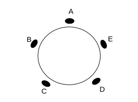

# Semana 2 {#sem2}
```{example, label="exConjunto15"}
Dado o conjunto $A = \{1,2,3,4,5\}$, quantos subconjuntos de 2 elementos $A$ possui?
```

```{solution}
Vamos listar:
\[
  \left.\begin{matrix}
A_1 = \{1,2\}, & A_2 = \{1,3\},\\ 
A_3 = \{1,4\}, & A_4 = \{1,5\},\\ 
A_5 = \{2,3\}, & A_6 = \{2,4\},\\ 
A_7 = \{2,5\}, & A_9 = \{3,4\},\\ 
A_9 = \{3,5\}, & A_{10} = \{4,5\}. 
\end{matrix}\right.
\]
Ao todo são 10 subconjuntos de 2 elementos formados com os 5 elementos de $A$.
```

*Atenção!* No Exemplo \@ref(exm:exPosicoes), obtivemos 20 números de 2 algarismos diferentes e no Exemplo \@ref(exm:exConjunto15) obtivemos 10 subconjuntos de 2 elementos.
Observe que $12 \neq 21$, mas $\{1,2\}=\{2,1\}$.
Pelo princípio multiplicativo, obtivemos $5\times 4=20$, considerando a ordem de colocação dos dígitos.
Na formação de  subconjuntos a ordem não importa, devemos dividir o resultado anterior por $2 = 2\times 1 = 2!$, isto é, pela permutação de 2 que é o número de elementos em cada subconjunto.

```{example}
Quantos subconjuntos possui o conjunto $A = \{a,b,c\}$?
```

```{solution}
Vamos listar: $\emptyset, \{a\}, \{b\}, \{c\}, \{a,b\}, \{a,c\}, \{b,c\}, \{a,b,c\}$.
Ao todo há 8 subconjuntos.
Em relação aos elementos, podemos dizer que cada um deles **aparece** ou **não aparece** nos subconjuntos.
Então, para o elemento $a$ temos 2 possibilidades quanto à sua presença no subconjunto (aparecer ou não).
O mesmo para $b$ e $c$.
Pelo princípio multiplicativo, temos $2 \times 2 \times 2 = 8$ subconjuntos de $A$.
```


```{example}
Quantos subconjuntos possui um conjunto $A$ com $n$ elementos?
```

```{solution}
Pelo exemplo anterior, cada elemento de $A$ pode ou não estar presente num determinado subconjunto e, pelo fato de $A$ ter $n$ elementos, então $A$ possui $2\times 2 \times \cdots \times 2 = 2^{n}$ subconjuntos.
```

```{example}
De quantos modos podemos formar uma roda com 5 crianças?
```

```{solution}
Parece que para formar a roda com as crianças basta escolher uma ordem para elas, o que pode ser feito de $5!=120$ modos.
Mas veja, na Figura \@ref(fig:figRoda), que as rodas $ABCDE$ e $EABCD$ são iguais, pois em uma roda o que importa é a posição relativa das crianças entre si.
A roda $ABCDE$ pode ser girada para se tornar $EABCD$.
Como cada roda pode ser girada de 5 formas, a nossa contagem de 120 rodas contou cada uma delas 5 vezes, assim, a resposta é $120/5=24$.
```

<!-- se o tikz nao funcionar, usar as figuras abaixo 
*Figuras geradas pela ferramenta [https://www.mathcha.io/editor]* 
r `
r knitr::include_graphics('img/circulo2.svg')` -->


```{r figRoda, echo=FALSE, engine='tikz', out.width='90%',  fig.cap='Roda com cinco crianças.', fig.align = 'center', engine.opts = list(template = "latex/tikz2pdf.tex")}
\begin{center}


\tikzset{every picture/.style={line width=0.75pt}} %set default line width to 0.75pt        

\begin{tikzpicture}[x=0.75pt,y=0.75pt,yscale=-1,xscale=1]
%uncomment if require: \path (0,236); %set diagram left start at 0, and has height of 236

%Shape: Ellipse [id:dp34470311589558866] 
\draw   (127,126.34) .. controls (127,93.95) and (155.32,67.69) .. (190.25,67.69) .. controls (225.18,67.69) and (253.5,93.95) .. (253.5,126.34) .. controls (253.5,158.74) and (225.18,185) .. (190.25,185) .. controls (155.32,185) and (127,158.74) .. (127,126.34) -- cycle ;
%Shape: Ellipse [id:dp6599313452344084] 
\draw  [fill={rgb, 255:red, 0; green, 0; blue, 0 }  ,fill opacity=1 ] (182.23,55.69) .. controls (182.23,52.84) and (186.27,50.53) .. (191.25,50.53) .. controls (196.23,50.53) and (200.27,52.84) .. (200.27,55.69) .. controls (200.27,58.54) and (196.23,60.84) .. (191.25,60.84) .. controls (186.27,60.84) and (182.23,58.54) .. (182.23,55.69) -- cycle ;
%Shape: Ellipse [id:dp7689410690620535] 
\draw  [fill={rgb, 255:red, 0; green, 0; blue, 0 }  ,fill opacity=1 ] (237.7,182.93) .. controls (236.14,180.55) and (238.26,176.41) .. (242.43,173.68) .. controls (246.6,170.96) and (251.25,170.68) .. (252.8,173.07) .. controls (254.36,175.45) and (252.24,179.59) .. (248.07,182.32) .. controls (243.9,185.04) and (239.25,185.32) .. (237.7,182.93) -- cycle ;
%Shape: Ellipse [id:dp37952256808104967] 
\draw  [fill={rgb, 255:red, 0; green, 0; blue, 0 }  ,fill opacity=1 ] (114.24,109.19) .. controls (111.87,107.61) and (112.19,102.97) .. (114.96,98.82) .. controls (117.73,94.68) and (121.9,92.6) .. (124.26,94.18) .. controls (126.63,95.77) and (126.31,100.41) .. (123.54,104.55) .. controls (120.77,108.7) and (116.6,110.77) .. (114.24,109.19) -- cycle ;
%Shape: Ellipse [id:dp6179971973259972] 
\draw  [fill={rgb, 255:red, 0; green, 0; blue, 0 }  ,fill opacity=1 ] (256.38,94.54) .. controls (258.95,93.31) and (262.77,95.97) .. (264.91,100.48) .. controls (267.05,104.98) and (266.69,109.62) .. (264.12,110.84) .. controls (261.55,112.06) and (257.73,109.4) .. (255.59,104.9) .. controls (253.45,100.4) and (253.81,95.76) .. (256.38,94.54) -- cycle ;
%Shape: Ellipse [id:dp5611562061729183] 
\draw  [fill={rgb, 255:red, 0; green, 0; blue, 0 }  ,fill opacity=1 ] (135.18,178.65) .. controls (136.46,176.1) and (141.1,175.85) .. (145.56,178.08) .. controls (150.01,180.31) and (152.59,184.18) .. (151.32,186.73) .. controls (150.04,189.27) and (145.4,189.53) .. (140.94,187.3) .. controls (136.49,185.07) and (133.91,181.19) .. (135.18,178.65) -- cycle ;

%Shape: Ellipse [id:dp14157568108618346] 
\draw   (375,122.34) .. controls (375,89.95) and (403.32,63.69) .. (438.25,63.69) .. controls (473.18,63.69) and (501.5,89.95) .. (501.5,122.34) .. controls (501.5,154.74) and (473.18,181) .. (438.25,181) .. controls (403.32,181) and (375,154.74) .. (375,122.34) -- cycle ;
%Shape: Ellipse [id:dp6519245043873838] 
\draw  [fill={rgb, 255:red, 0; green, 0; blue, 0 }  ,fill opacity=1 ] (430.23,51.69) .. controls (430.23,48.84) and (434.27,46.53) .. (439.25,46.53) .. controls (444.23,46.53) and (448.27,48.84) .. (448.27,51.69) .. controls (448.27,54.54) and (444.23,56.84) .. (439.25,56.84) .. controls (434.27,56.84) and (430.23,54.54) .. (430.23,51.69) -- cycle ;
%Shape: Ellipse [id:dp11214800106098388] 
\draw  [fill={rgb, 255:red, 0; green, 0; blue, 0 }  ,fill opacity=1 ] (485.7,178.93) .. controls (484.14,176.55) and (486.26,172.41) .. (490.43,169.68) .. controls (494.6,166.96) and (499.25,166.68) .. (500.8,169.07) .. controls (502.36,171.45) and (500.24,175.59) .. (496.07,178.32) .. controls (491.9,181.04) and (487.25,181.32) .. (485.7,178.93) -- cycle ;
%Shape: Ellipse [id:dp7458939573908205] 
\draw  [fill={rgb, 255:red, 0; green, 0; blue, 0 }  ,fill opacity=1 ] (362.24,105.19) .. controls (359.87,103.61) and (360.19,98.97) .. (362.96,94.82) .. controls (365.73,90.68) and (369.9,88.6) .. (372.26,90.18) .. controls (374.63,91.77) and (374.31,96.41) .. (371.54,100.55) .. controls (368.77,104.7) and (364.6,106.77) .. (362.24,105.19) -- cycle ;
%Shape: Ellipse [id:dp8735185255535125] 
\draw  [fill={rgb, 255:red, 0; green, 0; blue, 0 }  ,fill opacity=1 ] (504.38,90.54) .. controls (506.95,89.31) and (510.77,91.97) .. (512.91,96.48) .. controls (515.05,100.98) and (514.69,105.62) .. (512.12,106.84) .. controls (509.55,108.06) and (505.73,105.4) .. (503.59,100.9) .. controls (501.45,96.4) and (501.81,91.76) .. (504.38,90.54) -- cycle ;
%Shape: Ellipse [id:dp7766849583583963] 
\draw  [fill={rgb, 255:red, 0; green, 0; blue, 0 }  ,fill opacity=1 ] (383.18,174.65) .. controls (384.46,172.1) and (389.1,171.85) .. (393.56,174.08) .. controls (398.01,176.31) and (400.59,180.18) .. (399.32,182.73) .. controls (398.04,185.27) and (393.4,185.53) .. (388.94,183.3) .. controls (384.49,181.07) and (381.91,177.19) .. (383.18,174.65) -- cycle ;


% Text Node
\draw (187,27) node [anchor=north west][inner sep=0.75pt]   [align=left] {A};
% Text Node
\draw (267,83) node [anchor=north west][inner sep=0.75pt]   [align=left] {E};
% Text Node
\draw (250.07,185.32) node [anchor=north west][inner sep=0.75pt]   [align=left] {D};
% Text Node
\draw (132,189) node [anchor=north west][inner sep=0.75pt]   [align=left] {C};
% Text Node
\draw (102,84) node [anchor=north west][inner sep=0.75pt]   [align=left] {B};
% Text Node
\draw (350,80) node [anchor=north west][inner sep=0.75pt]   [align=left] {A};
% Text Node
\draw (380,185) node [anchor=north west][inner sep=0.75pt]   [align=left] {B};
% Text Node
\draw (498.07,181.32) node [anchor=north west][inner sep=0.75pt]   [align=left] {C};
% Text Node
\draw (515,79) node [anchor=north west][inner sep=0.75pt]   [align=left] {D};
% Text Node
\draw (435,24) node [anchor=north west][inner sep=0.75pt]   [align=left] {E};


\end{tikzpicture}
\end{center}
```


```{example}
De quantos modos podemos dividir 8 pessoas em dois grupos de 4 pessoas cada?
```

```{solution}
Vamos colocar as 8 pessoas em fila e dividi-las de modo que um grupo seja formado pelas 4 primeiras e o outro pelas 4 últimas.
Como há $8!$ modos de colocá-las na fila, a resposta parece ser $8!$.
Considere a divisão $abcd|efgh$.
Note que ela é idêntica à $efgh|abcd$.
Na nossa contagem de $8!$, essas divisões foram contadas como se fossem distintas.
Também, divisões como $abcd|efgh$ e $cabd|efgh$, que diferem-se pela ordem dos elementos em cada grupo, foram contadas como se fossem distintas.
Cada divisão foi contada $2\times 4!\times 4!$ vezes ($2$ por causa da ordem dos grupos, $4!$ por causa da ordem dos elementos no primeiro grupo e $4!$ por causa da ordem dos elementos no segundo grupo).
Assim, o número de divisões é 
$$\frac{8!}{2\cdot 4!4!}=35.$$
```

```{example}
Quantos são os divisores do número 126.000?
```

```{solution}
Ao fatorá-lo, obtemos $N=126000=2^4\cdot 3^2\cdot 5^3\cdot 7$. 
Note que nos divisores de $N$

* o expoente do fator $2$ pode variar de 0 a 4 ($2^0, 2^1, 2^2, 2^3, 2^4$);
* o expoente do fator $3$ pode variar de 0 a 2 ($3^0, 3^1, 3^2$);
* o expoente do fator $5$ pode variar de 0 a 3 ($5^0, 5^1, 5^2, 5^3$);
* o expoente do fator $7$ pode variar de 0 a 1 ($7^0, 7^1$).

Então, representando os divisores de $N$ como números da forma 

$$D = 2^x\cdot 3^y\cdot 5^z\cdot 7^w,$$

podemos dizer que 

* $x$ toma valores em $\{0,1,2,3,4\}$, i.e.\ $5$ possibilidades para $x$;
* $y$ toma valores em $\{0,1,2\}$, i.e.\ $3$ possibilidades para $y$;
* $z$ toma valores em $\{0,1,2,3\}$, i.e.\ $4$ possibilidades para $z$;
* $w$ toma valores em $\{0,1\}$, i.e.\ $2$ possibilidades para $w$.

Assim, pelo princípio multiplicativo, $5\cdot 3\cdot 4\cdot 2 = 120$ divisores de $N$.
```

## Arranjo simples ($r$-permutação)

```{definition, name="Arranjo simples", label="defArranjo"}
Um arranjo simples de $n$ elementos tomandos $r$ a $r$, em que $n \geq 1$ e $r \leq n$, $r \in \mathbf{N}$ são todos os grupos de $r$ elementos distintos que diferem entre si pela ordem e pela natureza dos $r$ elementos que compõem cada grupo. 
Notação: $A^{r}_{n}$.
```

Vamos encontrar uma expressão matemática que caracterize $A^{r}_{n}$.
Temos $n$ elementos dos quais queremos tomar $r$.
Isto equivale a preencher $r$ lugares com $n$ objetos.

$$
\underbrace{\_\_}_{L_1}\underbrace{\_\_}_{L_2}\underbrace{\_\_}_{L_3}\cdots\underbrace{\_\_}_{L_r}
$$

No primeiro lugar há $n$ objetos diferentes que podem ser escolhidos.
No segundo lugar há $n-1$ objetos diferentes (lembre-se que um já foi escolhido).
No terceiro lugar há $n-2$ objetos diferentes, e assim sucessivamente, de forma que $L_r$ terá $n-(r-1)$ maneiras diferentes de ser preenchido.
Pelo Princípio Multiplicativo, podemos dizer que as $r$ posições podem ser preenchidas sucessivamente de $n(n-1)(n-2)\cdots(n-(r-1))$ maneiras distintas.
Portanto 
\begin{equation}
A^{r}_{n} = n(n-1)(n-2)\cdots(n-(r-1)).
(\#eq:arranjo)
\end{equation}

Multiplicando e dividindo por 1, temos que

$$
A^{r}_{n} = n(n-1)(n-2)\cdots(n-(r-1))\frac{(n-r)(n-r-1)\cdots2\cdot 1}{(n-r)(n-r-1)\cdots2\cdot 1} = \frac{n!}{(n-r)!}.
$$

```{example}
Quantos inteiros entre 1000 e 9999 tem dígitos distintos e
(a) são números pares?
(b) constituem-se inteiramente de dígitos ímpares?
```

```{solution}
Os números que buscamos tem 4 dígitos, ou 4 posições a serem preenchidas

$$
  \underbrace{\_\_}_{p_1}\underbrace{\_\_}_{p_2}\underbrace{\_\_}_{p_3}\underbrace{\_\_}_{p_4}.
$$

Para resolver o item (a), note que números pares tem na última posição 0, 2, 4, 6 ou 8.

* números terminados em 0: $\underbrace{\_\_}_{p_1}\underbrace{\_\_}_{p_2}\underbrace{\_\_}_{p_3}\underbrace{0}_{p_4}$.
Com excessão do zero, dígitos disponíveis: $1,2,\ldots,9$.
Preenchemos as três primeiras posiçõeos de $A^{3}_{9}=\frac{9!}{6!}=504$ maneiras.

* números terminados em 2, 4, 6 ou 8: 
Preenchimento da última posição: 4 maneiras.
Preenchimento da primeira posição: 8 maneiras (exclui-se 0 e o dígito em $p_4$).
Preenchemos as posições $p_2$ e $p_3$ de $A^{2}_{8}=\frac{8!}{6!}=56$ maneiras.
Pelo Princípio Multiplicativo, há $4\cdot 8\cdot A^{2}_{8} = 1792$ números pares com dígitos distintos que não terminam em zero.

Finalmente, pelo Princípio Aditivo, há $A^{3}_{9} + 4\cdot 8 \cdot A^{3}_{9} = 2296$ números pares entre 1000 e 9999 com dígitos distintos.

No item (b), se os números são constituidos de dígitos ímpares, então são formados pelos dígitos 1, 3, 5, 7 e 9.
Portanto há $A^4_5=5!=120$ números entre 1000 e 9999 formados de dígitos ímpares.
```

## Combinações

```{definition, name="Combinação simples", label="defComb"}
Combinações simples de $n$ elementos tomados $r$ a $r$ ($r$-combinação), em que $n \geq 1$, $r \in \mathbb{N}$  tal que $r \leq n$, são todas as escolhas não ordenadas de $r$ desses elementos.
Notação $C^r_n = {n\choose r}$.
```

```{example}
Seja $\mathcal{S} = \{1,2,3,4\}$. 
O subconjunto $\{1,3,4\}$ é uma $3$-combinação do conjunto $\mathcal{S}$.
Note que $\{4,1,3\}$ é a mesma $3$-combinação, pois a ordem em que os elementos são listados não importa.
```

```{example}
Considere o conjunto $\mathcal{X}_1 = \{1,2,3\}$, um conjunto de cardinalidade $3$.
Quais são todos os subconjuntos de $\mathcal{X}_1$?
```
```{solution}
O conjunto vazio é o único subconjunto de $\mathcal{X_1}$ com tamanho zero.
Existem $3$ subconjuntos de tamanho $1$,
$$ \{1\}, \qquad \{2\}, \qquad \{3\}. $$
Também existem $3$ subconjuntos de tamanho $2$,
$$ \{1,2\}, \qquad \{1,3\}, \qquad \{2,3\}. $$
E existe $1$ subconjunto de tamanho 3, o próprio $\mathcal{X}_1$.
```

```{example, label="exComb4"}
Considere agora $\mathcal{X}_2 = \{1,2,3,4\}$.
Quais são todos os subconjuntos de $\mathcal{X}_2$?
```

```{solution}
Novamente, o conjunto vazio é o único subconjunto de $\mathcal{X}_2$ com tamanho zero e $\mathcal{X}_2$ é o único subconjunto de tamanho $4$.
Existem $4$ subconjuntos de tamanho $1$,
$$ \{1\}, \qquad \{2\}, \qquad \{3\}, \qquad \{4\}. $$
Também existem $6$ subconjuntos de tamanho $2$,
$$ \{1,2\}, \qquad \{1,3\}, \qquad \{1,4\}, $$
$$ \{2,3\}, \qquad \{2,4\}, \qquad \{3,4\}. $$
E existem $4$ subconjuntos de tamanho 3,
$$ \{1,2,3\}, \qquad \{1,2,4\}, \qquad \{1,3,4\}, \qquad \{2,3,4\}.$$
```

Note que, no Exemplo \@ref(exm:exComb4), os conjuntos de tamanho $3$ são uma bijeção entre os conjuntos de tamanho $1$, já que todo conjunto de tamanho $3$ é o complemento de conjunto de tamanho $1$.
Em geral, é verdade que o número de subconjuntos com $k$ elementos é igual ao número de subconjuntos com $n-k$ elementos.


```{proposition}
Para todo $n \in \mathbb{N}$ e todo $k \in \mathbb{Z}$, se ${n \choose k}$ denota o número de subconjuntos de cardinalidade $k$ de um conjunto de cardinalidade $n$, então
\begin{align}
{0 \choose 0} &= 1, \\
{n \choose k} &= 0, \qquad \text{se } k \notin \{0, 1, \cdots, n\},\\
{n \choose k} &= {n-1 \choose k} + {n-1 \choose k-1}.
\end{align}
```


```{proof}
Claramente, quando $k \notin \{0, 1, \cdots, n\}$, temos que ${n \choose k} = 0$.
Temos também que ${0 \choose 0} = 1$, pois o conjunto vazio é o único subconjunto de tamanho zero.
Se $n\geq 1$, temos que considerar os casos em que $k=0$ e $k=n$ separadamente.

* Se $k=0$, então o único subconjunto de $\{0, 1, \ldots, n\}$ com zero elementos é o conjunto vazio, assim
$$ {n \choose 0} = 1 = {n-1 \choose 0} + {n-1 \choose -1} = 1+0.$$

* Se $k=n$, então o único subconjunto de $\{0, 1, \ldots, n\}$ com $n$ elementos é o próprio $\{0, 1, \ldots, n\}$, assim,
$$ {n \choose n} = 1 = {n-1 \choose n} + {n-1 \choose n-1} = 0+1.$$
  
* Se $1 \leq k \leq n-1$, então existem dois tipos de subconjuntos de $\{0, 1, \ldots, n\}$ com $k$ elementos: aqueles que contém $n$ e aqueles que não contém $n$.
O número de subconjuntos de $k$ elementos de $\{0, 1, \ldots, n\}$ contendo $n$ é igual ao número de subconjuntos de $\{0, 1, \ldots, n-1\}$ contendo $k-1$ elementos, que é denotado por ${n-1 \choose k-1}$.
O número de subconjuntos de $k$ elementos de $\{0, 1, \ldots, n\}$ que não contém $n$ é igual ao número de subconjuntos de $\{0, 1, \ldots, n-1\}$ contendo $k$ elementos, que é denotado por ${n-1 \choose k}$.
Então, o número de subconjuntos de $\{0, 1, \ldots, n\}$ com $k$ elementos é 
$$ {n \choose k} = {n-1 \choose k} + {n-1 \choose k-1}.$$

A equação acima é conhecida também com [relação de Stifel](https://pt.wikipedia.org/wiki/Rela%C3%A7%C3%A3o_de_Stifel), ou regra de Pascal.
```


Através da relação de Stifel, pode-se criar um triângulo numérico infinito formado por coeficientes binomiais, como mostrado na Firgura \@ref(fig:figTriangulo).
Este é conhecido como Triângulo combinatório.

```{r, label="figTriangulo", echo=FALSE, engine='tikz', out.width='90%',  fig.cap='Triângulo combinatório.', fig.align = 'center', engine.opts = list(template = "latex/tikz2pdf.tex")}
\begin{center}
\begin{tikzpicture}
\foreach \n in {0,...,4} {
  \foreach \k in {0,...,\n} {
    \node at (\k-\n/2,-\n) {${\n \choose \k}$};
  }
}
\end{tikzpicture}
\end{center}
```


```{example}
$${4 \choose 1} = {3 \choose 0} + {3 \choose 1},$$
$${4 \choose 2} = {3 \choose 2} + {3 \choose 1}.$$
```

```{proposition}
Para todo $n \in \mathbb{N}$ e todo $k \in \mathbb{Z}$, $0 \leq k \leq n$, temos 
$${n \choose k} = \frac{n!}{k!(n-k)!}.$$
```

```{proof}
Vamos usar indução sobre n para fazer a prova.

1. Para $n=0$. Como $0 \leq k \leq n$, temos que $k=0$, logo ${0 \choose 0} =1$,
$$\frac{0!}{0!(0)!}=1.$$
  
2. Hipótese de indução: supor que se cumpre para n-1.

3. Verificar que vale para $n$.

Pela fórmula de Pascal
\begin{align}
{n \choose k} &= {n-1 \choose k} + {n-1 \choose k-1} \\
&= \frac{(n-1)!}{k!(n-1-k)!} + \frac{(n-1)!}{(k-1)!(n-1-(k-1))!} \\
&= \frac{(n-1)!}{k!(n-1-k)!} + \frac{(n-1)!}{(k-1)!(n-k)!} \\
&= \frac{(n-k)}{(n-k)}\frac{(n-1)!}{k!(n-1-k)!} + \frac{k}{k}\frac{(n-1)!}{(k-1)!(n-k)!} \\
&= \bigg(\frac{n-k}{k!(n-k)(n-k-1)!} + \frac{k}{k(k-1)!(n-k)!} \bigg)(n-1)! \\
&= \bigg(\frac{n-k}{k!(n-k)!} + \frac{k}{k!(n-k)!} \bigg)(n-1)! \\
&= \frac{n}{k!(n-k)!}(n-1)! \\
&= \frac{n!}{k!(n-k)!}.
\end{align}

```


Como seria essa prova por um argumento combinatório?


```{example}
Quantos são os anagramas formados por $2$ vogais e $3$ consoantes escolhidas dentre $18$ consoantes e $5$ vogais? 
```

```{solution}
A escolha das duas vogais pode se dar de $C^2_5$ maneiras diferentes.
A escolha das consoantes pode se dar de $C^3_{18}$ maneiras diferentes.
Portanto, pelo Princípio Multiplicativo, o número de anagramas possíveis formados por $2$ vogais e $3$ consoantes é
$$C^2_5 \cdot C^3_{18} = \frac{5!}{2!3!}\frac{18!}{3!15!}=8160.$$
```


```{remark}
Por simetria, $C^{k}_{n} = C^{n-k}_n$. 
O número $C^{n-k}_n$ é chamado de combinação complementar.
Isto é, se consideramos um conjunto com $n$ elementos, o número de maneiras de escolher $k$ objetos é identico ao número de maneiras de escolher $n-k$ objetos dentre os $n$, pois do total $n$ tiramos $k$ e sobram $n-k$ e, consequentemente, se de $n$ objetos tiramos $n-k$, sobram-se $k$ objetos.
```

```{example}
De quantas maneiras podemos arrumar em fila $5$ sinais negativos $(-)$ e $7$ sinais positivos $(+)$?
```

```{solution}
Este problema é equivalente à ter $12$ lugares para se preencher com sinais $-$ e $+$.
Neste caso, tanto faz se escolhermos $5$ lugares dentre os $12$ para colocar os $-$ e nos que sobrarem colocarmos os $7$ $+$, ou o contrário, visto que $C^{5}_{12} = C^{7}_{12} = \frac{12!}{7!5!}=792.$
```

```{example}
Quantas diagonais possui um polígono regular de $n$ lados?
```

```{solution}
Sejam $P_1, P_2, \cdots, P_n$ os vértices.
Ao observar a Figura \@ref(fig:figPoligono), vemos que não pode-se ligar $P_1$ a $P_2$ e nem $P_1$ a $P_8 (=P_n)$, pois teríamos lados e não diagonais.
Entretanto, $P_1$ pode ser ligado a qualquer um dos $5 = n-3$ vértices restantes.
O número de maneiras de traçarmos estas diagonais é escolher 1 dentre os $n-3$ vértices restantes, isto é $C^{1}_{n-3}$.
Como há $n$ vértices e para cada um deles há $C^{1}_{n-3}$ diagonais possíveis, então $n \cdot C^{1}_{n-3}$ deveria ser o número de diagonais do polígono.
Mas estaríamos contando a diagonal entre os vértices $P_1$ e $P_3$, por exemplo, duas vezes.
Devemos então dividir este resultado por $2$.
Portanto, um polígono regular de $n$ lados possui
$$ \frac{n \cdot C^{1}_{n-3}}{2} = \frac{n}{2}\frac{(n-3)!}{1!(n-4)!} = \frac{n(n-3)}{2} $$
diagonais.
```

```{r figPoligono, echo=FALSE, engine='tikz', out.width='90%',  fig.cap='Polígono regular de 8 lados.', fig.align = 'center', engine.opts = list(template = "latex/tikz2pdf.tex")}
\begin{center}
\tikzset{every picture/.style={line width=0.75pt}} %set default line width to 0.75pt        

\begin{tikzpicture}[x=0.75pt,y=0.75pt,yscale=-1,xscale=1]
%uncomment if require: \path (0,300); %set diagram left start at 0, and has height of 300

%Shape: Regular Polygon [id:dp5932392582890005] 
\draw   (440.5,142.75) -- (410.99,213.99) -- (339.75,243.5) -- (268.51,213.99) -- (239,142.75) -- (268.51,71.51) -- (339.75,42) -- (410.99,71.51) -- cycle ;
%Straight Lines [id:da4674332088718889] 
\draw  [dash pattern={on 4.5pt off 4.5pt}]  (410.99,71.51) -- (339.75,243.5) ;
%Straight Lines [id:da568250103558863] 
\draw  [dash pattern={on 4.5pt off 4.5pt}]  (339.75,42) -- (339.75,243.5) ;
%Straight Lines [id:da9857034164543101] 
\draw  [dash pattern={on 4.5pt off 4.5pt}]  (239.75,143.5) -- (339.75,243.5) ;
%Straight Lines [id:da5430705220909584] 
\draw  [dash pattern={on 4.5pt off 4.5pt}]  (268.51,71.51) -- (339.75,243.5) ;
%Straight Lines [id:da14313772950954484] 
\draw  [dash pattern={on 4.5pt off 4.5pt}]  (440.5,142.75) -- (339.75,243.5) ;

% Text Node
\draw (332,251) node [anchor=north west][inner sep=0.75pt]   [align=left] {P{\scriptsize 1}};
% Text Node
\draw (248,215) node [anchor=north west][inner sep=0.75pt]   [align=left] {P{\scriptsize 2}};
% Text Node
\draw (216,136) node [anchor=north west][inner sep=0.75pt]   [align=left] {P{\scriptsize 3}};
% Text Node
\draw (250,51) node [anchor=north west][inner sep=0.75pt]   [align=left] {P{\scriptsize 4}};
% Text Node
\draw (333,18) node [anchor=north west][inner sep=0.75pt]   [align=left] {P{\scriptsize 5}};
% Text Node
\draw (416,50) node [anchor=north west][inner sep=0.75pt]   [align=left] {P{\scriptsize 6}};
% Text Node
\draw (449,130) node [anchor=north west][inner sep=0.75pt]   [align=left] {P{\scriptsize 7}};
% Text Node
\draw (418,218) node [anchor=north west][inner sep=0.75pt]   [align=left] {P{\scriptsize 8}};
\end{tikzpicture}
\end{center}
```

```{example}
De quantas maneiras pode-se escolher $3$ números distintos do conjunto $\mathcal{A}=\{1, 2, 3, \ldots, 50\}$ de modo que sua soma seja um múltiplo de $3$?
```

```{solution}
Sejam os conjuntos 

\begin{align}
\mathcal{A}_1 &= \{x \in \mathcal{A} | x=3k, k=1,2,\ldots \} = \{3, 6, 9, \ldots, 48\},\\
\mathcal{A}_2 &= \{x \in \mathcal{A} | x=3k+1, k=1,2,\ldots \} = \{1, 4, 7, 10, \ldots, 49\},\\
\mathcal{A}_3 &= \{x \in \mathcal{A} | x=3k+2, k=1,2,\ldots \} = \{2, 5, 8, 11, \ldots, 50\}.\\
\end{align}

Vamos denominar $n(\mathcal{A}_i)$ a cardinalidade de $\mathcal{A}_i$.
Então, 
$$n(\mathcal{A}_1) = 16, \qquad n(\mathcal{A}_2)=17, \qquad n(\mathcal{A}_3)=17.$$

Se somarmos $3$ números quaisquer de $\mathcal{A}_1$, teremos como soma um múltiplo de $3$, pois se $x,y,z \in \mathcal{A}_1$, então $x+y+z = 3(k + k^{\prime} + k^{\prime\prime})$, em que $k, k^\prime, k^{\prime\prime} \in \mathbb{N}$.
Essa soma pode ser feita de $C^{3}_{16} = \frac{16!}{3!13!}=560$ maneiras.


Se somarmos 3 números quaisquer de $\mathcal{A}_2$, teremos como soma um múltiplo de $3$, pois se $x,y,z \in \mathcal{A}_2$, então $x+y+z =(3k+1)+(3k^{\prime}+1)+(3k^{\prime\prime}+1)=3(k + k^{\prime} + k^{\prime\prime})+3$, em que $k, k^\prime, k^{\prime\prime} \in \mathbb{N}$.
Essa soma pode ser feita de $C^{3}_{17} = \frac{17!}{3!14!}=680$ maneiras.


Se somarmos 3 números quaisquer de $\mathcal{A}_3$, teremos como soma um múltiplo de $3$, pois se $x,y,z \in \mathcal{A}_3$, então $x+y+z =(3k+2)+(3k^{\prime}+2)+(3k^{\prime\prime}+2)=3(k + k^{\prime} + k^{\prime\prime})+6$, em que $k, k^\prime, k^{\prime\prime} \in \mathbb{N}$.
Essa soma pode ser feita de $C^{3}_{17} = \frac{17!}{3!14!}=680$ maneiras.


Se  somarmos $1$ elemento de $\mathcal{A}_1$ com $1$ elemento de $\mathcal{A}_2$ e com $1$ elemento de $\mathcal{A}_3$, obteremos como soma um múltiplo de $3$, pois se $x \in \mathcal{A}_1$, $y \in \mathcal{A}_2$ e $z \in \mathcal{A}_3$, então $x+y+z =$ $3k+(3k^{\prime}+1)+(3k^{\prime\prime}+2)=$ $3(k + k^{\prime} + k^{\prime\prime})+3$, em que $k, k^\prime, k^{\prime\prime} \in \mathbb{N}$.
Essa soma pode ser feita de $C^{1}_{16}C^{1}_{17}C^{1}_{17} = 16 \cdot 17 \cdot 17 = 4624$ maneiras.


Portanto, podemos escolher $3$ números distintos de $\mathcal{A}$, de modo a obter um múltiplo de $3$, de $C^{3}_{16}+C^{3}_{17}+C^{3}_{17}+C^{1}_{16}C^{1}_{17}C^{1}_{17} = 6544$ maneiras.
```

```{example, label="exNumConsec"}
Dado $A = \{1,2,3,4,5\}$, de quantos modos é possível formar subconjuntos de $2$ elementos  nos quais não haja números consecutivos?
```

```{solution}
Vamos enumerar estes conjuntos: $\{1,3\}$, $\{1,4\}$, $\{1,5\}$, $\{2,4\}$, $\{2,5\}$, $\{3,5\}$.
Há, portanto, $6$ subconjuntos nas condições impostas pelo enunciado do problema.
```

Neste caso explorado pelo Exemplo \@ref(exm:exNumConsec) foi fácil enumerar.
Entretanto, para um conjunto com $10$ elementos, a solução não seria tão fácil de ser determinada.
Vamos encontrar uma maneira de contar o número de subconjuntos sem que haja a necessidade de enumerá-los.
Vamos marcar com o sinal "$+$" os elementos que farão parte do subconjunto e com o sinal "$-$" os elementos que não farão parte do subconjunto.
Dessa forma, $\{1,3\}$ pode ser representado por $+-+--$, $\{2,5\}$ pode ser representado por $-+--+$, e $\{1,2\}$ pode ser representado por $++---$, que não é um conjunto válido, de acordo com as condições do enunciado.
Veja que para formar o subconjunto desejado, devemos colocar 3 sinais "$-$" e 2 sinais "$+$" em fila, sem que haja dois sinais "$+$" consecutivos.
Isto pode ser feito se colocarmos os $3$ sinais "$-$" e deixarmos espaços entre eles, onde eventualmente colocaremos os sinais "$+$".
$$\_\_ - \_\_ - \_\_ - \_\_ .$$
Há $4$ posições vazias, e, para colocarmos os dois sinais "$+$", basta escolhermos $2$ dentre estas $4$ posições.
Consequentemente, há $C^2_4=6$ maneiras disso ser feito e, portanto, há $6$ subconjuntos de $2$ elementos não consecutivos de $A$.

## Aplicações

### Equações lineares com coeficientes unitários
O objetivo aqui é contar o número de soluções inteiras de uma equação da forma

\begin{equation}
x_1 + x_2 + x_3 + \cdots + x_n = m,
(\#eq:inteiros)
\end{equation}

em que $x_i$, para $i=1,2,\ldots, n$, e $m$ são inteiros.

```{theorem, label="eqIntPos"}
O número de soluções em inteiros positivos da Equação \@ref(eq:inteiros), para $m>0$ é dado por $C^{n-1}_{m-1}$.
```

```{proof}
Como estamos interessados em expressar o inteiro positivo $m$ como soma de $n$ inteiros positivos, basta colocarmoms $n-1$ barras divisoras entre os $m$ $1$´s:

$$1 + 1 \vert + 1 + \cdots +1 \vert  +1 \cdots  + 1 \vert + 1 + \cdots + 1 =m.$$

O valor de $x_1$ será o número de $1$´s que antecedem a primeira barra, o valor de $x_2$ será o número de $1$´s entre a primeira e a segunda barra, e assim por diante, até obtermos o valor de $x_n$ como sendo o número de $1$´s à direita da barra de número $n-1$.
Como a cada possível distribuição das barras corresponde uma única solução para a equação acima, basta contarmos de quantas formas isso pode ser feito.
Devemos selecionar $n-1$ dos $m-1$ possíveis locais (os sinais de "$+$" que separam os $1$´s) para a colocação das barras divisórias, o que pode ser feito de $C^{n-1}_{m-1}$ maneiras diferentes.
```

```{theorem, label="solNaoNegInt"}
O número de soluções não negativas inteiras da Equação \@ref(eq:inteiros), para $m>0$ e $x_i\geq 0$ é dado por $C^{n-1}_{m+n-1} = C^{m}_{m+n-1}$.
```

```{proof}
Somando $1$ a cada $x_i$, temos
$$(x_1+1) + (x_2+1) + (x_3+1) + \cdots + (x_n+1) = m+n.$$
Seja $y_i = x_i+1$, para $i=1,2,\ldots,n$, então
\begin{equation}
y_1 + y_2 + y_3 + \cdots + y_n = m+n,
(\#eq:inteirosY)
\end{equation}
para  $y_i \geq 1$, inteiro.
Este problema é equivalente a determinar o número de soluções inteiras positivas da Equação \@ref(eq:inteirosY), que, pelo Teorema \@ref(thm:eqIntPos), é 
$$C^{n-1}_{m+n-1} = C^{m}_{m+n-1}.$$
```


```{example}
Encontrar (a) o número de soluções em inteiros não-negativos e (b) soluções em inteiros positivos da equação $x_1 + x_2 + x_3 + x_4 + x_5 = 12$.
```

```{solution}
(a) $C^{5-1}_{12+5-1} = C^{4}_{16} = 1820,$
(b) $C^{4}_{11} = 330.$
```


```{example}
Encontrar o número de soluções em inteiros positivos maiores do que $3$ na equação $x_1 + x_2 + x_3 = 17$, isto é, determinar o número de soluções inteiras de $x_1 + x_2 + x_3 = 17$, em que $x_i>3$, $i=1,2,3$.
```

```{solution}
Algumas soluções procuradas são $(4,5,8)$, $(5,7,5)$ e $(9,4,4)$.
Subtraindo $3$ unidades de cada componente destas ternas ordenadas, obtemos $(1,2,5)$, $(2,4,2)$ e $(6,1,1)$, respectivamente, que são soluções em inteiros positivos da equação
\begin{equation}
y_1 + y_2 + y_3 = 8, \qquad y_i\geq 1,
(\#eq:inteirosY2)
\end{equation}

em que $y_i=x_i-3$, $i=1,2,3$.
Como o número de soluções da Equação \@ref(eq:inteirosY2) é $C^2_7=21$, este é o número procurado, uma vez que esta mudança de variável descrita acima estabelece uma relação biunívoca entre os conjuntos de soluções das duas equações.
```

### Combinações com repetições

```{example, label="parqueDiversoes"}
Num parque de diversões existem quatro tipos de brinquedos, $a$, $b$, $c$ e $d$.
Uma pessoa quer comprar dois bilhetes.
De quantas maneiras ela pode comprar?
```

```{solution}
É  claro que ela pode comprar dois bilhetes do mesmo tipo.
A lista de possibilidades é

\begin{align}
aa, &\quad ab, \quad ac, \quad ad, \quad bb, \\
bc, &\quad bd, \quad cc, \quad cd, \quad dd. 
(\#eq:combRep)
\end{align}
$$$$

Veja que este número de possibilidades é maior que $C^2_4=6$.
```

As combinações listadas na Expressão \@ref(eq:combRep) são chamadas combinações com repetição.

Retomando o contexto apresentado no Exemplo \@ref(exm:parqueDiversoes), se uma pessoa tem dinheiro para comprar $5$ bilhetes, algumas possibilidades seriam

$$aaaaa, \quad abbbc, \quad bbccd.$$
Estamos interessados em contar o total de elementos do tipo acima.
Para saber os bilhetes comprados, basta que a pessoa nos diga quantos bilhetes de cada tipo ela comprou.
Sejam $x_1, x_2, x_3, x_4$ o número de bilhetes comprados para os brinquedos $a,b,c,d$, respectivamente.
O que estamos procurando é o número de soluções inteiras não-negativas para a equação
$$x_1+x_2+x_3+x_4=5,$$
que, como sabemos, através do Teorema \@ref(thm:solNaoNegInt), é $C^3_8=56$, e vamos denotar por $CR^4_5$.

Podemos generalizar o resultado anterior.
Assim, $CR^p_n$ é o número total de maneiras de selecionarmos $p$ objetos dentre $n$ objetos distintos, em que cada objeto pode ser escolhido até $p$ vezes, que, como vimos, é igual ao número de soluções não negativas da equação 
$$x_1+x_2+\cdots x_p=n,$$
que é $$C^{n-1}_{n+p-1}=C^{p}_{n+p-1}.$$
Logo temos que 
$$CR^{p}_{n}=CR^{p}_{n+p-1}.$$


### Arranjo com repetições
Lembre que, pela Expressão \@ref(eq:arranjo), 
$$A^{r}_{n} = n(n-1)(n-2)\cdots(n-(r-1)).$$
Este número conta todas as possíveis maneiras de se retirar, de um conjunto de $m$ elementos distintos, $p$ elementos, levando-se em conta a ordem dos elementos.

Caso sejam permitidas repetições, o princípio multiplicativo nos diz que o número total de maneiras de se retirar, levando-se em conta a ordem, $p$ dos $m$ objetos, distintos ou não, é igual a 
$$AR_m^p = m^p,$$
uma vez que o primeiro elemento pode ser retirado de $m$ maneiras distintas, o segunto também de $m$ maneiras, e assim sucessivamente, até que o $p$-ésimo seja escolhido.

```{example}
Qual o total de placas de carro que podem ser construídas constando de 7 símbolos, sendo os 3 primeiros constituídos por letras e os 4 últimos por dígitos? Considere um alfabeto com 26 letras.
```

```{solution}
Podemos escolher as 3 letras de $AR_{26}^{3}$ maneiras distintas e os 4 dígitos de $AR_{10}^{4}$ formas diferentes.
Logo, pelo princípio multiplicativo, temos um total de 
$$AR_{26}^{3}AR_{10}^{4} = 175.760.000$$
```

## Princípio da inclusão e exclusão

Queremos obter uma fórmula que forneça o número total de elementos na  união de um número finito de conjuntos.
Considere o diagrama mostrado na Figura \@ref(fig:figVennAB), com os conjuntos $A$ e $B$.
O número total de elementos da união $A \cup B$ é
$$|A\cup B| = |A| + |B| - |A\cap B|.$$

```{r figVennAB, echo=FALSE, engine='tikz', out.width='90%',  fig.cap='Polígono regular de 8 lados.', fig.align = 'center', engine.opts = list(template = "latex/tikz2pdf.tex")}
\begin{center}
\tikzset{every picture/.style={line width=0.75pt}} %set default line width to 0.75pt
\begin{tikzpicture}[x=0.75pt,y=0.75pt,yscale=-1,xscale=1]
%uncomment if require: \path (0,236); %set diagram left start at 0, and has height of 236

%Shape: Rectangle [id:dp5645848357402596] 
\draw   (216,45.14) -- (462.5,45.14) -- (462.5,186) -- (216,186) -- cycle ;
%Shape: Circle [id:dp0038771155200034713] 
\draw   (273,122.25) .. controls (273,97.26) and (293.26,77) .. (318.25,77) .. controls (343.24,77) and (363.5,97.26) .. (363.5,122.25) .. controls (363.5,147.24) and (343.24,167.5) .. (318.25,167.5) .. controls (293.26,167.5) and (273,147.24) .. (273,122.25) -- cycle ;
%Shape: Circle [id:dp9828315731839483] 
\draw   (334,120.25) .. controls (334,95.26) and (354.26,75) .. (379.25,75) .. controls (404.24,75) and (424.5,95.26) .. (424.5,120.25) .. controls (424.5,145.24) and (404.24,165.5) .. (379.25,165.5) .. controls (354.26,165.5) and (334,145.24) .. (334,120.25) -- cycle ;

% Text Node
\draw (269,149) node [anchor=north west][inner sep=0.75pt]   [align=left] {A};
% Text Node
\draw (417,149) node [anchor=north west][inner sep=0.75pt]   [align=left] {B};


\end{tikzpicture}
\end{center}
```

```{theorem, label="teoPrincInclExcl"}
O número de elementos na união de $n$ conjuntos finitos $A_1, A_2, \ldots, A_n$ é dado por 
\begin{align}
|A_1 \cup A_2 \cup \cdots \cup A_n| = &\sum_{i=1}^{n} |A_i| - \sum_{1\leq i\leq j} |A_i \cap A_j|\\
  &+ \sum_{1\leq i\leq j\leq k} |A_i \cap A_j \cap A_k| + \cdots + (-1)^{n-1}|A_1 \cap A_2 \cap \cdots \cap A_n|.
(\#eq:inclusaoExclusao)
\end{align}
```

```{proof}
Devemos mostrar que um elemento que pertença a $p$ dos conjuntos $A_i$, para $p=1,2,\ldots, n$, é contado pela Expressão \@ref(eq:inclusaoExclusao) exatamente uma vez.
Pertencendo a $p$ dos conjuntos $A_i$`s, ele será contato $p$ vezes em
$$\sum_{i=1}^{n} |A_i|,$$
em
$$\sum_{1\leq i\leq j} |A_i \cap A_j|$$
será contado $C^2_p$ vezes (há $C^2_n$ interseções dois a dois e o elemento está em $C^2_p$ delas),
em 
$$\sum_{1\leq i\leq j\leq k} |A_i \cap A_j \cap A_k|$$
será contado $C^3_p$ vezes, e assim sucessivamente até o termo $|A_1 \cap A_2 \cap \cdots A_n|$, em que o elemento será contado uma vez.
A interseção de mais do que $p$ conjuntos não fornecerá nenhuma contribuição, pois o elemento em questão pertence a exatamente $p$ dos conjuntos $A_1, A_2, \ldots, A_n$.

Somando todas essas contribuições, teremos

\begin{equation}
C^{1}_{p}-C^{2}_{p}+C^{3}_{p}-C^{4}_{p}+\cdots +(-1)^{p-1}C^{p}_{p}.
(\#eq:inclusaoExclusaoFinal)
\end{equation}

Os termos que aparecem na soma da Expressão \@ref(eq:inclusaoExclusaoFinal) são os elementos da $p$-ésima linha do triângulo combinatório.
Sabemos que termos equidistantes dos extremos em uma linha do triângulo combinatório são iguais $(C^{k}_{p}=C^{p-k}_{p})$, assim

$$C^{0}_{p}-C^{1}_{p}+C^{2}_{p}-C^{3}_{p}+C^{4}_{p}+\cdots +(-1)^{p}C^{p}_{p} = 0.$$
  Isso implica que a soma na Expressão \@ref(eq:inclusaoExclusaoFinal) é igual a 1, pois $C^{0}_{p}=1$.
```

A seguir, veremos alguns exemplos de aplicação do Princípio da Inclusão e Exclusão.

```{example}
Dentre os números de 1 até 3600 inclusive, quantos são divisíveis por 3 ou por 7?
```

```{remark}
A notação $\big\lfloor{x}\big\rfloor$ representa o maior inteiro menor ou igual a $x$ e $\big\lceil{x}\big\rceil$ representa o menor inteiro maior ou igual a $x$.
```

```{solution}
Sabemos que $\big\lfloor{\frac{3600}{3}}\big\rfloor=1200$ são divisíveis por $3$ e que $\big\lfloor{\frac{3600}{7}}\big\rfloor=514$ são divisíveis por 7.
Ao somar estes números estaremos contando duas vezes todos os números que são divisíveis por $3$ e por $7$, ou seja, os divisíveis por $21$, que são $\big\lfloor{\frac{3600}{21}}\big\rfloor=171$.
Logo, dentre os números de 1 até 3600 inclusive, 
$$1200 + 514 - 171 = 1543$$
são divisíveis por 3 ou por 7.
```

```{example, label="div3Numeros"}
Quantos são os inteiros entre 1 até 42000 inclusive que não são divisíveis por 2, por 3 e nem por 7?
```

```{solution}
Sejam
\begin{align}
A &= \{1, 2, 3, \ldots, 42000\}, \\
A_1 &= \{x \in A | x = 2k, k \in \mathbb{N}\}, \\
A_2 &= \{x \in A | x = 3k, k \in \mathbb{N}\}, \\
A_3 &= \{x \in A | x = 7k, k \in \mathbb{N}\}.
\end{align}

Pelo Princípo da Inclusão e Exclusão, o número procurado será dado por
\begin{align} 
|A| - |A_1\cup A_2 \cup A_3| = |A| &- |A_1| - |A_2| - |A_3| \\
 &+ |A_1 \cap A_2| + |A_1 \cap A_3|+ |A_2 \cap A_3| \\ 
 &- |A_1 \cap A_2 \cap A_3|.
\end{align}

Como 
\begin{align} 
|A_1| &= \bigg\lfloor{\frac{4200}{2}}\bigg\rfloor=21000, &\quad 
  |A_2| &= \bigg\lfloor{\frac{4200}{3}}\bigg\rfloor=14000, &\quad \\
  |A_3| &= \bigg\lfloor{\frac{4200}{7}}\bigg\rfloor=6000, &\quad 
|A_1 \cap A_2| &= \bigg\lfloor{\frac{4200}{6}}\bigg\rfloor=7000, &\quad \\
  |A_1 \cap A_3| &= \bigg\lfloor{\frac{4200}{14}}\bigg\rfloor=3000, &\quad 
  |A_2 \cap A_3| &= \bigg\lfloor{\frac{4200}{21}}\bigg\rfloor=2000, &\quad\\
|A_1 \cap A_2 \cap A_3| &= \bigg\lfloor{\frac{4200}{42}}\bigg\rfloor=1000, &\quad
  |A| &= 42000,
\end{align} 
temos que o número procurado é $12000$.
```

O Exemplo \@ref(exm:divGeneralizado) abaixo é uma generalização do Exemplo \@ref(exm:div3Numeros).

```{example, label="divGeneralizado"}
Dado um inteiro positivo $m$ e sendo $p_1, p_2, \ldots, p_r$ números menores que ou iguais a $m$ e primos entre si, encontrar uma fórmula para o cálculo do número de inteiros positivos menores que ou iguais a $m$ que não são divisíveis por nenhum dos números $p_1, p_2, \ldots, p_r$.
```

```{solution}
Sejam
\begin{align}
A &= \{1, 2, 3, \ldots, m\}, \\
A_1 &= \{x \in A | x \text{ é divisível por } p_1\}, \\
A_2 &= \{x \in A | x \text{ é divisível por } p_2\}, \\
A_3 &= \{x \in A | x \text{ é divisível por } p_3\}, \\
    &\vdots\\
A_r &= \{x \in A | x \text{ é divisível por } p_r\}. \\
\end{align}

Pelo Princípo da Inclusão e Exclusão, o número procurado será dado por
\begin{align} 
|A| - |A_1\cup A_2 \cup \cdots \cup A_r| = |A| &- \sum_{i=1}^{r}|A_i| + \sum_{1\leq i<j}|A_i \cap A_j|\\
 & + \sum_{1\leq i<j<k}|A_i \cap A_j \cap A_k|\\
 & - \cdots + (-1)^r|A_1 \cap A_2 \cap\cdots\cap A_r|.
\end{align}

Como 
\begin{align} 
|A| &= m, &\quad |A_i| &= \bigg\lfloor{\frac{m}{p_i}}\bigg\rfloor, &\quad \\
|A_i \cap A_j| &= \bigg\lfloor{\frac{m}{p_i p_j}}\bigg\rfloor, &\quad 
|A_i \cap A_j \cap A_k| &= \bigg\lfloor{\frac{m}{p_i p_j p_k}}\bigg\rfloor,
\end{align} 
\begin{align} 
&\vdots \\ |A_1 \cap A_2 \cap\cdots\cap A_r| &= \bigg\lfloor{\frac{m}{p_1 p_2 \cdots p_r}}\bigg\rfloor
\end{align} 

Portanto, pelo Princípo da Inclusão e Exclusão, temos

\begin{align}
|A| - |A_1\cup A_2 \cup \cdots \cup A_r| = m &- \sum_{i}\bigg\lfloor{\frac{m}{p_i}}\bigg\rfloor + \sum_{1\leq i < j}\bigg\lfloor{\frac{m}{p_i p_j}}\bigg\rfloor \\
&+ \cdots + (-1)^r\bigg\lfloor{\frac{m}{p_1 p_2 \cdots p_r}}\bigg\rfloor.
\end{align}
```

```{example}
De quantos modos $n$ casais podem sentar-se ao redor de uma mesa circular de tal formar que os membros do casal não fiquem juntos?
```


```{remark}
Antes de resolver este problema para o caso geral ($n$ casais), suponha que existam $3$ pessoas em uma mesa circular.
Neste caso, existem $3!$ permutações dessas pessoas, mas algumas permutações são equivalentes, pois elas estão organizadas em círculo ($abc$, $bca$ e $cab$, por exemplo), veja a Figura \@ref(fig:figPermutacaoCircular).
Note que aqui existem $2$ permutações circulares dessas $3$ pessoas, ou seja $\frac{3!}{3}=(3-1)!=2!$.
```

```{r figPermutacaoCircular, echo=FALSE, engine='tikz', out.width='90%',  fig.cap='Permutação circular de três elementos.', fig.align = 'center', engine.opts = list(template = "latex/tikz2pdf.tex")}
\begin{center}


\tikzset{every picture/.style={line width=0.75pt}} %set default line width to 0.75pt        

\begin{tikzpicture}[x=0.75pt,y=0.75pt,yscale=-1,xscale=1]
%uncomment if require: \path (0,155); %set diagram left start at 0, and has height of 155


%Shape: Circle [id:dp1332750306593402] 
\draw   (223,39) .. controls (223,25.19) and (234.19,14) .. (248,14) .. controls (261.81,14) and (273,25.19) .. (273,39) .. controls (273,52.81) and (261.81,64) .. (248,64) .. controls (234.19,64) and (223,52.81) .. (223,39) -- cycle ;
%Shape: Circle [id:dp24825806956916474] 
\draw   (305,38) .. controls (305,24.19) and (316.19,13) .. (330,13) .. controls (343.81,13) and (355,24.19) .. (355,38) .. controls (355,51.81) and (343.81,63) .. (330,63) .. controls (316.19,63) and (305,51.81) .. (305,38) -- cycle ;
%Shape: Circle [id:dp8635389509208122] 
\draw   (384,38) .. controls (384,24.19) and (395.19,13) .. (409,13) .. controls (422.81,13) and (434,24.19) .. (434,38) .. controls (434,51.81) and (422.81,63) .. (409,63) .. controls (395.19,63) and (384,51.81) .. (384,38) -- cycle ;

%Shape: Circle [id:dp17236987897516576] 
\draw   (225,118) .. controls (225,104.19) and (236.19,93) .. (250,93) .. controls (263.81,93) and (275,104.19) .. (275,118) .. controls (275,131.81) and (263.81,143) .. (250,143) .. controls (236.19,143) and (225,131.81) .. (225,118) -- cycle ;
%Shape: Circle [id:dp722209476128614] 
\draw   (307,117) .. controls (307,103.19) and (318.19,92) .. (332,92) .. controls (345.81,92) and (357,103.19) .. (357,117) .. controls (357,130.81) and (345.81,142) .. (332,142) .. controls (318.19,142) and (307,130.81) .. (307,117) -- cycle ;
%Shape: Circle [id:dp9973887706114672] 
\draw   (386,117) .. controls (386,103.19) and (397.19,92) .. (411,92) .. controls (424.81,92) and (436,103.19) .. (436,117) .. controls (436,130.81) and (424.81,142) .. (411,142) .. controls (397.19,142) and (386,130.81) .. (386,117) -- cycle ;


% Text Node
\draw (231,19) node [anchor=north west][inner sep=0.75pt]   [align=left] {a};
% Text Node
\draw (258,20) node [anchor=north west][inner sep=0.75pt]   [align=left] {b};
% Text Node
\draw (244,45) node [anchor=north west][inner sep=0.75pt]   [align=left] {c};
% Text Node
\draw (325,45) node [anchor=north west][inner sep=0.75pt]   [align=left] {a};
% Text Node
\draw (339,20) node [anchor=north west][inner sep=0.75pt]   [align=left] {c};
% Text Node
\draw (312,19) node [anchor=north west][inner sep=0.75pt]   [align=left] {b};
% Text Node
\draw (404,45) node [anchor=north west][inner sep=0.75pt]   [align=left] {b};
% Text Node
\draw (418,20) node [anchor=north west][inner sep=0.75pt]   [align=left] {a};
% Text Node
\draw (391,19) node [anchor=north west][inner sep=0.75pt]   [align=left] {c};
% Text Node
\draw (406,124) node [anchor=north west][inner sep=0.75pt]   [align=left] {c};
% Text Node
\draw (420,99) node [anchor=north west][inner sep=0.75pt]   [align=left] {a};
% Text Node
\draw (393,98) node [anchor=north west][inner sep=0.75pt]   [align=left] {b};
% Text Node
\draw (327,124) node [anchor=north west][inner sep=0.75pt]   [align=left] {b};
% Text Node
\draw (341,99) node [anchor=north west][inner sep=0.75pt]   [align=left] {c};
% Text Node
\draw (314,98) node [anchor=north west][inner sep=0.75pt]   [align=left] {a};
% Text Node
\draw (246,124) node [anchor=north west][inner sep=0.75pt]   [align=left] {b};
% Text Node
\draw (260,99) node [anchor=north west][inner sep=0.75pt]   [align=left] {c};
% Text Node
\draw (233,98) node [anchor=north west][inner sep=0.75pt]   [align=left] {a};


\end{tikzpicture}
\end{center}
```


```{solution}
Consideramos os casais $C_i$, para $i=1,\ldots, n$ e definimos os $n$ conjuntos a seguir
$A_i =$ "conjunto das permutações circulares das $2n$ pessoas nas quais os membros do $i$-ésimo casal estejam juntos", para $i=1,\ldots, n$.
Estamos procurando o complementar da união destes $n$ conjuntos.
Veja que $|A_i| = 2(2n-1-1)!$, pois o casal $P_1,P_2$ pode se sentar de duas maneiras, a saber, $P_1 P_2$ e $P_2 P_1$, e, como estarão juntos na mesa circular, podem ser considerados como sendo uma única pessoa, sendo então $2n-1$ elementos no círculo.
Seguindo este mesmo raciocínio,
\begin{align}
|A_i \cap A_j| &= 2 \cdot 2 (2n - 2 -1)!, \\
|A_i \cap A_j \cap A_k| &= 2 \cdot 2 \cdot 2 (2n - 3 -1)!, \\
&\vdots \\
|A_i \cap A_j \cap \cdots \cap A_n| &= 2^n (2n - n -1)!.
\end{align}

Então,
$$\overline{A_i \cup A_j \cup \cdots \cup A_n} = (2n-1)! + \sum_{i=1}^{n}{n\choose i}(-1)^i2^i(2n-1-i)!.$$
```