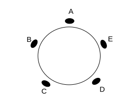
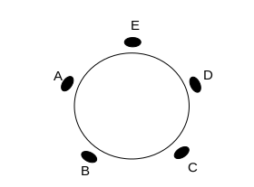

--- 
title: "Análise Combinatória, Probabilidade e Aplicações"
author: "Magno T F Severino"
date: "`r Sys.Date()`"
output: pdf_document
documentclass: book
bibliography:
- book.bib
- packages.bib
biblio-style: apalike
link-citations: yes
description: Notas de aula da disciplina.
site: bookdown::bookdown_site
---

<!-- \newtheorem{definition}{Definição} -->
<!-- \newtheorem{notation}{Notação}[section] -->
<!-- \newtheorem{example}{Exemplo}[section] -->


# Introdução {-}

Curso ministrado no Programa de Verão do IME-USP, em 2023.

Dias de aulas: 11/01/2021 à 26/02/2021

<!-- Dias de monitorias.  -->

<!-- Datas de provas. -->

<!-- Referências bibliográficas. -->

<!-- # # LISTA DE TAREFAS {-} -->
<!-- * Semana 1: 11 páginas - FEITO! REVISADO! SLIDE FEITO! -->
<!-- * Semana 2: 15 páginas - FEITO! REVISADO! SLIDE FEITO! -->
<!-- * Semana 3: 9 páginas - FEITO! REVISADO! SLIDE FEITO! -->
<!-- * Semana 4: 8 páginas - FEITO! REVISAO! SLIDE FEITO! -->
<!-- * Semana 5: 8 páginas - FEITO! -->
<!-- * Semana 6: 7 páginas - FEITO! -->
<!--   * arrumar tabela da semana 6 -->

<!-- * referencia teorema binomial inicio semana 5 -->
<!-- * adicionar exemplos prob condicional para o caso de dist. conjunta -->
<!-- * corrigir erro referencia fim da secao 4.2 -->


```{r include=FALSE}
library(kableExtra)

# automatically create a bib database for R packages
knitr::write_bib(c(
  .packages(), 'bookdown', 'knitr', 'rmarkdown'
), 'packages.bib')
```

<!--chapter:end:index.Rmd-->

---
output: html_document
editor_options: 
  chunk_output_type: console
---
# Semana 1 {#sem1}

## Conjuntos

```{definition, label="defConj"}
Um conjunto é uma coleção não ordenada de objetos.
Os objetos que constituem um conjunto são chamados **elementos do conjunto**.
```

```{remark}
$a \in A$ indica que $a$ é um elemento do conjunto $A$.
$b \notin B$ indica que $b$ *não* é um elemento do conjunto A.
Por convenção, vamos utilizar **letra minúscula** para representar elementos e **letra maiúscula** para conjuntos.
```

Existem duas maneiras de descrever um conjunto:

- Listar os elementos (quando possível);
- Através das propriedados do conjunto.

```{example, label="exInicial"} 


* O conjunto das vogais: $V = \{a, e, i, o, u\}$;
  
* O conjunto dos inteiros positivos ímpares menores que 10: $I = \{1,3,5,7,9\};$
  
* O conjunto dos inteiros positivos menores que 100: $A = \{1,2,3,\ldots,99\}.$

* $I = \{x\ |\ x,$ é inteiro, ímpar, positivo e menor que $10 \} =$ $\{x \in \mathbb{Z}^{+}|$ $x \text{ é ímpar e }$ $X < 10\}$.
  
* O conjunto de todos os números racionais positivos: $\mathbb{Q}^{+} =$  $\{x \in \mathbb{R}|$ $x  = \frac{p}{q},$ $\text{para alguns inteiros $p$ e $q$}\}.$
  
```


Notação:

- $\mathbb{N}$: conjunto dos números naturais;
- $\mathbb{Z}$: conjunto dos números inteiros;
- $\mathbb{Z}^{+}$: conjunto dos números inteiros positivos
- $\mathbb{Q}=\big\{\frac{p}{q} \ | \ p \in \mathbb{Z}, q \in \mathbb{Z} \ \text{e} \ q \in \mathbb{Z} \big\}$: conjunto dos números racionais;
- $\mathbb{R}$: conjunto dos números reais;
- $\mathbb{R}^{+}$: conjunto dos números reais positivos;
- $\emptyset$: conjunto vazio, não possui nenhum elemento.

```{remark}
Conjuntos podem conter outros conjuntos.
```

```{example}
$A = \{\mathbb{N}, \mathbb{Z}, \mathbb{Q}\}.$
```

<!-- ### Subconjuntos -->

```{definition, label="defSubConj", name="Subconjunto"}
O conjunto $A$ é um subconjunto de $B$, se, e somente se, todo elemento de $A$ também for elemento de $B$.
```

```{remark}
$A \subseteq B, \text{sse}, \forall a \in A \Leftrightarrow  a \in B$.

1. para mostrar que $A \nsubseteq B$, é necessário encontrar um elemento $x \in A$, tal que $x \notin B$.

2. para enfatizar que $A$ é um subconjunto de $B$, mas $A \ne B$, escrevemos $A \subset B$ (dizemos que $A$ é subconjunto próprio de $B$).

3. para mostrar que $A = B$, devemos mostrar que $A \subseteq B$ e $B \subseteq A$.

```

<!-- ### Cardinalidade -->

```{definition, label="defcardin", name="Cardinalidade"}
Seja $\mathcal{S}$ um conjunto. 
Se $\mathcal{S}$ tem exatamente $n$ elementos, $n \in \mathbb{Z}^{+}$, dizemos que $\mathcal{S}$ é finito e que tem cardinalidade $n$.
Notação: $|\mathcal{S}| = n$.
```

```{example}
A cardinalidade dos conjuntos definidos no Exemplo \@ref(exm:exInicial) é

- $|V| = 5$,

- $|I| = 5$,

- $|A| = 99$,

- $|\mathbb{Q}| = \infty$,
  
- $|\emptyset| = 0$.
  
```


```{definition, name="Conjunto infinito", label="definfty"}
Um conjunto é infinito se não é finito.
```

```{example}
$|\mathbb{Z}| = \infty.$
```

```{example, name="Hotel de Hilbert"}
Considere um hotel hipotético com infinitos quartos, todos ocupados - cada um com um hóspede. 
Suponha que um novo hóspede chega e gostaria de se acomodar no hotel. 
Se o hotel tivesse apenas um número finito de quartos, então é claro que o requerimento não poderia ser cumprido, mas como o hotel possui um número infinito de quartos então se movermos o hóspede do quarto 1 para o quarto 2, o hóspede do quarto 2 para o quarto 3 e assim por diante (simultaneamente), movendo o hóspede do quarto $N$ para o quarto $N+1$, podemos acomodar o novo hóspede no quarto 1, que agora está vago. 
Por um argumento análogo é possível alocar um número infinito (contável) de novos clientes: apenas mova o hóspede do quarto 1 para o quarto 2, o hóspede do quarto 2 para o quarto 4, e em geral do quarto $N$ para o quarto $2N$, assim todos os quartos de número ímpar estarão livres para os novos hóspedes. 
Veja mais [aqui](https://pt.wikipedia.org/wiki/Hotel_de_Hilbert).
```

Assita um [vídeo explicativo vídeo aqui](https://www.youtube.com/watch?v=WK47hxmVdv4).

<!-- ### Conjunto de Potências -->

```{definition, label="defconjpot", name="Conjunto de Potências"}
Dado um conjunto $\mathcal{S}$, o conjunto potência de $\mathcal{S}$ é o conjunto de todos os subconjuntos de $\mathcal{S}$, incluindo o conjunto vazio e o próprio $\mathcal{S}$.
Notação: $\mathcal{P}(\mathcal{S})$.
```

```{example}

Considere $\mathcal{S} = \{0,1,2\}$, então

$\mathcal{P}(\mathcal{S}) = \{\emptyset,  \{0\},  \{1\},  \{2\},  \{0,1\},  \{0,2\},  \{1,2\},  \underbrace{\{0,1,2\}}_{\mathcal{S}}  \}.$ 
```

```{remark}
Se um conjunto tem $n$ elementos, seu conjunto potência tem $2^n$ elementos (este fato será provado adiante).

```

<!-- ### Produto Cartesiano -->

```{definition, label="defprodcart", name="$n$-tupla"}
A $n$-tupla $(a_1, a_2, \ldots, a_n)$ é a coleção ordenada que tem $a_1$ como primeiro elemento, $a_2$ como segundo elemento e $a_n$ como $n$-ésimo elemento.
```

```{remark}
Duas $n$-tuplas $(a_1, \ldots, a_n)$ e $(b_1, \ldots, b_n)$ são iguais se, e somente se, $a_i = b_i, \forall i \in \{1, \ldots, n\}$.
```

```{definition,  label="defprodcart2", name="Produto Cartesiano"}
Sejam $A$ e $B$ conjuntos. 
O produto cartesiano entre $A$ e $B$, denotado por $A \times B$ é o conjunto dos pares ordenados $(a,b)$ em que $a \in A$ e $b \in B$.
Notação: $A \times B = \{(a,b):$ $a \in A \ \text{e} \ b \in B\}.$
```

```{example}
Sejam $A = \{1,2\} \ \text{e} \ B =  \{1,2,3\},$ então

$A \times B = \{(1,1), (1,2),  (1,3),  (2,1),  (2,2),  (2,3)\}.$ 
```

```{definition,  label="defprodcart3"}
O produto cartesiano dos conjuntos $A_1, A_2, \ldots, A_n$, denotado por $A \times A_2 \times \ldots \times A_n$ é o conjunto de n-tuplas ordenadas $(a_1, a_2, \ldots, a_n)$ em que $a_i \in A_i, \text{para} \ i=1,2,\ldots,n$.
Notação:
$A_1 \times A_2 \times \ldots \times A_n =$ $\{(a_1, a_2, \ldots, a_n):$ $a_i \in A_i, \ i=1,2,\ldots,n\}$.
```


### Operações entre conjuntos

```{definition, name = "União",  label="defunion"}
Sejam $A$ e $B$ conjuntos. 
A união dos conjuntos $A$ e $B$, denotado por $A \cup B$, é formada pelos elementos que estão em $A$ **ou** $B$, ou seja, que pertencem à pelo menos um conjunto.
Notação: $A \cup B = \{ x$ $|\ x \in A \ \mbox{ou}$ $\ x \in B\}$.
```

```{example, label="exUniao"}
Sejam $A = \{1,3,5\} \ \text{e} \ B =  \{1,2,3\}$, então

$A \cup B = \{(1,2,3,5)\}.$ 
```


```{definition, name = "Interseção",  label="defintersec"}
Sejam $A$ e $B$ conjuntos. 
A interseção dos conjuntos $A$ e $B$, denotado por $A \cap B$, é o conjunto formado pelos elementos que pertencem ao conjunto $A$ **e** ao conjunto $B$.
Notação:
$A \cap B = \{$ $x |\ x \in A$ $\ \mbox{e} \ x \in B\}$.
```


```{example, label="exIntersecao"}
Sejam $A = \{1,3,5\} \ \text{e} \ B =  \{1,2,3\}$, então

$A \cap B = \{(1,3)\}.$
```

```{definition, name = "Diferença",  label="defdifer"}
Sejam $A$ e $B$ conjuntos. 
A diferença dos conjuntos $A$ e $B$, denotada por $A \setminus B$, é o conjunto formado pelos elementos que pertencem ao conjunto $A$, mas não pertencem ao conjunto $B$.
Notação:
$A \setminus B =$ $\{x : x$ $\in A \ e$ $\ x \notin B\}.$
```

```{definition, name = "Complemento",  label="defcompl"}
Seja $\Omega$ o conjunto universal. 
O complemento de um conjunto $A$ e $B$, denotado por $\bar{A}$ ou $A^c$, é o complemento de $A$ em relação a $\Omega.$
Notação:
$A^c = \Omega \setminus A =$ $\{x :$ $x \notin A\}.$
```


```{r venndiag, echo=FALSE, engine='tikz', out.width='90%',  fig.cap='Diagrama de Venn que representa os conjuntos $A$ e $B$ dos exemplos anteriores.', fig.align = 'center', engine.opts = list(template = "latex/tikz2pdf.tex")}
\begin{center}

\tikzset{every picture/.style={line width=0.75pt}} %set default line width to 0.75pt        

\begin{tikzpicture}[x=0.75pt,y=0.75pt,yscale=-1,xscale=1]
%uncomment if require: \path (0,300); %set diagram left start at 0, and has height of 300

%Shape: Circle [id:dp2436306557760699] 
\draw   (100,99.5) .. controls (100,63.33) and (129.33,34) .. (165.5,34) .. controls (201.67,34) and (231,63.33) .. (231,99.5) .. controls (231,135.67) and (201.67,165) .. (165.5,165) .. controls (129.33,165) and (100,135.67) .. (100,99.5) -- cycle ;
%Shape: Circle [id:dp9832570701717033] 
\draw   (180,100) .. controls (180,64.1) and (209.1,35) .. (245,35) .. controls (280.9,35) and (310,64.1) .. (310,100) .. controls (310,135.9) and (280.9,165) .. (245,165) .. controls (209.1,165) and (180,135.9) .. (180,100) -- cycle ;
%Shape: Rectangle [id:dp7045960480023841] 
\draw   (46,12) -- (372,12) -- (372,189) -- (46,189) -- cycle ;

% Text Node
\draw (132,87) node [anchor=north west][inner sep=0.75pt]   [align=left] {5};
% Text Node
\draw (59,162) node [anchor=north west][inner sep=0.75pt]   [align=left] {$\displaystyle \Omega $};
% Text Node
\draw (110,31) node [anchor=north west][inner sep=0.75pt]   [align=left] {A};
% Text Node
\draw (287,32) node [anchor=north west][inner sep=0.75pt]   [align=left] {B};
% Text Node
\draw (259,84) node [anchor=north west][inner sep=0.75pt]   [align=left] {2};
% Text Node
\draw (199,79) node [anchor=north west][inner sep=0.75pt]   [align=left] {1\\3};

\end{tikzpicture}
\end{center}
```

### Identidades de conjuntos

```{example}
Prove que $\overline{A\cap B} =$ $\overline A \cup \overline B.$
```

```{solution}
A ideia é mostrar que (i) $\overline{A\cap B} \subseteq$ $\overline A \cup \overline B$ e, depois, (ii) $\overline A \cup$ $\overline B \subseteq \overline{A\cap B}.$
  
(i) Vamos mostrar que se $x \in \overline{A\cap B} \Rightarrow$ $x \in \overline A \cup \overline B.$

\begin{align}
x \in \overline{A\cap B} &\Rightarrow
x \notin A\cap B \quad \text{(def. do complemento)}\\
& \Rightarrow \neg(x \in A\cap B) \quad \text{(def. de não pertencer)}\\
& \Rightarrow \neg(x \in A) \text{ ou } \neg(x \in B)\\
& \Rightarrow x \notin A \text{ ou } x \notin B\\
& \Rightarrow x \in \overline A \cup \overline B.\\
\end{align}

Ou seja, $\overline{A\cap B} \subseteq$ $\overline A \cup \overline B.$
  
  
(ii) Vamos mostrar que se $x \in \overline A \cup \overline B \Rightarrow x \in \overline{A\cap B}.$
\begin{align}
x \in \overline A \cup \overline B &\Rightarrow
x \in \overline A \text{ ou } x \in \overline B \quad\text{(def. da união)}\\
& \Rightarrow x \notin A \text{ ou } x \notin B\quad\text{(def. do complemento)}\\
& \Rightarrow \neg(x \in A) \text{ ou } \neg(x \in B)\\
& \Rightarrow \neg(x \in A \text{ e } x \in B) \\
& \Rightarrow x \in \overline{A\cap B}.\\
\end{align}

Ou seja, $\overline A \cup \overline B \subseteq \overline{A\cap B}.$
```

### Uniões e interseções gerais

Considere $n$ conjuntos $A_1, A_2, \ldots, A_n:$

* sua união é $$\bigcup_{i=1}^{n}A_i = \{x: x \in A_i \text{ para algum $i$}\},$$
* sua interseção é $$\bigcap_{i=1}^{n}A_i = \{x: x \in A_i \text{ para todo $i$}\}.$$

```{example}
Para $i=1,2,\ldots,$ seja $A_i=\{i, i+1, i+2, \ldots\}$, temos

* $\bigcup_{i=1}^{n}A_i =$ $\bigcup_{i=1}^{n}\{i, i+1, i+2, \ldots\} =$ $\{1,2,3,\ldots\}=\mathbb{Z}^+$,

* $\bigcap_{i=1}^{n}A_i =$ $\bigcap_{i=1}^{n}\{i, i+1, i+2, \ldots\} =$ $\{n,n+1,n+2,\ldots\}=A_n$.

```

```{remark}
Podemos extender a notação anterior para um número enumerável de conjuntos, assim

* $A_1 \cup A_2 \cup \ldots \cup A_n \cup \ldots = \bigcup_{i=1}^{\infty}A_i,$
  
* $A_1 \cap A_2 \cap \ldots \cap A_n \cap \ldots = \bigcap_{i=1}^{\infty}A_i,$
  
```

Além disso, podemos generalizar a indexação do conjunto de índices.
Considere novamente os conjuntos $A_1, A_2, \ldots$ e seja $I$ um conjunto, então

* $\bigcup_{i\in I}A_i = \{x: \text{ existe } i\in I  \text{ tal que } x \in A_i\},$
* $\bigcap_{i\in I}A_i = \{x: x \in A_i \text{ para todo $i \in I$}\}.$

```{example}
Seja $A_i = \{1,2,\ldots, i\},$ $i=1,2,3, \ldots$, então

* $\bigcup_{i=1}^{\infty}A_i = \bigcup_{i=1}^{\infty}\{1,2,\ldots, i\}=\{1,2,3,\ldots\}=\mathbb{Z}^+,$
  
* $\bigcap_{i=1}^{\infty}A_i = \bigcap_{i=1}^{\infty}\{1,2,\ldots, i\}=\{1\}.$
  
```

```{definition, label="defPart", name="Partição"}
Seja $A$ um conjunto não vazio.
Uma partição de $A$ é uma familia de subconjuntos não vazios $A_1, A_2, \ldots, A_n$ tais que 
$$\bigcup_{i=1}^{n}A_i=A$$
e $A_i \cap A_j = \emptyset$ se $i \neq j.$
```

### Representação de conjuntos na linguagem `R`

Se você não tem conhecimento prévio de `R`, veja o Apêndice \@ref(S:apendiceR).
A linguagem `R` é bastante útil para manipulação de dados.
Podemos fazer todas as operações de conjuntos usando funções definidas na linguagem:

* função `union(A, B)`: $A \cup B$;
* função `intersect(A, B)`: $A \cap B$;
* função `setdiff(A, B)`: $A \setminus B$;

Sejam $A = \{1,2,3,4,5\}$, $B=\{4,5,6,7\}$.
A operação $A \cup B$ então é obtida pelo comando

```{r}
A <- c(1,2,3,4,5)
B <- c(4,5,6,7)

union(A,B)
```

A operação $A \cap B$ é obtida através comando
```{r}
intersect(A,B)
```

Finalmente, a operação $A \setminus B$ pode ser feita usando
```{r}
setdiff(A,B)
```

A utilização dessas funções em conjunto pode ser feita para obter operações mais complexas.

## Somatórios e produtórios

Somas como $a_k + a_{k+1} + \cdots + a_m$ podem ser escritas em forma compacta usando o símbolo somatório $\big(\sum\big)$:
$$\sum_{i=k}^{i=m}a_i=\sum_{i=k}^{m}a_i = a_k + a_{k+1} + \cdots + a_m.$$

```{example, label="ex19"}
$\sum_{j=-2}^{3}j^2 =$ $(-2)^2 + (-1)^2 + 0^2 + 1^2 + 2^2 + 3^2=19.$
```

```{theorem}
Seja $n$ um inteiro qualquer, $c$ um real qualquer e $a_1, \ldots, a_n$, $b_1, \ldots, b_n$ duas sequências de números.
Então

i.   $\sum_{i=1}^{n} c = nc,$
ii.  $\sum_{i=1}^{n} ca_i = c\big(\sum_{i=1}^{n}a_i\big),$
iii. $\sum_{i=1}^{n} (a_i + b_i) = \sum_{i=1}^{n}a_i + \sum_{i=1}^{n}b_i$,
iv.  $\sum_{i=1}^{p}a_i + \sum_{i=p+1}^{n}a_i = \sum_{i=1}^{n}a_i,$
v.   $\sum_{i=0}^{n} a_{p-i}=\sum_{i=p-n}^{p} a_{i}.$
```

```{proof}
A cargo do leitor.
```


O produto $a_k\cdot a_{k+1}\cdots a_m$ é denotado por $\prod_{i=k}^{m}a_i.$

```{example}
O fatorial $n!$ é definido por $n!=n(n-1)(n-2)\cdots 2\cdot 1,$ e $0!=1.$
Usando a notação de produtório, temos
$$\prod_{k=1}^{n}k = n!.$$
```

```{theorem}
Seja $n$ um inteiro qualquer, $c$ um real qualquer e $a_1, \ldots, a_n$, $b_1, \ldots, b_n$ duas sequências de números.
Então

i.   $\prod_{i=1}^{n}a_i b_i = \big(\prod_{i=1}^{n}a_i\big)\big(\prod_{i=1}^{n}b_i\big).$
ii.  $\prod_{i=1}^{n} c = c^n.$
iii. $\prod_{i=1}^{n} ca_i = c^n\prod_{i=1}^{n}a_i.$
iv.  $\prod_{i=1}^{n} a_i^2 = \big(\prod_{i=1}^{n}a_i\big)^2,$ em geral, $\prod_{i=1}^{n} a_i^c = \big(\prod_{i=1}^{n}a_i\big)^c.$
```

```{proof}
A cargo do leitor.
```

```{example, label="exProd"}

a. \begin{align}
\prod_{i=1}^{3} i(i+1) &= (1\cdot 2)(2\cdot 3)(3\cdot 4) \\
&= (1\cdot 2\cdot 3)(2\cdot 3\cdot 4)\\
&= \bigg(\prod_{i=1}^{3}i\bigg)\bigg(\prod_{i=1}^{3}(i+1)\bigg).
\end{align}

  
b. $\prod_{i=1}^{3} 3i =$ $(3\cdot 1)(3\cdot 2)(3\cdot 3) =$ $3^3\prod_{i=1}^{3}i.$

  
c. $\prod_{i=1}^{4}(i+1)^2 =$ $2^2\cdot 3^2\cdot 4^2\cdot 5^2 =$ $(2\cdot 3\cdot 4\cdot 5)^2 =$ $\big(\prod_{i=1}^{4}(i+1)\big)^2.$
```

### Somatórios e produtórios na linguagem `R`
Considere a soma $\sum_{j=-2}^{3}j^2$ apresentada no Exemplo \@ref(exm:ex19).
Duas formas de representá-la em `R` podem ser vistas abaixo, utilizando a função `sum`.
```{r}
sum(c(-2,-1,0,1,2,3)^2)

sum((-2:3)^2)
```
Caso tenha dúvidas em relação ao operador `:`, veja a Seção \@ref(S:sequencia).

Podemos utilizar a função `prod` para calcular produtórios.
Considere o produtório $\prod_{i=1}^{3} 3i$ apresentado no Exemplo \@ref(exm:exProd).
Veja como obtê-lo através de dois comandos no `R`:

```{r}
prod(c(3*1, 3*2, 3*3))

prod(3*c(1:3))
```

## Princípio de indução matemática
Este princípio é uma ferramenta útil para provar resultados envolvendo números inteiros.

### Primeira forma do Princípio de Indução Matemática {-}

Seja $P(n)$ uma propriedade relativa aos inteiros.
Se

* $P(n)$ é verdadeira para $n=1$, e 

* $P(k)$ é verdadeira e implica que $P(k+1)$ é verdadeira,

então $P(n)$ é verdadeira pra todo $n \geq 1$.

Para aplicar a primeira forma do Princípio de Indução Matemática (PIM), devemos seguir os passos seguintes 

1. Verificar se $P(n)$ é verdadeira para $n=1$ (passo inicial);

2. Assumir $P(k)$ verdadeira (hipótese de indução) e provar que $P(k+1)$ é verdadeira;

3. Se 1) e 2) valem, concluir que $P(n)$ é válida para qualquer $n \geq 1.$

```{example}
Mostre que a soma dos cubos de três inteiros positivos consecutivos é um múltiplo de $9$.
```

```{remark}
Lembre-se que $(a+b)^3 = a^3+3a^2b + 3ab^2 + b^3$.
```

```{solution}
Vamos usar o PIM.

1. Passo inicial: para $n=1$
  \begin{align}
    1^3 + (1+1)^3 + (1+2)^3 &= 1 + 8 + 27\\
    &= 36 \\
    &= 9 \cdot 4.
  \end{align}

2. Hipótese de indução: para $n=k$,
$$k^3 + (k+1)^3 + (k+2)^3 = 9L,$$
em que $L$ é um inteiro. 
Devemos mostrar que 
$$(k+1)^3 + [(k+1) + 1]^3 + [(k+1)+2]^3 = 9M,$$
para algum inteiro $M$.
\begin{align}
(k+1)^3 + [(k+1) + 1]^3 + [(k+1)+2]^3 &= (k+1)^3 + (k+2)^3 + (k+3)^3\\
&= (k+1)^3 + (k+2)^3 + (k^3 + 3k^2 3 + 3k9 + 27)\\
&= \underbrace{(k+1)^3 + (k+2)^3 + k^3}_{9L} + 9K^2 + 27k + 27\\
&= 9L + 9k^2 + 27k + 27\\
&= 9(L + k^2 + 3k + 3)\\
&= 9M,
\end{align}
em que $M = L + 3k^2 + 3k + 3.$
```

```{example}
Conjecture uma fórmula para a soma dos $n$ primeiros inteiros positivos ímpares e use indução para estabelecer a conjectura.
```

```{solution}
As primeiras cinco somas são tais que 
\begin{align}
1 &= 1^2 \\
1 + 3 = 4 &= 2^2\\
1 + 3 + 5 = 9 &= 3^2\\
1 + 3 + 5 + 7 = 16 &= 4^2\\
1 + 3 + 5 + 7 + 9 = 25 &= 5^2.
\end{align}

Portanto, a conjectura é $\sum_{i=1}^{n}(2i-1)=n^2.$
Vamos usar o princípio de indução matemática para prová-la.

1. Passo inicial: $n=1$
  $$\sum_{i=1}^{1}(2i-1) = 1 = 1^2.$$

2. Hipótese de indução: supor que vale para $n=k$.
Considere a soma para $n=k+1$
\begin{align}
\sum_{i=1}^{k+1}(2i-1) &= \sum_{i=1}^{k}(2i-1) + [2(k+1)-1]\\
&= k^2 + 2k + 1 \\
&= (k+1)^2.
\end{align}
```

```{example}
Prove, usando indução, que para qualquer $n$ natural, 
$$\prod_{i=1}^{n}a_i^m = \bigg(\prod_{i=1}^{n}a_i\bigg)^m.$$
```

```{solution}
1. Passo inicial: $\prod_{i=1}^{1}a_i^m = a_1^m = \bigg(\prod_{i=1}^{1}a_i\bigg)^m.$
  
2. Hipótese de indução: supor que vale para $n=k.$ 
  $$\prod_{i=1}^{k}a_i^m = \bigg(\prod_{i=1}^{k}a_i\bigg)^m.$$
  Assim,
\begin{align}
  \prod_{i=1}^{k+1}a_i^m &= \bigg(\prod_{i=1}^{k}a_i^m\bigg) \bigg(\prod_{i=k+1}^{k+1}a_i^m\bigg) \\
&=\bigg(\prod_{i=1}^{k}a_i\bigg)^m a_{k+1}^{m} \\
&= \bigg[\bigg(\prod_{i=1}^{k}a_i\bigg)a_{k+1}\bigg]^m\\
&= \bigg(\prod_{i=1}^{k+1}a_i\bigg)^m.
\end{align}
```

```{remark}
A primeira forma do princípio de indução matemática é útil em casos em que o $n$-ésimo termo da sequência pode ser calculado a partir de $n$ e do antecessor imediato na sequência.
Em situações em que a sequência é definida de maneira recursiva (depende de dois ou mais termos anteriores), é conveniente utilizar a segunda forma do princípio da indução.
```

### Segunda forma do princípio de Indução Matemática {-}

Seja $P(n)$ uma propriedade relativa aos inteiros.
Se 

i. $P(n)$ é verdadeira para $n=1$ e
ii. $P(n)$ é verdadeira para $1\leq n \leq k$ e implica que $P(k+1)$ é verdadeira, então $P(n)$ é verdadeira para todo inteiro $n \geq 1.$

```{example}
Definimos recursivamente, para todo $n$ a função $\mu(n)$, por
\begin{align}
\mu(1) &= 1\\
\mu(2) &= 5\\
\mu(n) &= \mu(n-1) + 2\mu(n-2), \forall \ n>2.
\end{align}
Prove, usando indução, que $\mu(n) = 2^n + (-1)^n.$
```

```{solution}


i. Temos que $2^1 + (-1)^1 =$ $1 = \mu(1)$ e $2^2+(-1)^2=5=$ $\mu(2),$ portanto $p(1)$ e $p(2)$ são verdadeiras.

ii. Supor que, para todo inteiro $n$ tal que $2 < n \leq k$ a equação $\mu(n) = \mu(n-1) + 2\mu(n-2)$ é válida.
Devemos provar que a equação é válida para $n=k+1$.
Assim,

\begin{align}
\mu(k+1) &= \mu(k) + 2\mu(k-1)\\
&= 2^k + (-1)^k + 2[2^{k-1} + (-1)^{k-1}]\\
&= 2\cdot 2^k + (-1)^k + 2(-1)^{k-1}\\
&= 2^{k+1} + (-1)^{k-1}[(-1)+2]\\
&= 2^{k+1} + (-1)^{k-1}[1] \qquad{\text{(note que $(-1)^{k-1}=(-1)^{k+1}$})}\\
&= 2^{k+1} + (-1)^{k+1}.
\end{align}

Dessa forma, com $P(1)$, $P(2)$, $\ldots$, $P(k)$ são válidas, então $P(k+1)$ também é.
```

```{example, name="Número de subconjuntos de um conjunto finito"}
Prove que se $\mathcal{S}$ é um conjunto finito com $n$ elementos, em que $n$ é inteiro não negativo, então, $\mathcal{S}$ tem $2^n$ subconjuntos.
```

```{solution}


i. Temos que $P(0)$ é verdadeiro, i.e., o conjunto vazio tem $2^0=1$ subconjunto.

ii. Supor verdadeiro para $n=k$, ou seja, todo conjunto com $k$ elementos tem $2^k$ subconjuntos.
Vamos mostrar que vale para $n=k+1.$
Seja $\mathcal{T}$ um conjunto com $k+1$ elementos.
Então, podemos escrever 
$$\mathcal{T} = \mathcal{S}\cup\{a\},$$
em que $a \in \mathcal{T}$ e $\mathcal{S}=\mathcal{T}\setminus\{a\},$ assim, $|\mathcal{S}|=k.$
Os subconjuntos de $\mathcal{T}$ podem ser obtidos da seguinte forma:
para cada subconjunto $\mathcal{X}$ de $\mathcal{S}$, existem dois subconjuntos de $\mathcal{T}$, a saber, $\mathcal{X}$ e $\mathcal{X}\cup \{a\}.$
Veja na figura \@ref(fig:figconjXTS).
Essa abordagem inclui todos os subconjuntos de $\mathcal{T}$, e são todos distintos.
Vamos agora usar a hipótese de indução.
$\mathcal{S}$ tem $2^k$ subconjuntos, pois tem $k$ elementos.
Também sabemos que existem 2 subconjuntos de $\mathcal{T}$ para cada subconjunto de $\mathcal{S}$.
Então, temos $2\cdot 2^k = 2^{k+1}$ subconjuntos de $\mathcal{T}.$
```


```{r figconjXTS, echo=FALSE, engine='tikz', out.width='90%',  fig.cap='Decomposição do conjunto.', fig.align = 'center', engine.opts = list(template = "latex/tikz2pdf.tex")}
\begin{center}


\tikzset{every picture/.style={line width=0.75pt}} %set default line width to 0.75pt        

\begin{tikzpicture}[x=0.75pt,y=0.75pt,yscale=-1,xscale=1]
%uncomment if require: \path (0,221); %set diagram left start at 0, and has height of 221

%Shape: Ellipse [id:dp5251520053135463] 
\draw   (160,101.5) .. controls (160,75.82) and (183.84,55) .. (213.25,55) .. controls (242.66,55) and (266.5,75.82) .. (266.5,101.5) .. controls (266.5,127.18) and (242.66,148) .. (213.25,148) .. controls (183.84,148) and (160,127.18) .. (160,101.5) -- cycle ;
%Shape: Ellipse [id:dp18360452950622497] 
\draw  [dash pattern={on 4.5pt off 4.5pt}] (181.5,94.5) .. controls (181.5,83.18) and (193.48,74) .. (208.25,74) .. controls (223.02,74) and (235,83.18) .. (235,94.5) .. controls (235,105.82) and (223.02,115) .. (208.25,115) .. controls (193.48,115) and (181.5,105.82) .. (181.5,94.5) -- cycle ;
%Down Arrow [id:dp09213635274229892] 
\draw  [draw opacity=0][fill={rgb, 255:red, 128; green, 128; blue, 128 }  ,fill opacity=1 ] (332.33,85.45) -- (332.27,78.84) -- (282.39,98.99) -- (282.28,85.77) -- (332.16,65.62) -- (332.1,59.01) -- (365.47,58.79) -- cycle ;
%Down Arrow [id:dp3266963265865088] 
\draw  [draw opacity=0][fill={rgb, 255:red, 128; green, 128; blue, 128 }  ,fill opacity=1 ] (330.44,152.1) -- (330.76,145.5) -- (281.63,125.64) -- (282.29,112.44) -- (331.42,132.29) -- (331.75,125.69) -- (363.85,152.13) -- cycle ;
%Shape: Ellipse [id:dp5774371437267407] 
\draw   (384,54) .. controls (384,37.43) and (410.53,24) .. (443.25,24) .. controls (475.97,24) and (502.5,37.43) .. (502.5,54) .. controls (502.5,70.57) and (475.97,84) .. (443.25,84) .. controls (410.53,84) and (384,70.57) .. (384,54) -- cycle ;
%Shape: Ellipse [id:dp9543028121077344] 
\draw   (382,152) .. controls (382,135.43) and (408.53,122) .. (441.25,122) .. controls (473.97,122) and (500.5,135.43) .. (500.5,152) .. controls (500.5,168.57) and (473.97,182) .. (441.25,182) .. controls (408.53,182) and (382,168.57) .. (382,152) -- cycle ;
%Shape: Ellipse [id:dp32217111713207447] 
\draw  [dash pattern={on 4.5pt off 4.5pt}] (399,53.5) .. controls (399,42.18) and (410.98,33) .. (425.75,33) .. controls (440.52,33) and (452.5,42.18) .. (452.5,53.5) .. controls (452.5,64.82) and (440.52,74) .. (425.75,74) .. controls (410.98,74) and (399,64.82) .. (399,53.5) -- cycle ;
%Shape: Ellipse [id:dp7508519170869032] 
\draw  [dash pattern={on 4.5pt off 4.5pt}] (401.13,152) .. controls (401.13,140.68) and (419.09,131.5) .. (441.25,131.5) .. controls (463.41,131.5) and (481.38,140.68) .. (481.38,152) .. controls (481.38,163.32) and (463.41,172.5) .. (441.25,172.5) .. controls (419.09,172.5) and (401.13,163.32) .. (401.13,152) -- cycle ;


% Text Node
\draw (164,135.4) node [anchor=north west][inner sep=0.75pt]    {$\mathcal{S}$};
% Text Node
\draw (204,87.4) node [anchor=north west][inner sep=0.75pt]    {$\mathcal{X}$};
% Text Node
\draw (419,43.4) node [anchor=north west][inner sep=0.75pt]    {$\mathcal{X}$};
% Text Node
\draw (412.5,144.4) node [anchor=north west][inner sep=0.75pt]    {$\mathcal{X} \ \cup \ \{a\}$};
% Text Node
\draw (468,45.4) node [anchor=north west][inner sep=0.75pt]    {$\cdot a$};
% Text Node
\draw (485,174.4) node [anchor=north west][inner sep=0.75pt]    {$\mathcal{T}$};
% Text Node
\draw (485,76.4) node [anchor=north west][inner sep=0.75pt]    {$\mathcal{T}$};


\end{tikzpicture}
\end{center}
```

## Princípio aditivo e multiplicativo

```{definition, name="Princípio aditivo", label="defAaditivo"}
Se $A$ e $B$ são dois conjuntos disjuntos ($A \cap B = \emptyset$) com $p$ e $q$ elementos, respectivamente, então $A \cup B$ possui $p + q$ elementos.
```


```{example}
Suponha que tenham entrado em cartaz 3 filmes e 2 peças de teatro, e que Marcelo tenha dinheiro para assistir apenas 1 evento.
Quantos são os programas que Marcelo pode escolher fazer?
```


```{solution}
Defina \[A = \{x \vert x \text{ é filme}\} = \{F_1, F_2, F_3\}\]
  e
\[B = \{y \vert y \text{ é teatro}\} = \{T_1, T_2\}.\]
Então, 
\[A \cup B = \{x \vert x \text{ é filme ou peça}\}.\]
$\vert A \vert = 3$ e $\vert B \vert = 2$, logo $\vert A \cup B \vert = 5$.
```


```{definition, name="Princípio multiplicativo", label="defMultiplicativo"}
Se um evento $A$ pode ocorrer de $m$ maneiras diferentes, outro evento $B$ pode ocorrer de $n$ maneiras diferentes, então o número de maneiras de ocorrer o evento $A$ seguido de $B$ é $m\times n$.
Em conjuntos, se $|A|=m$ e $|B|=n$, então $|A\times B| = m \times n$.
```


```{example}
No exemplo anterior, se Marcelo tiver dinheiro para assitir a um filme e a uma peça de teatro, quantos sas os programas que ele pode escolher fazer?
```


```{solution}
$|A|=3$ e $|B|=2$.
Também, $|A\cap B| = \emptyset$.
Então, $|A \times B| = 6.$
```


#### Extensão do princípio aditivo {-} 
Se $A_1, A_2, \ldots, A_n$ são conjuntos, disjuntos 2 a 2, e se $A_i$ possui $a_i$ elementos, então a união $\bigcup_{i=1}^{n}A_i$ possui $\sum_{i=1}^{n}a_i$ elementos.


####  Extensão do princípio multiplicativo {-}
Se um evento $A_i$ pode ocorrer de $m_i$ maneiras diferentes, $i = 1,2,\ldots, n$, então esses $n$ eventos podem ocorrer, em sucessão, de $m_1 \times m_2 \times \cdots \times m_n$ maneiras diferentes.

Em linguagem de conjuntos, se $A_1, A_2, \ldots, A_n$ são conjuntos finitos com $|A_i|=m_i$,  $i = 1,2,\ldots, n$, então, se $A_i \cap A_j = \emptyset$, $i \neq j$,
$$ |A_1 \cup A_2 \cup \cdots \cup A_n| =  \sum_{i=1}^{n}|A_i|,$$
$$ |A_1 \times A_2 \times \cdots \times A_n| =  \prod_{i=1}^{n}|A_i|.$$

### Aplicações dos Princípios Aditivo e Multiplicativo

```{example}
Um amigo mostrou-me 5 livros diferentes de matematica, 7 de física e 10 de química e pediu-me para escolher dois livros com a condição de que eles não fossem da mesma matéria. De quantas maneiras posso  escolhê-los?
```

```{solution}
Posso fazer as seguintes escolhas:
  
\[ \left.\begin{array}{ll}
\text{a)}& \text{Matemática e física: } 5 \times 7 = 35 \text{ maneiras;} \\ 
\text{b)}& \text{Matemática e química: } 5 \times 10 = 50 \text{ maneiras;} \\ 
\text{c)}& \text{Física e química: } 7 \times 10 = 70 \text{ maneiras.}
\end{array}\right\} \text{(princípio multiplicativo)}
\]

Como minhas escolhas só podem ocorrer dentre uma das possibilidades a), b) ou c), então, pelo princípio aditivo, $35 + 50 + 70 = 155$ é o número de maneiras de fazer essas escolhas.
```


```{example}
Quantos são os números de 9 dígitos que podemos formar com todos os dígitos $1, 1, 1, 1, 1, 1, 1, 2, 3$?
```

```{solution}
Se, primeiramente, colocarmos todoos os dígitos $1$´s, deixando um espaço entre eles, teremos
$$\_1\_1\_1\_1\_1\_1\_1\_.$$
Há $8$ espaçoes nos quais podem ser colocador os dígitos $2$ e $3$. 
Se colocarmos o $2$ primeiro, uma entre as 8 possibilidades é 
$$\_1\_2\_1\_1\_1\_1\_1\_1\_.$$
Agora há $9$ espaços onde o dígito $3$ pode ser colocado.
Portanto, $8 \times 9 = 72$ são os números formados com 9 dígitos, sendo sete $1$'s, um 2 e um 3.
```

```{example}
Há 12 mulheres e 10 homens, 5 deles (3 mulheres e 2 homens) são irmãos e os restantes não possuem parentesco. 
Quantos são os casamentos heterossexuais possíveis?
```

```{solution}


- Considerando as 3 mulheres que possuem irmãos (2), ha $3\times 8=24$ casamentos possíveis;
- Considerando as 9 mulheres que não possuem irmãos, há $9\times 10=90$ casamentos  possíveis;

portanto, pelo princípio aditivo, há $24+90 = 114$ casamentos heterosexuais possíveis.
```


## Permutação

```{definition, name="Permutação", label="defPermutacao"}
Uma permutação de $n$ objetos distintos é qualquer agrupamento ordenado desses objetos, de modo que, se denominarmos $P_n$ o número das permutações simples dos $n$ objetos, então
$$P_n = n(n-1)(n-2)\cdots 1 = n!.$$
```

```{example, label="exPosicoes"}
Considerando os digitos $1, 2, 3, 4$ e $5$, quantos números de 2 algarismos distintos podem ser formados?
```

```{solution}
Existem duas posições a serem preenchidas $[\text{Pos}_1][\text{Pos}_2]$.
A posição $[\text{Pos}_1]$ pode ser preenchida de 5 maneiras diferentes, restando, portanto, 4 dígitos que podem ocupar a posição $[\text{Pos}_2]$.
Então há $5\times 4 = 20$ números de 2 algarismos distintos que podem ser formados com os 5 digitos disponíveis.
```

<!--chapter:end:01-semana1.Rmd-->

# Semana 2 {#sem2}
```{example, label="exConjunto15"}
Dado o conjunto $A = \{1,2,3,4,5\}$, quantos subconjuntos de 2 elementos $A$ possui?
```

```{solution}
Vamos listar:
\[
  \left.\begin{matrix}
A_1 = \{1,2\}, & A_2 = \{1,3\},\\ 
A_3 = \{1,4\}, & A_4 = \{1,5\},\\ 
A_5 = \{2,3\}, & A_6 = \{2,4\},\\ 
A_7 = \{2,5\}, & A_9 = \{3,4\},\\ 
A_9 = \{3,5\}, & A_{10} = \{4,5\}. 
\end{matrix}\right.
\]
Ao todo são 10 subconjuntos de 2 elementos formados com os 5 elementos de $A$.
```

*Atenção!* No Exemplo \@ref(exm:exPosicoes), obtivemos 20 números de 2 algarismos diferentes e no Exemplo \@ref(exm:exConjunto15) obtivemos 10 subconjuntos de 2 elementos.
Observe que $12 \neq 21$, mas $\{1,2\}=\{2,1\}$.
Pelo princípio multiplicativo, obtivemos $5\times 4=20$, considerando a ordem de colocação dos dígitos.
Na formação de  subconjuntos a ordem não importa, devemos dividir o resultado anterior por $2 = 2\times 1 = 2!$, isto é, pela permutação de 2 que é o número de elementos em cada subconjunto.

```{example}
Quantos subconjuntos possui o conjunto $A = \{a,b,c\}$?
```

```{solution}
Vamos listar: $\emptyset, \{a\}, \{b\}, \{c\}, \{a,b\}, \{a,c\}, \{b,c\}, \{a,b,c\}$.
Ao todo há 8 subconjuntos.
Em relação aos elementos, podemos dizer que cada um deles **aparece** ou **não aparece** nos subconjuntos.
Então, para o elemento $a$ temos 2 possibilidades quanto à sua presença no subconjunto (aparecer ou não).
O mesmo para $b$ e $c$.
Pelo princípio multiplicativo, temos $2 \times 2 \times 2 = 8$ subconjuntos de $A$.
```


```{example}
Quantos subconjuntos possui um conjunto $A$ com $n$ elementos?
```

```{solution}
Pelo exemplo anterior, cada elemento de $A$ pode ou não estar presente num determinado subconjunto e, pelo fato de $A$ ter $n$ elementos, então $A$ possui $2\times 2 \times \cdots \times 2 = 2^{n}$ subconjuntos.
```

```{example}
De quantos modos podemos formar uma roda com 5 crianças?
```

```{solution}
Parece que para formar a roda com as crianças basta escolher uma ordem para elas, o que pode ser feito de $5!=120$ modos.
Mas veja, na Figura \@ref(fig:figRoda), que as rodas $ABCDE$ e $EABCD$ são iguais, pois em uma roda o que importa é a posição relativa das crianças entre si.
A roda $ABCDE$ pode ser girada para se tornar $EABCD$.
Como cada roda pode ser girada de 5 formas, a nossa contagem de 120 rodas contou cada uma delas 5 vezes, assim, a resposta é $120/5=24$.
```

<!-- se o tikz nao funcionar, usar as figuras abaixo 
*Figuras geradas pela ferramenta [https://www.mathcha.io/editor]* 
r `
r ` -->


```{r figRoda, echo=FALSE, engine='tikz', out.width='90%',  fig.cap='Roda com cinco crianças.', fig.align = 'center', engine.opts = list(template = "latex/tikz2pdf.tex")}
\begin{center}


\tikzset{every picture/.style={line width=0.75pt}} %set default line width to 0.75pt        

\begin{tikzpicture}[x=0.75pt,y=0.75pt,yscale=-1,xscale=1]
%uncomment if require: \path (0,236); %set diagram left start at 0, and has height of 236

%Shape: Ellipse [id:dp34470311589558866] 
\draw   (127,126.34) .. controls (127,93.95) and (155.32,67.69) .. (190.25,67.69) .. controls (225.18,67.69) and (253.5,93.95) .. (253.5,126.34) .. controls (253.5,158.74) and (225.18,185) .. (190.25,185) .. controls (155.32,185) and (127,158.74) .. (127,126.34) -- cycle ;
%Shape: Ellipse [id:dp6599313452344084] 
\draw  [fill={rgb, 255:red, 0; green, 0; blue, 0 }  ,fill opacity=1 ] (182.23,55.69) .. controls (182.23,52.84) and (186.27,50.53) .. (191.25,50.53) .. controls (196.23,50.53) and (200.27,52.84) .. (200.27,55.69) .. controls (200.27,58.54) and (196.23,60.84) .. (191.25,60.84) .. controls (186.27,60.84) and (182.23,58.54) .. (182.23,55.69) -- cycle ;
%Shape: Ellipse [id:dp7689410690620535] 
\draw  [fill={rgb, 255:red, 0; green, 0; blue, 0 }  ,fill opacity=1 ] (237.7,182.93) .. controls (236.14,180.55) and (238.26,176.41) .. (242.43,173.68) .. controls (246.6,170.96) and (251.25,170.68) .. (252.8,173.07) .. controls (254.36,175.45) and (252.24,179.59) .. (248.07,182.32) .. controls (243.9,185.04) and (239.25,185.32) .. (237.7,182.93) -- cycle ;
%Shape: Ellipse [id:dp37952256808104967] 
\draw  [fill={rgb, 255:red, 0; green, 0; blue, 0 }  ,fill opacity=1 ] (114.24,109.19) .. controls (111.87,107.61) and (112.19,102.97) .. (114.96,98.82) .. controls (117.73,94.68) and (121.9,92.6) .. (124.26,94.18) .. controls (126.63,95.77) and (126.31,100.41) .. (123.54,104.55) .. controls (120.77,108.7) and (116.6,110.77) .. (114.24,109.19) -- cycle ;
%Shape: Ellipse [id:dp6179971973259972] 
\draw  [fill={rgb, 255:red, 0; green, 0; blue, 0 }  ,fill opacity=1 ] (256.38,94.54) .. controls (258.95,93.31) and (262.77,95.97) .. (264.91,100.48) .. controls (267.05,104.98) and (266.69,109.62) .. (264.12,110.84) .. controls (261.55,112.06) and (257.73,109.4) .. (255.59,104.9) .. controls (253.45,100.4) and (253.81,95.76) .. (256.38,94.54) -- cycle ;
%Shape: Ellipse [id:dp5611562061729183] 
\draw  [fill={rgb, 255:red, 0; green, 0; blue, 0 }  ,fill opacity=1 ] (135.18,178.65) .. controls (136.46,176.1) and (141.1,175.85) .. (145.56,178.08) .. controls (150.01,180.31) and (152.59,184.18) .. (151.32,186.73) .. controls (150.04,189.27) and (145.4,189.53) .. (140.94,187.3) .. controls (136.49,185.07) and (133.91,181.19) .. (135.18,178.65) -- cycle ;

%Shape: Ellipse [id:dp14157568108618346] 
\draw   (375,122.34) .. controls (375,89.95) and (403.32,63.69) .. (438.25,63.69) .. controls (473.18,63.69) and (501.5,89.95) .. (501.5,122.34) .. controls (501.5,154.74) and (473.18,181) .. (438.25,181) .. controls (403.32,181) and (375,154.74) .. (375,122.34) -- cycle ;
%Shape: Ellipse [id:dp6519245043873838] 
\draw  [fill={rgb, 255:red, 0; green, 0; blue, 0 }  ,fill opacity=1 ] (430.23,51.69) .. controls (430.23,48.84) and (434.27,46.53) .. (439.25,46.53) .. controls (444.23,46.53) and (448.27,48.84) .. (448.27,51.69) .. controls (448.27,54.54) and (444.23,56.84) .. (439.25,56.84) .. controls (434.27,56.84) and (430.23,54.54) .. (430.23,51.69) -- cycle ;
%Shape: Ellipse [id:dp11214800106098388] 
\draw  [fill={rgb, 255:red, 0; green, 0; blue, 0 }  ,fill opacity=1 ] (485.7,178.93) .. controls (484.14,176.55) and (486.26,172.41) .. (490.43,169.68) .. controls (494.6,166.96) and (499.25,166.68) .. (500.8,169.07) .. controls (502.36,171.45) and (500.24,175.59) .. (496.07,178.32) .. controls (491.9,181.04) and (487.25,181.32) .. (485.7,178.93) -- cycle ;
%Shape: Ellipse [id:dp7458939573908205] 
\draw  [fill={rgb, 255:red, 0; green, 0; blue, 0 }  ,fill opacity=1 ] (362.24,105.19) .. controls (359.87,103.61) and (360.19,98.97) .. (362.96,94.82) .. controls (365.73,90.68) and (369.9,88.6) .. (372.26,90.18) .. controls (374.63,91.77) and (374.31,96.41) .. (371.54,100.55) .. controls (368.77,104.7) and (364.6,106.77) .. (362.24,105.19) -- cycle ;
%Shape: Ellipse [id:dp8735185255535125] 
\draw  [fill={rgb, 255:red, 0; green, 0; blue, 0 }  ,fill opacity=1 ] (504.38,90.54) .. controls (506.95,89.31) and (510.77,91.97) .. (512.91,96.48) .. controls (515.05,100.98) and (514.69,105.62) .. (512.12,106.84) .. controls (509.55,108.06) and (505.73,105.4) .. (503.59,100.9) .. controls (501.45,96.4) and (501.81,91.76) .. (504.38,90.54) -- cycle ;
%Shape: Ellipse [id:dp7766849583583963] 
\draw  [fill={rgb, 255:red, 0; green, 0; blue, 0 }  ,fill opacity=1 ] (383.18,174.65) .. controls (384.46,172.1) and (389.1,171.85) .. (393.56,174.08) .. controls (398.01,176.31) and (400.59,180.18) .. (399.32,182.73) .. controls (398.04,185.27) and (393.4,185.53) .. (388.94,183.3) .. controls (384.49,181.07) and (381.91,177.19) .. (383.18,174.65) -- cycle ;


% Text Node
\draw (187,27) node [anchor=north west][inner sep=0.75pt]   [align=left] {A};
% Text Node
\draw (267,83) node [anchor=north west][inner sep=0.75pt]   [align=left] {E};
% Text Node
\draw (250.07,185.32) node [anchor=north west][inner sep=0.75pt]   [align=left] {D};
% Text Node
\draw (132,189) node [anchor=north west][inner sep=0.75pt]   [align=left] {C};
% Text Node
\draw (102,84) node [anchor=north west][inner sep=0.75pt]   [align=left] {B};
% Text Node
\draw (350,80) node [anchor=north west][inner sep=0.75pt]   [align=left] {A};
% Text Node
\draw (380,185) node [anchor=north west][inner sep=0.75pt]   [align=left] {B};
% Text Node
\draw (498.07,181.32) node [anchor=north west][inner sep=0.75pt]   [align=left] {C};
% Text Node
\draw (515,79) node [anchor=north west][inner sep=0.75pt]   [align=left] {D};
% Text Node
\draw (435,24) node [anchor=north west][inner sep=0.75pt]   [align=left] {E};


\end{tikzpicture}
\end{center}
```


```{example}
De quantos modos podemos dividir 8 pessoas em dois grupos de 4 pessoas cada?
```

```{solution}
Vamos colocar as 8 pessoas em fila e dividi-las de modo que um grupo seja formado pelas 4 primeiras e o outro pelas 4 últimas.
Como há $8!$ modos de colocá-las na fila, a resposta parece ser $8!$.
Considere a divisão $abcd|efgh$.
Note que ela é idêntica à $efgh|abcd$.
Na nossa contagem de $8!$, essas divisões foram contadas como se fossem distintas.
Também, divisões como $abcd|efgh$ e $cabd|efgh$, que diferem-se pela ordem dos elementos em cada grupo, foram contadas como se fossem distintas.
Cada divisão foi contada $2\times 4!\times 4!$ vezes ($2$ por causa da ordem dos grupos, $4!$ por causa da ordem dos elementos no primeiro grupo e $4!$ por causa da ordem dos elementos no segundo grupo).
Assim, o número de divisões é 
$$\frac{8!}{2\cdot 4!4!}=35.$$
```

```{example}
Quantos são os divisores do número 126.000?
```

```{solution}
Ao fatorá-lo, obtemos $N=126000=2^4\cdot 3^2\cdot 5^3\cdot 7$. 
Note que nos divisores de $N$

* o expoente do fator $2$ pode variar de 0 a 4 ($2^0, 2^1, 2^2, 2^3, 2^4$);
* o expoente do fator $3$ pode variar de 0 a 2 ($3^0, 3^1, 3^2$);
* o expoente do fator $5$ pode variar de 0 a 3 ($5^0, 5^1, 5^2, 5^3$);
* o expoente do fator $7$ pode variar de 0 a 1 ($7^0, 7^1$).

Então, representando os divisores de $N$ como números da forma 

$$D = 2^x\cdot 3^y\cdot 5^z\cdot 7^w,$$

podemos dizer que 

* $x$ toma valores em $\{0,1,2,3,4\}$, i.e.\ $5$ possibilidades para $x$;
* $y$ toma valores em $\{0,1,2\}$, i.e.\ $3$ possibilidades para $y$;
* $z$ toma valores em $\{0,1,2,3\}$, i.e.\ $4$ possibilidades para $z$;
* $w$ toma valores em $\{0,1\}$, i.e.\ $2$ possibilidades para $w$.

Assim, pelo princípio multiplicativo, $5\cdot 3\cdot 4\cdot 2 = 120$ divisores de $N$.
```

## Arranjo simples ($r$-permutação)

```{definition, name="Arranjo simples", label="defArranjo"}
Um arranjo simples de $n$ elementos tomandos $r$ a $r$, em que $n \geq 1$ e $r \leq n$, $r \in \mathbf{N}$ são todos os grupos de $r$ elementos distintos que diferem entre si pela ordem e pela natureza dos $r$ elementos que compõem cada grupo. 
Notação: $A^{r}_{n}$.
```

Vamos encontrar uma expressão matemática que caracterize $A^{r}_{n}$.
Temos $n$ elementos dos quais queremos tomar $r$.
Isto equivale a preencher $r$ lugares com $n$ objetos.

$$
\underbrace{\_\_}_{L_1}\underbrace{\_\_}_{L_2}\underbrace{\_\_}_{L_3}\cdots\underbrace{\_\_}_{L_r}
$$

No primeiro lugar há $n$ objetos diferentes que podem ser escolhidos.
No segundo lugar há $n-1$ objetos diferentes (lembre-se que um já foi escolhido).
No terceiro lugar há $n-2$ objetos diferentes, e assim sucessivamente, de forma que $L_r$ terá $n-(r-1)$ maneiras diferentes de ser preenchido.
Pelo Princípio Multiplicativo, podemos dizer que as $r$ posições podem ser preenchidas sucessivamente de $n(n-1)(n-2)\cdots(n-(r-1))$ maneiras distintas.
Portanto 
\begin{equation}
A^{r}_{n} = n(n-1)(n-2)\cdots(n-(r-1)).
(\#eq:arranjo)
\end{equation}

Multiplicando e dividindo por 1, temos que

$$
A^{r}_{n} = n(n-1)(n-2)\cdots(n-(r-1))\frac{(n-r)(n-r-1)\cdots2\cdot 1}{(n-r)(n-r-1)\cdots2\cdot 1} = \frac{n!}{(n-r)!}.
$$

```{example}
Quantos inteiros entre 1000 e 9999 tem dígitos distintos e
(a) são números pares?
(b) constituem-se inteiramente de dígitos ímpares?
```

```{solution}
Os números que buscamos tem 4 dígitos, ou 4 posições a serem preenchidas

$$
  \underbrace{\_\_}_{p_1}\underbrace{\_\_}_{p_2}\underbrace{\_\_}_{p_3}\underbrace{\_\_}_{p_4}.
$$

Para resolver o item (a), note que números pares tem na última posição 0, 2, 4, 6 ou 8.

* números terminados em 0: $\underbrace{\_\_}_{p_1}\underbrace{\_\_}_{p_2}\underbrace{\_\_}_{p_3}\underbrace{0}_{p_4}$.
Com excessão do zero, dígitos disponíveis: $1,2,\ldots,9$.
Preenchemos as três primeiras posiçõeos de $A^{3}_{9}=\frac{9!}{6!}=504$ maneiras.

* números terminados em 2, 4, 6 ou 8: 
Preenchimento da última posição: 4 maneiras.
Preenchimento da primeira posição: 8 maneiras (exclui-se 0 e o dígito em $p_4$).
Preenchemos as posições $p_2$ e $p_3$ de $A^{2}_{8}=\frac{8!}{6!}=56$ maneiras.
Pelo Princípio Multiplicativo, há $4\cdot 8\cdot A^{2}_{8} = 1792$ números pares com dígitos distintos que não terminam em zero.

Finalmente, pelo Princípio Aditivo, há $A^{3}_{9} + 4\cdot 8 \cdot A^{3}_{9} = 2296$ números pares entre 1000 e 9999 com dígitos distintos.

No item (b), se os números são constituidos de dígitos ímpares, então são formados pelos dígitos 1, 3, 5, 7 e 9.
Portanto há $A^4_5=5!=120$ números entre 1000 e 9999 formados de dígitos ímpares.
```

## Combinações

```{definition, name="Combinação simples", label="defComb"}
Combinações simples de $n$ elementos tomados $r$ a $r$ ($r$-combinação), em que $n \geq 1$, $r \in \mathbb{N}$  tal que $r \leq n$, são todas as escolhas não ordenadas de $r$ desses elementos.
Notação $C^r_n = {n\choose r}$.
```

```{example}
Seja $\mathcal{S} = \{1,2,3,4\}$. 
O subconjunto $\{1,3,4\}$ é uma $3$-combinação do conjunto $\mathcal{S}$.
Note que $\{4,1,3\}$ é a mesma $3$-combinação, pois a ordem em que os elementos são listados não importa.
```

```{example}
Considere o conjunto $\mathcal{X}_1 = \{1,2,3\}$, um conjunto de cardinalidade $3$.
Quais são todos os subconjuntos de $\mathcal{X}_1$?
```
```{solution}
O conjunto vazio é o único subconjunto de $\mathcal{X_1}$ com tamanho zero.
Existem $3$ subconjuntos de tamanho $1$,
$$ \{1\}, \qquad \{2\}, \qquad \{3\}. $$
Também existem $3$ subconjuntos de tamanho $2$,
$$ \{1,2\}, \qquad \{1,3\}, \qquad \{2,3\}. $$
E existe $1$ subconjunto de tamanho 3, o próprio $\mathcal{X}_1$.
```

```{example, label="exComb4"}
Considere agora $\mathcal{X}_2 = \{1,2,3,4\}$.
Quais são todos os subconjuntos de $\mathcal{X}_2$?
```

```{solution}
Novamente, o conjunto vazio é o único subconjunto de $\mathcal{X}_2$ com tamanho zero e $\mathcal{X}_2$ é o único subconjunto de tamanho $4$.
Existem $4$ subconjuntos de tamanho $1$,
$$ \{1\}, \qquad \{2\}, \qquad \{3\}, \qquad \{4\}. $$
Também existem $6$ subconjuntos de tamanho $2$,
$$ \{1,2\}, \qquad \{1,3\}, \qquad \{1,4\}, $$
$$ \{2,3\}, \qquad \{2,4\}, \qquad \{3,4\}. $$
E existem $4$ subconjuntos de tamanho 3,
$$ \{1,2,3\}, \qquad \{1,2,4\}, \qquad \{1,3,4\}, \qquad \{2,3,4\}.$$
```

Note que, no Exemplo \@ref(exm:exComb4), os conjuntos de tamanho $3$ são uma bijeção entre os conjuntos de tamanho $1$, já que todo conjunto de tamanho $3$ é o complemento de conjunto de tamanho $1$.
Em geral, é verdade que o número de subconjuntos com $k$ elementos é igual ao número de subconjuntos com $n-k$ elementos.


```{proposition}
Para todo $n \in \mathbb{N}$ e todo $k \in \mathbb{Z}$, se ${n \choose k}$ denota o número de subconjuntos de cardinalidade $k$ de um conjunto de cardinalidade $n$, então
\begin{align}
{0 \choose 0} &= 1, \\
{n \choose k} &= 0, \qquad \text{se } k \notin \{0, 1, \cdots, n\},\\
{n \choose k} &= {n-1 \choose k} + {n-1 \choose k-1}.
\end{align}
```


```{proof}
Claramente, quando $k \notin \{0, 1, \cdots, n\}$, temos que ${n \choose k} = 0$.
Temos também que ${0 \choose 0} = 1$, pois o conjunto vazio é o único subconjunto de tamanho zero.
Se $n\geq 1$, temos que considerar os casos em que $k=0$ e $k=n$ separadamente.

* Se $k=0$, então o único subconjunto de $\{0, 1, \ldots, n\}$ com zero elementos é o conjunto vazio, assim
$$ {n \choose 0} = 1 = {n-1 \choose 0} + {n-1 \choose -1} = 1+0.$$

* Se $k=n$, então o único subconjunto de $\{0, 1, \ldots, n\}$ com $n$ elementos é o próprio $\{0, 1, \ldots, n\}$, assim,
$$ {n \choose n} = 1 = {n-1 \choose n} + {n-1 \choose n-1} = 0+1.$$
  
* Se $1 \leq k \leq n-1$, então existem dois tipos de subconjuntos de $\{0, 1, \ldots, n\}$ com $k$ elementos: aqueles que contém $n$ e aqueles que não contém $n$.
O número de subconjuntos de $k$ elementos de $\{0, 1, \ldots, n\}$ contendo $n$ é igual ao número de subconjuntos de $\{0, 1, \ldots, n-1\}$ contendo $k-1$ elementos, que é denotado por ${n-1 \choose k-1}$.
O número de subconjuntos de $k$ elementos de $\{0, 1, \ldots, n\}$ que não contém $n$ é igual ao número de subconjuntos de $\{0, 1, \ldots, n-1\}$ contendo $k$ elementos, que é denotado por ${n-1 \choose k}$.
Então, o número de subconjuntos de $\{0, 1, \ldots, n\}$ com $k$ elementos é 
$$ {n \choose k} = {n-1 \choose k} + {n-1 \choose k-1}.$$

A equação acima é conhecida também com [relação de Stifel](https://pt.wikipedia.org/wiki/Rela%C3%A7%C3%A3o_de_Stifel), ou regra de Pascal.
```


Através da relação de Stifel, pode-se criar um triângulo numérico infinito formado por coeficientes binomiais, como mostrado na Firgura \@ref(fig:figTriangulo).
Este é conhecido como Triângulo combinatório.

```{r, label="figTriangulo", echo=FALSE, engine='tikz', out.width='90%',  fig.cap='Triângulo combinatório.', fig.align = 'center', engine.opts = list(template = "latex/tikz2pdf.tex")}
\begin{center}
\begin{tikzpicture}
\foreach \n in {0,...,4} {
  \foreach \k in {0,...,\n} {
    \node at (\k-\n/2,-\n) {${\n \choose \k}$};
  }
}
\end{tikzpicture}
\end{center}
```


```{example}
$${4 \choose 1} = {3 \choose 0} + {3 \choose 1},$$
$${4 \choose 2} = {3 \choose 2} + {3 \choose 1}.$$
```

```{proposition}
Para todo $n \in \mathbb{N}$ e todo $k \in \mathbb{Z}$, $0 \leq k \leq n$, temos 
$${n \choose k} = \frac{n!}{k!(n-k)!}.$$
```

```{proof}
Vamos usar indução sobre n para fazer a prova.

1. Para $n=0$. Como $0 \leq k \leq n$, temos que $k=0$, logo ${0 \choose 0} =1$,
$$\frac{0!}{0!(0)!}=1.$$
  
2. Hipótese de indução: supor que se cumpre para n-1.

3. Verificar que vale para $n$.

Pela fórmula de Pascal
\begin{align}
{n \choose k} &= {n-1 \choose k} + {n-1 \choose k-1} \\
&= \frac{(n-1)!}{k!(n-1-k)!} + \frac{(n-1)!}{(k-1)!(n-1-(k-1))!} \\
&= \frac{(n-1)!}{k!(n-1-k)!} + \frac{(n-1)!}{(k-1)!(n-k)!} \\
&= \frac{(n-k)}{(n-k)}\frac{(n-1)!}{k!(n-1-k)!} + \frac{k}{k}\frac{(n-1)!}{(k-1)!(n-k)!} \\
&= \bigg(\frac{n-k}{k!(n-k)(n-k-1)!} + \frac{k}{k(k-1)!(n-k)!} \bigg)(n-1)! \\
&= \bigg(\frac{n-k}{k!(n-k)!} + \frac{k}{k!(n-k)!} \bigg)(n-1)! \\
&= \frac{n}{k!(n-k)!}(n-1)! \\
&= \frac{n!}{k!(n-k)!}.
\end{align}

```


Como seria essa prova por um argumento combinatório?


```{example}
Quantos são os anagramas formados por $2$ vogais e $3$ consoantes escolhidas dentre $18$ consoantes e $5$ vogais? 
```

```{solution}
A escolha das duas vogais pode se dar de $C^2_5$ maneiras diferentes.
A escolha das consoantes pode se dar de $C^3_{18}$ maneiras diferentes.
Portanto, pelo Princípio Multiplicativo, o número de anagramas possíveis formados por $2$ vogais e $3$ consoantes é
$$C^2_5 \cdot C^3_{18} = \frac{5!}{2!3!}\frac{18!}{3!15!}=8160.$$
```


```{remark}
Por simetria, $C^{k}_{n} = C^{n-k}_n$. 
O número $C^{n-k}_n$ é chamado de combinação complementar.
Isto é, se consideramos um conjunto com $n$ elementos, o número de maneiras de escolher $k$ objetos é identico ao número de maneiras de escolher $n-k$ objetos dentre os $n$, pois do total $n$ tiramos $k$ e sobram $n-k$ e, consequentemente, se de $n$ objetos tiramos $n-k$, sobram-se $k$ objetos.
```

```{example}
De quantas maneiras podemos arrumar em fila $5$ sinais negativos $(-)$ e $7$ sinais positivos $(+)$?
```

```{solution}
Este problema é equivalente à ter $12$ lugares para se preencher com sinais $-$ e $+$.
Neste caso, tanto faz se escolhermos $5$ lugares dentre os $12$ para colocar os $-$ e nos que sobrarem colocarmos os $7$ $+$, ou o contrário, visto que $C^{5}_{12} = C^{7}_{12} = \frac{12!}{7!5!}=792.$
```

```{example}
Quantas diagonais possui um polígono regular de $n$ lados?
```

```{solution}
Sejam $P_1, P_2, \cdots, P_n$ os vértices.
Ao observar a Figura \@ref(fig:figPoligono), vemos que não pode-se ligar $P_1$ a $P_2$ e nem $P_1$ a $P_8 (=P_n)$, pois teríamos lados e não diagonais.
Entretanto, $P_1$ pode ser ligado a qualquer um dos $5 = n-3$ vértices restantes.
O número de maneiras de traçarmos estas diagonais é escolher 1 dentre os $n-3$ vértices restantes, isto é $C^{1}_{n-3}$.
Como há $n$ vértices e para cada um deles há $C^{1}_{n-3}$ diagonais possíveis, então $n \cdot C^{1}_{n-3}$ deveria ser o número de diagonais do polígono.
Mas estaríamos contando a diagonal entre os vértices $P_1$ e $P_3$, por exemplo, duas vezes.
Devemos então dividir este resultado por $2$.
Portanto, um polígono regular de $n$ lados possui
$$ \frac{n \cdot C^{1}_{n-3}}{2} = \frac{n}{2}\frac{(n-3)!}{1!(n-4)!} = \frac{n(n-3)}{2} $$
diagonais.
```

```{r figPoligono, echo=FALSE, engine='tikz', out.width='90%',  fig.cap='Polígono regular de 8 lados.', fig.align = 'center', engine.opts = list(template = "latex/tikz2pdf.tex")}
\begin{center}
\tikzset{every picture/.style={line width=0.75pt}} %set default line width to 0.75pt        

\begin{tikzpicture}[x=0.75pt,y=0.75pt,yscale=-1,xscale=1]
%uncomment if require: \path (0,300); %set diagram left start at 0, and has height of 300

%Shape: Regular Polygon [id:dp5932392582890005] 
\draw   (440.5,142.75) -- (410.99,213.99) -- (339.75,243.5) -- (268.51,213.99) -- (239,142.75) -- (268.51,71.51) -- (339.75,42) -- (410.99,71.51) -- cycle ;
%Straight Lines [id:da4674332088718889] 
\draw  [dash pattern={on 4.5pt off 4.5pt}]  (410.99,71.51) -- (339.75,243.5) ;
%Straight Lines [id:da568250103558863] 
\draw  [dash pattern={on 4.5pt off 4.5pt}]  (339.75,42) -- (339.75,243.5) ;
%Straight Lines [id:da9857034164543101] 
\draw  [dash pattern={on 4.5pt off 4.5pt}]  (239.75,143.5) -- (339.75,243.5) ;
%Straight Lines [id:da5430705220909584] 
\draw  [dash pattern={on 4.5pt off 4.5pt}]  (268.51,71.51) -- (339.75,243.5) ;
%Straight Lines [id:da14313772950954484] 
\draw  [dash pattern={on 4.5pt off 4.5pt}]  (440.5,142.75) -- (339.75,243.5) ;

% Text Node
\draw (332,251) node [anchor=north west][inner sep=0.75pt]   [align=left] {P{\scriptsize 1}};
% Text Node
\draw (248,215) node [anchor=north west][inner sep=0.75pt]   [align=left] {P{\scriptsize 2}};
% Text Node
\draw (216,136) node [anchor=north west][inner sep=0.75pt]   [align=left] {P{\scriptsize 3}};
% Text Node
\draw (250,51) node [anchor=north west][inner sep=0.75pt]   [align=left] {P{\scriptsize 4}};
% Text Node
\draw (333,18) node [anchor=north west][inner sep=0.75pt]   [align=left] {P{\scriptsize 5}};
% Text Node
\draw (416,50) node [anchor=north west][inner sep=0.75pt]   [align=left] {P{\scriptsize 6}};
% Text Node
\draw (449,130) node [anchor=north west][inner sep=0.75pt]   [align=left] {P{\scriptsize 7}};
% Text Node
\draw (418,218) node [anchor=north west][inner sep=0.75pt]   [align=left] {P{\scriptsize 8}};
\end{tikzpicture}
\end{center}
```

```{example}
De quantas maneiras pode-se escolher $3$ números distintos do conjunto $\mathcal{A}=\{1, 2, 3, \ldots, 50\}$ de modo que sua soma seja um múltiplo de $3$?
```

```{solution}
Sejam os conjuntos 

\begin{align}
\mathcal{A}_1 &= \{x \in \mathcal{A} | x=3k, k=1,2,\ldots \} = \{3, 6, 9, \ldots, 48\},\\
\mathcal{A}_2 &= \{x \in \mathcal{A} | x=3k+1, k=1,2,\ldots \} = \{1, 4, 7, 10, \ldots, 49\},\\
\mathcal{A}_3 &= \{x \in \mathcal{A} | x=3k+2, k=1,2,\ldots \} = \{2, 5, 8, 11, \ldots, 50\}.\\
\end{align}

Vamos denominar $n(\mathcal{A}_i)$ a cardinalidade de $\mathcal{A}_i$.
Então, 
$$n(\mathcal{A}_1) = 16, \qquad n(\mathcal{A}_2)=17, \qquad n(\mathcal{A}_3)=17.$$

Se somarmos $3$ números quaisquer de $\mathcal{A}_1$, teremos como soma um múltiplo de $3$, pois se $x,y,z \in \mathcal{A}_1$, então $x+y+z = 3(k + k^{\prime} + k^{\prime\prime})$, em que $k, k^\prime, k^{\prime\prime} \in \mathbb{N}$.
Essa soma pode ser feita de $C^{3}_{16} = \frac{16!}{3!13!}=560$ maneiras.


Se somarmos 3 números quaisquer de $\mathcal{A}_2$, teremos como soma um múltiplo de $3$, pois se $x,y,z \in \mathcal{A}_2$, então $x+y+z =(3k+1)+(3k^{\prime}+1)+(3k^{\prime\prime}+1)=3(k + k^{\prime} + k^{\prime\prime})+3$, em que $k, k^\prime, k^{\prime\prime} \in \mathbb{N}$.
Essa soma pode ser feita de $C^{3}_{17} = \frac{17!}{3!14!}=680$ maneiras.


Se somarmos 3 números quaisquer de $\mathcal{A}_3$, teremos como soma um múltiplo de $3$, pois se $x,y,z \in \mathcal{A}_3$, então $x+y+z =(3k+2)+(3k^{\prime}+2)+(3k^{\prime\prime}+2)=3(k + k^{\prime} + k^{\prime\prime})+6$, em que $k, k^\prime, k^{\prime\prime} \in \mathbb{N}$.
Essa soma pode ser feita de $C^{3}_{17} = \frac{17!}{3!14!}=680$ maneiras.


Se  somarmos $1$ elemento de $\mathcal{A}_1$ com $1$ elemento de $\mathcal{A}_2$ e com $1$ elemento de $\mathcal{A}_3$, obteremos como soma um múltiplo de $3$, pois se $x \in \mathcal{A}_1$, $y \in \mathcal{A}_2$ e $z \in \mathcal{A}_3$, então $x+y+z =$ $3k+(3k^{\prime}+1)+(3k^{\prime\prime}+2)=$ $3(k + k^{\prime} + k^{\prime\prime})+3$, em que $k, k^\prime, k^{\prime\prime} \in \mathbb{N}$.
Essa soma pode ser feita de $C^{1}_{16}C^{1}_{17}C^{1}_{17} = 16 \cdot 17 \cdot 17 = 4624$ maneiras.


Portanto, podemos escolher $3$ números distintos de $\mathcal{A}$, de modo a obter um múltiplo de $3$, de $C^{3}_{16}+C^{3}_{17}+C^{3}_{17}+C^{1}_{16}C^{1}_{17}C^{1}_{17} = 6544$ maneiras.
```

```{example, label="exNumConsec"}
Dado $A = \{1,2,3,4,5\}$, de quantos modos é possível formar subconjuntos de $2$ elementos  nos quais não haja números consecutivos?
```

```{solution}
Vamos enumerar estes conjuntos: $\{1,3\}$, $\{1,4\}$, $\{1,5\}$, $\{2,4\}$, $\{2,5\}$, $\{3,5\}$.
Há, portanto, $6$ subconjuntos nas condições impostas pelo enunciado do problema.
```

Neste caso explorado pelo Exemplo \@ref(exm:exNumConsec) foi fácil enumerar.
Entretanto, para um conjunto com $10$ elementos, a solução não seria tão fácil de ser determinada.
Vamos encontrar uma maneira de contar o número de subconjuntos sem que haja a necessidade de enumerá-los.
Vamos marcar com o sinal "$+$" os elementos que farão parte do subconjunto e com o sinal "$-$" os elementos que não farão parte do subconjunto.
Dessa forma, $\{1,3\}$ pode ser representado por $+-+--$, $\{2,5\}$ pode ser representado por $-+--+$, e $\{1,2\}$ pode ser representado por $++---$, que não é um conjunto válido, de acordo com as condições do enunciado.
Veja que para formar o subconjunto desejado, devemos colocar 3 sinais "$-$" e 2 sinais "$+$" em fila, sem que haja dois sinais "$+$" consecutivos.
Isto pode ser feito se colocarmos os $3$ sinais "$-$" e deixarmos espaços entre eles, onde eventualmente colocaremos os sinais "$+$".
$$\_\_ - \_\_ - \_\_ - \_\_ .$$
Há $4$ posições vazias, e, para colocarmos os dois sinais "$+$", basta escolhermos $2$ dentre estas $4$ posições.
Consequentemente, há $C^2_4=6$ maneiras disso ser feito e, portanto, há $6$ subconjuntos de $2$ elementos não consecutivos de $A$.

## Aplicações

### Equações lineares com coeficientes unitários
O objetivo aqui é contar o número de soluções inteiras de uma equação da forma

\begin{equation}
x_1 + x_2 + x_3 + \cdots + x_n = m,
(\#eq:inteiros)
\end{equation}

em que $x_i$, para $i=1,2,\ldots, n$, e $m$ são inteiros.

```{theorem, label="eqIntPos"}
O número de soluções em inteiros positivos da Equação \@ref(eq:inteiros), para $m>0$ é dado por $C^{n-1}_{m-1}$.
```

```{proof}
Como estamos interessados em expressar o inteiro positivo $m$ como soma de $n$ inteiros positivos, basta colocarmoms $n-1$ barras divisoras entre os $m$ $1$´s:

$$1 + 1 \vert + 1 + \cdots +1 \vert  +1 \cdots  + 1 \vert + 1 + \cdots + 1 =m.$$

O valor de $x_1$ será o número de $1$´s que antecedem a primeira barra, o valor de $x_2$ será o número de $1$´s entre a primeira e a segunda barra, e assim por diante, até obtermos o valor de $x_n$ como sendo o número de $1$´s à direita da barra de número $n-1$.
Como a cada possível distribuição das barras corresponde uma única solução para a equação acima, basta contarmos de quantas formas isso pode ser feito.
Devemos selecionar $n-1$ dos $m-1$ possíveis locais (os sinais de "$+$" que separam os $1$´s) para a colocação das barras divisórias, o que pode ser feito de $C^{n-1}_{m-1}$ maneiras diferentes.
```

```{theorem, label="solNaoNegInt"}
O número de soluções não negativas inteiras da Equação \@ref(eq:inteiros), para $m>0$ e $x_i\geq 0$ é dado por $C^{n-1}_{m+n-1} = C^{m}_{m+n-1}$.
```

```{proof}
Somando $1$ a cada $x_i$, temos
$$(x_1+1) + (x_2+1) + (x_3+1) + \cdots + (x_n+1) = m+n.$$
Seja $y_i = x_i+1$, para $i=1,2,\ldots,n$, então
\begin{equation}
y_1 + y_2 + y_3 + \cdots + y_n = m+n,
(\#eq:inteirosY)
\end{equation}
para  $y_i \geq 1$, inteiro.
Este problema é equivalente a determinar o número de soluções inteiras positivas da Equação \@ref(eq:inteirosY), que, pelo Teorema \@ref(thm:eqIntPos), é 
$$C^{n-1}_{m+n-1} = C^{m}_{m+n-1}.$$
```


```{example}
Encontrar (a) o número de soluções em inteiros não-negativos e (b) soluções em inteiros positivos da equação $x_1 + x_2 + x_3 + x_4 + x_5 = 12$.
```

```{solution}
(a) $C^{5-1}_{12+5-1} = C^{4}_{16} = 1820,$
(b) $C^{4}_{11} = 330.$
```


```{example}
Encontrar o número de soluções em inteiros positivos maiores do que $3$ na equação $x_1 + x_2 + x_3 = 17$, isto é, determinar o número de soluções inteiras de $x_1 + x_2 + x_3 = 17$, em que $x_i>3$, $i=1,2,3$.
```

```{solution}
Algumas soluções procuradas são $(4,5,8)$, $(5,7,5)$ e $(9,4,4)$.
Subtraindo $3$ unidades de cada componente destas ternas ordenadas, obtemos $(1,2,5)$, $(2,4,2)$ e $(6,1,1)$, respectivamente, que são soluções em inteiros positivos da equação
\begin{equation}
y_1 + y_2 + y_3 = 8, \qquad y_i\geq 1,
(\#eq:inteirosY2)
\end{equation}

em que $y_i=x_i-3$, $i=1,2,3$.
Como o número de soluções da Equação \@ref(eq:inteirosY2) é $C^2_7=21$, este é o número procurado, uma vez que esta mudança de variável descrita acima estabelece uma relação biunívoca entre os conjuntos de soluções das duas equações.
```

### Combinações com repetições

```{example, label="parqueDiversoes"}
Num parque de diversões existem quatro tipos de brinquedos, $a$, $b$, $c$ e $d$.
Uma pessoa quer comprar dois bilhetes.
De quantas maneiras ela pode comprar?
```

```{solution}
É  claro que ela pode comprar dois bilhetes do mesmo tipo.
A lista de possibilidades é

\begin{align}
aa, &\quad ab, \quad ac, \quad ad, \quad bb, \\
bc, &\quad bd, \quad cc, \quad cd, \quad dd. 
(\#eq:combRep)
\end{align}
$$$$

Veja que este número de possibilidades é maior que $C^2_4=6$.
```

As combinações listadas na Expressão \@ref(eq:combRep) são chamadas combinações com repetição.

Retomando o contexto apresentado no Exemplo \@ref(exm:parqueDiversoes), se uma pessoa tem dinheiro para comprar $5$ bilhetes, algumas possibilidades seriam

$$aaaaa, \quad abbbc, \quad bbccd.$$
Estamos interessados em contar o total de elementos do tipo acima.
Para saber os bilhetes comprados, basta que a pessoa nos diga quantos bilhetes de cada tipo ela comprou.
Sejam $x_1, x_2, x_3, x_4$ o número de bilhetes comprados para os brinquedos $a,b,c,d$, respectivamente.
O que estamos procurando é o número de soluções inteiras não-negativas para a equação
$$x_1+x_2+x_3+x_4=5,$$
que, como sabemos, através do Teorema \@ref(thm:solNaoNegInt), é $C^3_8=56$, e vamos denotar por $CR^4_5$.

Podemos generalizar o resultado anterior.
Assim, $CR^p_n$ é o número total de maneiras de selecionarmos $p$ objetos dentre $n$ objetos distintos, em que cada objeto pode ser escolhido até $p$ vezes, que, como vimos, é igual ao número de soluções não negativas da equação 
$$x_1+x_2+\cdots x_p=n,$$
que é $$C^{n-1}_{n+p-1}=C^{p}_{n+p-1}.$$
Logo temos que 
$$CR^{p}_{n}=CR^{p}_{n+p-1}.$$


### Arranjo com repetições
Lembre que, pela Expressão \@ref(eq:arranjo), 
$$A^{r}_{n} = n(n-1)(n-2)\cdots(n-(r-1)).$$
Este número conta todas as possíveis maneiras de se retirar, de um conjunto de $m$ elementos distintos, $p$ elementos, levando-se em conta a ordem dos elementos.

Caso sejam permitidas repetições, o princípio multiplicativo nos diz que o número total de maneiras de se retirar, levando-se em conta a ordem, $p$ dos $m$ objetos, distintos ou não, é igual a 
$$AR_m^p = m^p,$$
uma vez que o primeiro elemento pode ser retirado de $m$ maneiras distintas, o segunto também de $m$ maneiras, e assim sucessivamente, até que o $p$-ésimo seja escolhido.

```{example}
Qual o total de placas de carro que podem ser construídas constando de 7 símbolos, sendo os 3 primeiros constituídos por letras e os 4 últimos por dígitos? Considere um alfabeto com 26 letras.
```

```{solution}
Podemos escolher as 3 letras de $AR_{26}^{3}$ maneiras distintas e os 4 dígitos de $AR_{10}^{4}$ formas diferentes.
Logo, pelo princípio multiplicativo, temos um total de 
$$AR_{26}^{3}AR_{10}^{4} = 175.760.000$$
```

## Princípio da inclusão e exclusão

Queremos obter uma fórmula que forneça o número total de elementos na  união de um número finito de conjuntos.
Considere o diagrama mostrado na Figura \@ref(fig:figVennAB), com os conjuntos $A$ e $B$.
O número total de elementos da união $A \cup B$ é
$$|A\cup B| = |A| + |B| - |A\cap B|.$$

```{r figVennAB, echo=FALSE, engine='tikz', out.width='90%',  fig.cap='Polígono regular de 8 lados.', fig.align = 'center', engine.opts = list(template = "latex/tikz2pdf.tex")}
\begin{center}
\tikzset{every picture/.style={line width=0.75pt}} %set default line width to 0.75pt
\begin{tikzpicture}[x=0.75pt,y=0.75pt,yscale=-1,xscale=1]
%uncomment if require: \path (0,236); %set diagram left start at 0, and has height of 236

%Shape: Rectangle [id:dp5645848357402596] 
\draw   (216,45.14) -- (462.5,45.14) -- (462.5,186) -- (216,186) -- cycle ;
%Shape: Circle [id:dp0038771155200034713] 
\draw   (273,122.25) .. controls (273,97.26) and (293.26,77) .. (318.25,77) .. controls (343.24,77) and (363.5,97.26) .. (363.5,122.25) .. controls (363.5,147.24) and (343.24,167.5) .. (318.25,167.5) .. controls (293.26,167.5) and (273,147.24) .. (273,122.25) -- cycle ;
%Shape: Circle [id:dp9828315731839483] 
\draw   (334,120.25) .. controls (334,95.26) and (354.26,75) .. (379.25,75) .. controls (404.24,75) and (424.5,95.26) .. (424.5,120.25) .. controls (424.5,145.24) and (404.24,165.5) .. (379.25,165.5) .. controls (354.26,165.5) and (334,145.24) .. (334,120.25) -- cycle ;

% Text Node
\draw (269,149) node [anchor=north west][inner sep=0.75pt]   [align=left] {A};
% Text Node
\draw (417,149) node [anchor=north west][inner sep=0.75pt]   [align=left] {B};


\end{tikzpicture}
\end{center}
```

```{theorem, label="teoPrincInclExcl"}
O número de elementos na união de $n$ conjuntos finitos $A_1, A_2, \ldots, A_n$ é dado por 
\begin{align}
|A_1 \cup A_2 \cup \cdots \cup A_n| = &\sum_{i=1}^{n} |A_i| - \sum_{1\leq i\leq j} |A_i \cap A_j|\\
  &+ \sum_{1\leq i\leq j\leq k} |A_i \cap A_j \cap A_k| + \cdots + (-1)^{n-1}|A_1 \cap A_2 \cap \cdots \cap A_n|.
(\#eq:inclusaoExclusao)
\end{align}
```

```{proof}
Devemos mostrar que um elemento que pertença a $p$ dos conjuntos $A_i$, para $p=1,2,\ldots, n$, é contado pela Expressão \@ref(eq:inclusaoExclusao) exatamente uma vez.
Pertencendo a $p$ dos conjuntos $A_i$`s, ele será contato $p$ vezes em
$$\sum_{i=1}^{n} |A_i|,$$
em
$$\sum_{1\leq i\leq j} |A_i \cap A_j|$$
será contado $C^2_p$ vezes (há $C^2_n$ interseções dois a dois e o elemento está em $C^2_p$ delas),
em 
$$\sum_{1\leq i\leq j\leq k} |A_i \cap A_j \cap A_k|$$
será contado $C^3_p$ vezes, e assim sucessivamente até o termo $|A_1 \cap A_2 \cap \cdots A_n|$, em que o elemento será contado uma vez.
A interseção de mais do que $p$ conjuntos não fornecerá nenhuma contribuição, pois o elemento em questão pertence a exatamente $p$ dos conjuntos $A_1, A_2, \ldots, A_n$.

Somando todas essas contribuições, teremos

\begin{equation}
C^{1}_{p}-C^{2}_{p}+C^{3}_{p}-C^{4}_{p}+\cdots +(-1)^{p-1}C^{p}_{p}.
(\#eq:inclusaoExclusaoFinal)
\end{equation}

Os termos que aparecem na soma da Expressão \@ref(eq:inclusaoExclusaoFinal) são os elementos da $p$-ésima linha do triângulo combinatório.
Sabemos que termos equidistantes dos extremos em uma linha do triângulo combinatório são iguais $(C^{k}_{p}=C^{p-k}_{p})$, assim

$$C^{0}_{p}-C^{1}_{p}+C^{2}_{p}-C^{3}_{p}+C^{4}_{p}+\cdots +(-1)^{p}C^{p}_{p} = 0.$$
  Isso implica que a soma na Expressão \@ref(eq:inclusaoExclusaoFinal) é igual a 1, pois $C^{0}_{p}=1$.
```

A seguir, veremos alguns exemplos de aplicação do Princípio da Inclusão e Exclusão.

```{example}
Dentre os números de 1 até 3600 inclusive, quantos são divisíveis por 3 ou por 7?
```

```{remark}
A notação $\big\lfloor{x}\big\rfloor$ representa o maior inteiro menor ou igual a $x$ e $\big\lceil{x}\big\rceil$ representa o menor inteiro maior ou igual a $x$.
```

```{solution}
Sabemos que $\big\lfloor{\frac{3600}{3}}\big\rfloor=1200$ são divisíveis por $3$ e que $\big\lfloor{\frac{3600}{7}}\big\rfloor=514$ são divisíveis por 7.
Ao somar estes números estaremos contando duas vezes todos os números que são divisíveis por $3$ e por $7$, ou seja, os divisíveis por $21$, que são $\big\lfloor{\frac{3600}{21}}\big\rfloor=171$.
Logo, dentre os números de 1 até 3600 inclusive, 
$$1200 + 514 - 171 = 1543$$
são divisíveis por 3 ou por 7.
```

```{example, label="div3Numeros"}
Quantos são os inteiros entre 1 até 42000 inclusive que não são divisíveis por 2, por 3 e nem por 7?
```

```{solution}
Sejam
\begin{align}
A &= \{1, 2, 3, \ldots, 42000\}, \\
A_1 &= \{x \in A | x = 2k, k \in \mathbb{N}\}, \\
A_2 &= \{x \in A | x = 3k, k \in \mathbb{N}\}, \\
A_3 &= \{x \in A | x = 7k, k \in \mathbb{N}\}.
\end{align}

Pelo Princípo da Inclusão e Exclusão, o número procurado será dado por
\begin{align} 
|A| - |A_1\cup A_2 \cup A_3| = |A| &- |A_1| - |A_2| - |A_3| \\
 &+ |A_1 \cap A_2| + |A_1 \cap A_3|+ |A_2 \cap A_3| \\ 
 &- |A_1 \cap A_2 \cap A_3|.
\end{align}

Como 
\begin{align} 
|A_1| &= \bigg\lfloor{\frac{4200}{2}}\bigg\rfloor=21000, &\quad 
  |A_2| &= \bigg\lfloor{\frac{4200}{3}}\bigg\rfloor=14000, &\quad \\
  |A_3| &= \bigg\lfloor{\frac{4200}{7}}\bigg\rfloor=6000, &\quad 
|A_1 \cap A_2| &= \bigg\lfloor{\frac{4200}{6}}\bigg\rfloor=7000, &\quad \\
  |A_1 \cap A_3| &= \bigg\lfloor{\frac{4200}{14}}\bigg\rfloor=3000, &\quad 
  |A_2 \cap A_3| &= \bigg\lfloor{\frac{4200}{21}}\bigg\rfloor=2000, &\quad\\
|A_1 \cap A_2 \cap A_3| &= \bigg\lfloor{\frac{4200}{42}}\bigg\rfloor=1000, &\quad
  |A| &= 42000,
\end{align} 
temos que o número procurado é $12000$.
```

O Exemplo \@ref(exm:divGeneralizado) abaixo é uma generalização do Exemplo \@ref(exm:div3Numeros).

```{example, label="divGeneralizado"}
Dado um inteiro positivo $m$ e sendo $p_1, p_2, \ldots, p_r$ números menores que ou iguais a $m$ e primos entre si, encontrar uma fórmula para o cálculo do número de inteiros positivos menores que ou iguais a $m$ que não são divisíveis por nenhum dos números $p_1, p_2, \ldots, p_r$.
```

```{solution}
Sejam
\begin{align}
A &= \{1, 2, 3, \ldots, m\}, \\
A_1 &= \{x \in A | x \text{ é divisível por } p_1\}, \\
A_2 &= \{x \in A | x \text{ é divisível por } p_2\}, \\
A_3 &= \{x \in A | x \text{ é divisível por } p_3\}, \\
    &\vdots\\
A_r &= \{x \in A | x \text{ é divisível por } p_r\}. \\
\end{align}

Pelo Princípo da Inclusão e Exclusão, o número procurado será dado por
\begin{align} 
|A| - |A_1\cup A_2 \cup \cdots \cup A_r| = |A| &- \sum_{i=1}^{r}|A_i| + \sum_{1\leq i<j}|A_i \cap A_j|\\
 & + \sum_{1\leq i<j<k}|A_i \cap A_j \cap A_k|\\
 & - \cdots + (-1)^r|A_1 \cap A_2 \cap\cdots\cap A_r|.
\end{align}

Como 
\begin{align} 
|A| &= m, &\quad |A_i| &= \bigg\lfloor{\frac{m}{p_i}}\bigg\rfloor, &\quad \\
|A_i \cap A_j| &= \bigg\lfloor{\frac{m}{p_i p_j}}\bigg\rfloor, &\quad 
|A_i \cap A_j \cap A_k| &= \bigg\lfloor{\frac{m}{p_i p_j p_k}}\bigg\rfloor,
\end{align} 
\begin{align} 
&\vdots \\ |A_1 \cap A_2 \cap\cdots\cap A_r| &= \bigg\lfloor{\frac{m}{p_1 p_2 \cdots p_r}}\bigg\rfloor
\end{align} 

Portanto, pelo Princípo da Inclusão e Exclusão, temos

\begin{align}
|A| - |A_1\cup A_2 \cup \cdots \cup A_r| = m &- \sum_{i}\bigg\lfloor{\frac{m}{p_i}}\bigg\rfloor + \sum_{1\leq i < j}\bigg\lfloor{\frac{m}{p_i p_j}}\bigg\rfloor \\
&+ \cdots + (-1)^r\bigg\lfloor{\frac{m}{p_1 p_2 \cdots p_r}}\bigg\rfloor.
\end{align}
```

```{example}
De quantos modos $n$ casais podem sentar-se ao redor de uma mesa circular de tal formar que os membros do casal não fiquem juntos?
```


```{remark}
Antes de resolver este problema para o caso geral ($n$ casais), suponha que existam $3$ pessoas em uma mesa circular.
Neste caso, existem $3!$ permutações dessas pessoas, mas algumas permutações são equivalentes, pois elas estão organizadas em círculo ($abc$, $bca$ e $cab$, por exemplo), veja a Figura \@ref(fig:figPermutacaoCircular).
Note que aqui existem $2$ permutações circulares dessas $3$ pessoas, ou seja $\frac{3!}{3}=(3-1)!=2!$.
```

```{r figPermutacaoCircular, echo=FALSE, engine='tikz', out.width='90%',  fig.cap='Permutação circular de três elementos.', fig.align = 'center', engine.opts = list(template = "latex/tikz2pdf.tex")}
\begin{center}


\tikzset{every picture/.style={line width=0.75pt}} %set default line width to 0.75pt        

\begin{tikzpicture}[x=0.75pt,y=0.75pt,yscale=-1,xscale=1]
%uncomment if require: \path (0,155); %set diagram left start at 0, and has height of 155


%Shape: Circle [id:dp1332750306593402] 
\draw   (223,39) .. controls (223,25.19) and (234.19,14) .. (248,14) .. controls (261.81,14) and (273,25.19) .. (273,39) .. controls (273,52.81) and (261.81,64) .. (248,64) .. controls (234.19,64) and (223,52.81) .. (223,39) -- cycle ;
%Shape: Circle [id:dp24825806956916474] 
\draw   (305,38) .. controls (305,24.19) and (316.19,13) .. (330,13) .. controls (343.81,13) and (355,24.19) .. (355,38) .. controls (355,51.81) and (343.81,63) .. (330,63) .. controls (316.19,63) and (305,51.81) .. (305,38) -- cycle ;
%Shape: Circle [id:dp8635389509208122] 
\draw   (384,38) .. controls (384,24.19) and (395.19,13) .. (409,13) .. controls (422.81,13) and (434,24.19) .. (434,38) .. controls (434,51.81) and (422.81,63) .. (409,63) .. controls (395.19,63) and (384,51.81) .. (384,38) -- cycle ;

%Shape: Circle [id:dp17236987897516576] 
\draw   (225,118) .. controls (225,104.19) and (236.19,93) .. (250,93) .. controls (263.81,93) and (275,104.19) .. (275,118) .. controls (275,131.81) and (263.81,143) .. (250,143) .. controls (236.19,143) and (225,131.81) .. (225,118) -- cycle ;
%Shape: Circle [id:dp722209476128614] 
\draw   (307,117) .. controls (307,103.19) and (318.19,92) .. (332,92) .. controls (345.81,92) and (357,103.19) .. (357,117) .. controls (357,130.81) and (345.81,142) .. (332,142) .. controls (318.19,142) and (307,130.81) .. (307,117) -- cycle ;
%Shape: Circle [id:dp9973887706114672] 
\draw   (386,117) .. controls (386,103.19) and (397.19,92) .. (411,92) .. controls (424.81,92) and (436,103.19) .. (436,117) .. controls (436,130.81) and (424.81,142) .. (411,142) .. controls (397.19,142) and (386,130.81) .. (386,117) -- cycle ;


% Text Node
\draw (231,19) node [anchor=north west][inner sep=0.75pt]   [align=left] {a};
% Text Node
\draw (258,20) node [anchor=north west][inner sep=0.75pt]   [align=left] {b};
% Text Node
\draw (244,45) node [anchor=north west][inner sep=0.75pt]   [align=left] {c};
% Text Node
\draw (325,45) node [anchor=north west][inner sep=0.75pt]   [align=left] {a};
% Text Node
\draw (339,20) node [anchor=north west][inner sep=0.75pt]   [align=left] {c};
% Text Node
\draw (312,19) node [anchor=north west][inner sep=0.75pt]   [align=left] {b};
% Text Node
\draw (404,45) node [anchor=north west][inner sep=0.75pt]   [align=left] {b};
% Text Node
\draw (418,20) node [anchor=north west][inner sep=0.75pt]   [align=left] {a};
% Text Node
\draw (391,19) node [anchor=north west][inner sep=0.75pt]   [align=left] {c};
% Text Node
\draw (406,124) node [anchor=north west][inner sep=0.75pt]   [align=left] {c};
% Text Node
\draw (420,99) node [anchor=north west][inner sep=0.75pt]   [align=left] {a};
% Text Node
\draw (393,98) node [anchor=north west][inner sep=0.75pt]   [align=left] {b};
% Text Node
\draw (327,124) node [anchor=north west][inner sep=0.75pt]   [align=left] {b};
% Text Node
\draw (341,99) node [anchor=north west][inner sep=0.75pt]   [align=left] {c};
% Text Node
\draw (314,98) node [anchor=north west][inner sep=0.75pt]   [align=left] {a};
% Text Node
\draw (246,124) node [anchor=north west][inner sep=0.75pt]   [align=left] {b};
% Text Node
\draw (260,99) node [anchor=north west][inner sep=0.75pt]   [align=left] {c};
% Text Node
\draw (233,98) node [anchor=north west][inner sep=0.75pt]   [align=left] {a};


\end{tikzpicture}
\end{center}
```


```{solution}
Consideramos os casais $C_i$, para $i=1,\ldots, n$ e definimos os $n$ conjuntos a seguir
$A_i =$ "conjunto das permutações circulares das $2n$ pessoas nas quais os membros do $i$-ésimo casal estejam juntos", para $i=1,\ldots, n$.
Estamos procurando o complementar da união destes $n$ conjuntos.
Veja que $|A_i| = 2(2n-1-1)!$, pois o casal $P_1,P_2$ pode se sentar de duas maneiras, a saber, $P_1 P_2$ e $P_2 P_1$, e, como estarão juntos na mesa circular, podem ser considerados como sendo uma única pessoa, sendo então $2n-1$ elementos no círculo.
Seguindo este mesmo raciocínio,
\begin{align}
|A_i \cap A_j| &= 2 \cdot 2 (2n - 2 -1)!, \\
|A_i \cap A_j \cap A_k| &= 2 \cdot 2 \cdot 2 (2n - 3 -1)!, \\
&\vdots \\
|A_i \cap A_j \cap \cdots \cap A_n| &= 2^n (2n - n -1)!.
\end{align}

Então,
$$\overline{A_i \cup A_j \cup \cdots \cup A_n} = (2n-1)! + \sum_{i=1}^{n}{n\choose i}(-1)^i2^i(2n-1-i)!.$$
```

<!--chapter:end:02-semana2.Rmd-->

# Semana 3 {#sem3}

<!-- ## A função $\phi$ de Euler -->
<!-- ```{definition, label="defPhiEuler"} -->
<!-- Chamamos de função $\phi$ de Euler a função que atribui a cada inteiro positivo $m$ o número de inteiros menors do que ou iguais a $m$ e relativamente primos com $m$. -->
<!-- ``` -->

<!-- ```{theorem, label="teoValorPhi"} -->
<!-- O valor de $\phi(m)$ é dado por  -->
<!-- $$\phi(m) = m\bigg(1 - \frac{1}{p_1}\bigg)\bigg(1 - \frac{1}{p_2}\bigg)\cdots\bigg(1 - \frac{1}{p_r}\bigg),$$ -->
<!-- em que $p_1, p_2, \ldots, p_r$ são os divisores primos de $m$, isto é, os primos na decomposição de $m$ em fatores primos: -->
<!-- $$m = p_1^{\alpha_1}p_2^{\alpha_2}\cdots p_r^{\alpha_r}.$$ -->
<!-- ``` -->

<!-- ```{proof} -->
<!-- Como o valor de $\phi(m)$ é o número de elementos no complementar da união dos $A_i$´s em $A$, temos -->

<!-- \begin{align} -->
<!-- \phi (m) &= \Big| \overline{\bigcup_{i=1}^{r} A_i} \Big| \\ -->
<!--          &= \Big| \bigcap_{i=1}^{r} \overline{A_i} \Big| \\ -->
<!--          &= \Big| \Omega \setminus \bigcup_{i=1}^{r} A_i \Big| \\ -->
<!--          &= |A| - |A_1 \cup A_2 \cup \cdots \cup A_r| \\ -->
<!--          &= |A| - \sum_{i=1}^{r}|A_i| + \sum_{1\leq i<j}|A_i \cap A_j| + \cdots + (-1)^r|A_1\cap A_2\cap\cdots\cap A_r|. -->
<!-- \end{align} -->

<!-- Como -->
<!-- \begin{align}  -->
<!-- |A| &= m, &\quad |A_i| &= \bigg\lfloor{\frac{m}{p_i}}\bigg\rfloor, &\quad \\ -->
<!-- |A_i \cap A_j| &= \bigg\lfloor{\frac{m}{p_i p_j}}\bigg\rfloor, &\quad  -->
<!-- |A_i \cap A_j \cap A_k| &= \bigg\lfloor{\frac{m}{p_i p_j p_k}}\bigg\rfloor, -->
<!-- \end{align}  -->
<!-- \begin{align}  -->
<!-- &\vdots \\ |A_1 \cap A_2 \cap\cdots\cap A_r| &= \bigg\lfloor{\frac{m}{p_1 p_2 \cdots p_r}}\bigg\rfloor, -->
<!-- \end{align}  -->

<!-- temos -->

<!-- \begin{align} -->
<!-- \phi(m) &= m - \sum_{i=1}^{r}\frac{m}{p_i} + \sum_{1\leq i<j}\frac{m}{p_i p_j} + \cdots + (-1)^r\frac{m}{p_1 p_2 \cdots p_r}\\ -->
<!-- &= m \Big(1 - \sum_{i=1}^{r}\frac{1}{p_i} + \sum_{1\leq i<j}\frac{1}{p_i p_j} + \cdots + (-1)^r\frac{1}{p_1 p_2 \cdots p_r} \Big) \\ -->
<!-- &= m \Big(1 - \frac{1}{p_1}\Big)\Big(1 - \frac{1}{p_2}\Big)\cdots\Big(1 - \frac{1}{p_r}\Big) -->
<!-- \end{align} -->

<!-- ``` -->
<!-- {RELEMBRAR COMO ESSE ULTIMO PASSO É FEITO} -->

<!-- ```{example} -->
<!-- Calcular $\phi(m)$ para $m=2100$ -->
<!-- ``` -->

<!-- ```{solution} -->
<!-- Como $m=2^2\cdot 3\cdot 5\cdot 7$, temos -->
<!-- $$\phi(m) = 2100 \Big(1 - \frac{1}{2}\Big)\Big(1 - \frac{1}{3}\Big) \Big(1 - \frac{1}{5}\Big)\Big(1 - \frac{1}{7}\Big) = 2100 \frac{1}{2}\frac{2}{3}\frac{4}{5}\frac{6}{7} = 480.$$ -->
<!-- ``` -->


<!-- ```{remark} -->
<!-- Se $p=m$, com $p$ primo, então $\phi(p)=p-1.$ -->
<!-- ``` -->

## Mais exemplos com permutações

```{example}
Determine o número de permutações simples dos elementos $a_1, a_2, \ldots, a_n$ nas quais $a_1$ está em primeiro ou $a_2$ está em segundo lugar.
```


```{solution}
Seja $A_1$ o conjunto das permutações em que $a_1$ está em primeiro lugar e $A_2$ o conjunto das permutações em que $a_2$ está em segundo lugar.
É claro que $|A_1|=|A_2|=(n-1)!$ e $|A_1 \cap A_2| = (n-2)!$.
Logo, o número que procuramos é $|A_1\cup A_2|$,
  
\begin{align}
|A_1\cup A_2| &= |A_1| + |A_2| - |A_1 \cap A_2| \\
&= (n-1)! + (n-1)! - (n-2)!\\
&= 2(n-1)! - (n-2)!\\
&= 2(n-1)(n-2)! - (n-2)!\\
&= (2n - 2-1)(n-2)!\\
&= (2n-3)(n-2)!.\\
\end{align}
```

```{definition, name="Permutação Caótica", label="defPermCaotica"}
Uma permutação de $a_1, a_2, \ldots, a_n$ é chamada de caótica quando nenhum dos $a_i$´s se encontra na posição original, isto é, na $i$-ésima posição.
```

Seja $A_i=$ "o conjunto das permutações de $a_1, a_2, \ldots, a_n$ tendo $a_i$ no $i$-ésimo lugar".
Para calcular o número de permutações caóticas, denotado por $D_n$ (desarranjo), devemos calcular o número de elementos que não pertencem  a nenhum dos $A_i$´s:

$$D_n = \Bigg|\overline{\bigcup_{i=1}^{n} A_i} \Bigg| = \Bigg|{\bigcap_{i=1}^{n} \overline{A_i}}\Bigg|.$$

Veja que 
\begin{align}
|A_i| &= (n-1)! &\qquad \text{existem $n$ termos iguais a este na soma}\\
|A_i\cap A_j| &= (n-2)! &\qquad \text{existem $C_n^1$ termos iguais a este na soma}\\
|A_i\cap A_j \cap A_k| &= (n-3)! &\qquad \text{existem $C_n^2$ termos iguais a este na soma}\\
&\vdots \\
|A_1\cap\cdots\cap A_n| &= 1 &\qquad \text{existem $C_n^n$ termos iguais a este na soma}.\\
\end{align}
Então,

\begin{align}
D_n = \Bigg|{\bigcap_{i=1}^{n} \overline{A_i}}\Bigg| 
&= n! - n(n-1)! + C_n^2(n-2)! - C_n^3(n-3)! + \cdots + (-1)^n\cdot 1 \\
&= n! - \frac{n!}{1} +  \frac{n!}{2!(n-2)!}(n-2)! - \frac{n!}{3!(n-3)!}(n-3)! + \cdots + (-1)^n\frac{n!}{n!}\\
&= n! - \frac{n!}{1} +  \frac{n!}{2!} - \frac{n!}{3!} + \cdots + (-1)^n\frac{n!}{n!}\\
&= n! \Bigg(1 - \frac{1}{1!} + \frac{1}{2!} - \frac{1}{3!} + \cdots +(-1)^n\frac{1}{n!}\Bigg).
\end{align}

```{example}
Quantas permutações dos inteiros $1,2,3,\ldots,10$ tem exatamente $4$ dos números em suas posições originais?
```

```{solution}
Como não são fixados os $4$ números que permanecerão nas suas posições originais, devemos escolher esstes números. 
Essa escolha pode ser feita de $C_{10}^4$ maneiras distintas.
Em seguinda, devemos permutar os $6$ números restantes caoticamente.
Então, a resposta será
$$C_{10}^4 D_6 = \frac{10!}{4!6!} 6! \Bigg(1 - \frac{1}{1!} + \frac{1}{2!} - \frac{1}{3!} + \frac{1}{4!} - \frac{1}{5!} + \frac{1}{6!}\Bigg) = 55650.$$
```

### Contando o número de funções

```{theorem, label="teoFuncoesBijetoras"}
Sejam $A$ e $B$ conjuntos, em que $|A|=n$ e $|B|=k$.
Se $k=n$, $n>0$, então o número de funções bijetoras $f:A\rightarrow B$ é $k!$.
```

```{proof}
Se em $A$ existem $n$ pontos $a_1, \ldots, a_n$, temos $n$ possíveis imagens para $a_1$, $n-1$ possíveis imagens para $a_2$, $n-2$ para $a_3$, $\ldots$, 1 para $a_n$.
```

```{theorem, label="teoFuncoesInjetoras"}
Sejam $A$ e $B$ conjuntos, em que $|A|=n$ e $|B|=k$.
Se $n\leq k$, então o número de funções injetoras $f:A\rightarrow B$ é $k(k-1)(k-2)\cdots(k-n-1)!$.
```

```{proof}
Exercício!
```

```{proposition}
Se $|A|=m$ e $|B|=n$, então o número de funções $f:A\rightarrow B$ é $n^m$
```

```{proof}
(por indução)
Para $m=0$, temos que $|A|=0$ e a única função é a função vazia.
Neste caso, $n^0=1$.
Suponha que vale para $m$ e assuma $|A|=m+1$.
Seja $a \in A$ (qualquer) e seja $|A^\prime|=A\setminus\{a\}$, um conjunto tal que $|A^\prime|=m$.
Qualquer função $f:A\rightarrow B$ atribui um elemento $f(a)\in B$ para $a$ e $f|_{A^\prime}$ sendo uma função de $A^\prime$ à $B$.
Pela hipótese de indução, existem $n^m$ funções de $A^\prime$ à $B$.
Logo, existem $n$ maneiras de atribuir $f(a)\in B$ para $a \in B$, logo, pelo Princípio Multiplicativo, existem
$$n\cdot n^m = n^{m+1}$$
funções de $A$ à $B$. 
```

Na contagem do número de aplicações sobrejetoras é que necessitamos do princípio de inclusão e exclusão.

```{theorem, label="teoFuncoesSobrejetoras"}
Sejam $A$ e $B$ conjuntos, em que $|A|=n$ e $|B|=k$.
Para $n\geq k$, o número de funções sobrejetoras $f:A\rightarrow B$ é dado por 
$$T(n,k) = \sum_{i=0}^{k}(-1)^i{k \choose i}(k-i)^n.$$
```

```{proof}
Como sabemos, uma função sobrejetora é tal que, para todo $b \in B$, existe pelo menos um $a \in A$ tal que $f(a)=b$.
Como existem $k^n$ funções de $A$ em $B$, vamos subtrair desse total o número de funções que não são sobrejetoras.

Considerando os elementos de $B$, $b_1, \ldots, b_k$, definimos $C_i=$ "conjunto de todas as funções $f:A\rightarrow B$ tais que $f^{-1}(b_i)=\emptyset$", isto é,
$f(a)\neq b_i, \forall a \in A$.
Como uma função deixa de ser sobrejetora quanto pertence a pelo menos um dos $C_i$´s, para $i=1,2,\ldots, k$, o conjunto de todas as funções não-sobrejetoras é
$$C_1 \cup C_2 \cup\cdots \cup C_k = \bigcup_{i=1}^{k}C_i.$$
Logo, pelo Princípio da Inclusão e Exclusão,
$$\Big|\bigcup_{i=1}^{k}C_i\Big| = \sum_{i=1}^{k}|C_i| - \sum_{1\leq i<j}^{}|C_i\cap C_j| + \sum_{1\leq i<j<l}^{}|C_i\cap C_j\cap C_l| + \cdots |C_1\cap\cdots\cap C_k|$$

Como $|C_i|=(k-1)^n$, $|C_i\cap C_j| = (k-2)^n, \ldots, |C_1\cap\ldots\cap C_k|=(k-k)^n$, temos
\begin{align}
  \Big|\bigcup_{i=1}^{k}C_i\Big| 
  &={k \choose 1}(k-1)^n - {k \choose 2}(k-2)^n + {k \choose 3}(k-3)^n + \cdots + {k \choose k}(k-k)^n \\
  &=\sum_{i=1}^{k}(-1)^{i-1}{k \choose i}(k-i)^n.
\end{align}

Subtraindo este número do total $k^n$, temos

$$k^n-\sum_{i=1}^{k}(-1)^{i-1}{k \choose i}(k-i)^n = \sum_{i=0}^{k}(-1)^{i}{k \choose i}(k-i)^n.$$
```


```{remark}
$T(n,k)$ é o número de maneiras de se distribuir $n$ bolas distintas em $k$ caixas distintas sem que nenhuma fique vazia.
```


```{example}
Consideremos um conjunto de $9$ pessoas, sendo que todas sabem dirigir.
De quantas maneiras estas $9$ pessoas podem se agrupar para levar $4$ carros de Campinas à São Paulo?
```

```{solution}
Como todo carro deve ter um motorista, este número será igual ao número de funções sobrejetoras de um conjunto de $9$ elementos num conjunto de $4$ elementos.
Pelo Teorema \@ref(thm:teoFuncoesSobrejetoras),

\begin{align}
T(9,4) &= \sum_{i=0}^{4}(-1)^k{4 \choose i}(4-i)^9 \\
&= {4 \choose 4} 4^9 - {4 \choose 1} 3^9 + {4 \choose 2} 2^9- {4 \choose 3} 1^9\\
&= 186480.
\end{align}
```

## Probabilidade

```{definition, name="Espaço amostral", label="defEspAmostral"}
O espaço amostral de um experimento é o conjunto de todos os resultados possíveis deste experimento.
Notação: $\mathcal{S}.$
```


```{example, label="exCorrida"}
Defina o espaço amostral do seguinte experimento: ordem de chegada de uma corrida entre $7$ pessoas numeradas de $1$ a $7$.
```

```{solution}
$\mathcal{S}=\{\text{todas as $7!$ permutações de $\{1,2,3,4,5,6,7\}$}\}.$
```


```{example, label="exDuasMoedas"}
Defina o espaço amostral do seguinte experimento: resultado do lançamento de duas moedas.
```

```{solution}
O espaço amostral é formado pelos quatro elementos a seguir
$$\mathcal{S}=\{(H,H),(H,T),(T,H),(T,T)\}.$$
O resultado será $(H,T)$ se a primeira moeda der $cara$ e a segunda $coroa$.
```


```{definition, name="Evento", label="defEvento"}
Qualquer subconjunto $E$ do espaço amostral é conhecido como evento.
```

Em outras palavras, um evento é um conjunto formado pelos possíveis resultados do experimento.
Se o resultado do experimento estiver contido em $E$, dizemos que $E$ ocorreu.

No Exemplo \@ref(exm:exCorrida), considere $E=\{\text{todos os resultados em $\mathcal{S}$ começando com $3$}\}$, então $E$ é o evento em que a pessoa identificada pelo número $3$ vence a corrida.
Já no Exemplo \@ref(exm:exDuasMoedas), se $E=\{(H,H),(H,T)\}$, então $E$ é o evento em que a primeira moeda lançada dá $cara$.

Para quaisquer dois eventos $E$ e $F$ de um espaço amostral $\mathcal{S}$, definimos o novo evento $E\cup F$ como sendo formado por todos os resultados que pertecem a $E$ ou a $F$ ou a $E$ e $F$ simultaneamente.
Isto é, o evento $E\cup F$ ocorrerá se $E$ ou $F$ ocorrer.

```{example}
No Exemplo \@ref(exm:exDuasMoedas), se $E=\{(H,H),(H,T)\}$ é o evento em que dá $cara$ no primeiro lançamento e $F=\{(T,H)\}$, então 
$E\cup F=\{(H,H),(H,T),(T,H)\}$.
Assim, $E\cup F$ ocorreria se desse $cara$ em qualquer uma das duas moedas.
```

Para quaisquer dois eventos $E$ e $F$ de um espaço amostral $\mathcal{S}$, definimos o evento $EF$ (ou $E\cap F$), chamado de interseção entre $E$ e $F$, como sendo formado por todos os resultados que estão tanto em $E$ quanto em $F$.

```{example}
No Exemplo \@ref(exm:exDuasMoedas), se $E=\{(H,H),(H,T),(T,H)\}$ é o evento em que pelo menos uma $cara$ aparece nas duas moedas e $F=\{(H,T),(T,H),(T,T)\}$ é o evento em que pelo menos uma coroa aparece, então 
$$E\cap F=\{(H,T),(T,H)\}$$
é o evento em que exatamente uma $cara$ e uma $coroa$ aparecem.
```

Se $EF=\emptyset$, então dizemos que $E$ e $F$ são mutualmente exclusivos.

## Axiomas de Probabilidade
Uma maneira de definir a probabilidade de um evento é em termos de sua frequência relativa: suponhamos que um experimento, cujo espaço amostral é $\mathcal{S}$, seja realizado repetidamente em condições exatamente iguais.
Para cada evento $E \subseteq \mathcal{S}$, definimos $n(E)$ como o número de vezes que $E$ ocorre nas $n$ primeiras repetições do experimento.
Então $P(E)$, a probabilidade do evento $E$, é definida como 
$$P(E) = \lim_{n \rightarrow \infty} \frac{n(E)}{n}.$$

Utilizando o `R`, vamos estimar a probabilidade de o lançamento de uma moeda dar `cara` através da frequencia relativa. 

A simulação abaixo representa o resultado do lançamento de $10$ moedas:
```{r}
rbinom(n = 10, size = 1, prob = 0.5)
```
Vamos considerar que `1` representa `cara` e `0` coroa.
Então, vamos realizar o experimento e calcular a probabilidade do evento $E=$ "o lançamento dá `cara`".
```{r}
n=10
(m10 <- sum(rbinom(n, size = 1, prob = 0.5))/n)
```

Veja que o resultado é P(E)=`r m10`.

Podemos repetir este experimento quantas vezes quisermos, por exemplo, para $n=100,1000,10000,1000000$.
```{r}
n=100
(m100 <- sum(rbinom(n, size = 1, prob = 0.5))/n)

n=1000
(m100 <- sum(rbinom(n, size = 1, prob = 0.5))/n)

n=10000
(m100 <- sum(rbinom(n, size = 1, prob = 0.5))/n)

n=100000
(m100 <- sum(rbinom(n, size = 1, prob = 0.5))/n)
```

```{r include=FALSE}
library(tidyverse)
library(ggplot2)

num <- c(10^c(0:4), 100*(2:9), 1000*(2:9), 2*10^4)
df <- data.frame(num=numeric(), p=numeric())
```


A Figura \@ref(fig:figSimulacao) mostra o resultado deste experimento para `n=``r paste0(sort(num), collapse=", ")`. 

```{r figSimulacao, echo=FALSE, message=FALSE, warning=FALSE, out.width='90%', fig.align="center", fig.cap="Simulação do lançamento de uma moeda para diferentes tamanhos amostrais"}
i=1
set.seed(1)
for(i in 1:length(num)){
  df <- rbind(df, 
              cbind(num[i], rbinom(num[i], size=1, prob=0.5)))
}

  
df %>% group_by(V1) %>% 
  summarise(p = mean(V2)) %>% 
  ggplot(aes(x=V1,y=p))+
  geom_line()+
  geom_hline(yintercept=0.5, color="red", linetype="dashed", alpha=0.5)+
  scale_x_continuous(expand = c(0.01, 0))+
  scale_y_continuous(expand = c(0, 0))+
  labs(y="Probabilidade", x="Tamanho amostral")+
  theme_bw()
```


Há um inconveniente nesta definição: como saberemos que $\frac{n(E)}{n}$ convergirá para algum valor limite constante que será o mesmo para cada possível sequência de repetições do experimento?

Vamos considerar a abordagem axiomática moderna da teoria da probabilidade. 
Então, vamos assumir que, para cada evento $E \subseteq \mathcal{S}$, existe um valor $P(E)$ chamado de probabilidade de ocorrência do evento $E$.
Vamos supor então que todas as probabilidade satisfazem certo conjunto de axiomas.

Considere um experimento cujo espaço amostral é $\mathcal{S}$. 
Para cada evento $E$ de $\mathcal{S}$, assumimos que o número $P(E)$ seja definido e satisfaça os três axiomas a seguir.

* Axioma 1: $0 \leq P(E) \leq 1$;
* Axioma 2: $P(S) = 1$;
* Axioma 3: para cada sequencia de eventos mutualmente exclusivos $E_1, E_2, \ldots$ (ou seja, $E_i E_j=\emptyset$ quando $i\neq j$), $P\big(\cup_{i=1}^{\infty}E_i\big)=\sum_{i=1}^{\infty}P(E_i)$.

Se considerarmos a sequência de eventos $E_1, E_2, \ldots$, em que $E_1=\mathcal{S}$ e $E_i=\emptyset$ para $i>1$, então, como os eventos são mutualmente exclusivos e $\mathcal{S}=\cup_{i=1}^{\infty}E_i$, teremos, pelo Axioma 3,
$$P(\mathcal{S})=\sum_{i=1}^{\infty}P(E_i) = P(\mathcal{S}) + \sum_{i=2}^{\infty}P(E_i),$$
o que implica que $P(\emptyset)=0$.
Isto é, o evento vazio tem probabilidade nula.
Daí seque que, para qualquer sequência de eventos mutualmente exclusivos $E_1, E_2, \ldots, E_n$,
$$P\Bigg(\bigcup_{i=1}^{n}E_i\Bigg) = \sum_{i=1}^{n}P(E_i).$$

```{example}
Se um dado é lançado e supormos que seus seis lados tenham a mesma probabilidade de aparecer, então teremos $P(\{1\})=$ $P(\{2\})=$ $P(\{3\})=$ $P(\{4\})=$ $P(\{5\})=$ $P(\{6\})=$ $\frac{1}{6}$.
Do Axioma 3, temos que a probabilidade de sair um número par é igual a 
$$P(\{2,4,6\}) = P(\{ 2 \})+P(\{ 4 \})+P(\{ 6 \}) = \frac{3}{6} = \frac{1}{2}.$$
```

```{proposition, label="propComplementar"}
$$P(E^c) = 1 - P(E^c).$$
```

Em palavras, a Proposição \@ref(prp:propComplementar) afirma que a probabilidade de um evento não ocorrer é igual à 1 menos a probabilidade dele ocorrer.

```{proof}
Note que $E$ e $E^c$ são sempre mutualmente exclusivos e, como $E\cup E^c=\mathcal{S}$, temos, pelos Axiomas 2 e 3,
$$1 = P(\mathcal{S}) = P(E\cup E^c) = P(E) + P(E^c)$$
```

```{proposition, label="propProbSubConjunto"}
Se $E \subset F$, então $P(E) \leq P(F)$.
```

```{proof}
Como $E \subset F$, podemos expressar $F$ como $F = E \cup E^c F$.
Portanto, como $E$ e $E^c F$ são mutualmente exclusivos, obtemos, pelo Axioma 3,
$$P(F) = P(E) + P(E^c F),$$
o que prova o resultado, já que $P( E^c F)\geq 0$.
```


```{proposition, label="propProbUniao"}
$$P(E \cup F) = P(E) + P(F) - P(E\cap F).$$
```

```{proof}
Note que $E \cup F = E \cup E^c F$.
Do Axioma 3 obtemos
$$P(E \cup F) = P(E \cup E^c F) = P(E) + P(E^c F).$$
Além disso, como $F = EF\cup E^c F$, obtemos do Axioma 3
$$P(F) = P(EF) + P(E^c F),$$
ou, equivalentemente, $P(E^c F) = P(F) - P(EF)$, o que completa a demonstração.
```

```{example}
Uma pessoa leva dois livros para ler durante as férias.
A probabilidaide dela gostar do primeiro livro é $0{,}5$, de gostar do segundo livro é $0{,}4$ e de gostar de ambos os livros é $0{,}3$.
Qual a probabilidade de que essa pessoa não goste de nenhum dos livros?
```

```{solution}
Seja $L_i$ o evento "a pessoa gosta do livro $i$", $i=1,2$.
Então, a probabilidade dessa pessoa gostar de pelo menos um livro é 
$$P(L_1 \cap L_2) = P(L_1) + P(L_2) - P(L_1L_2) = 0{,}5+0{,}4-0{,}3=0{,}6.$$
  
Como o evento "a pessoa não gosta de nenhum dos livros" é o complementar do evento em que ela gosta de pelo menos um deles, obtemos como resultado 
$$P\big(L_1^c \cap L_2^c\big) = P\big((L_1^c \cup L_2)^c\big) = 1 - P\big(L_1^c \cup L_2\big) = 0{,}4.$$
```


```{proposition, label="propInclusaoExclusao"}
\begin{align}
P(E_1\cup E_2 \cup\cdots\cup E_n) = \sum_{i=1}^{n}P(E_i) &- \sum_{1\leq i <j}P(E_i E_j) \\
&+ \cdots (-1)^{r+1}\sum_{1\leq i <j<\cdots<r}^{}P(E_i E_j \cdots E_r) +\cdots  \\
&+(-1)^{n+1}P(E_1 E_2 \cdots E_n).
\end{align}
```

```{remark}
A soma $\sum_{1\leq i <j<\cdots<r}^{}P(E_i E_j \cdots E_r)$ é feita ao longo de todos os ${n \choose r}$ subconjuntos possíveis de tamanho $r$ do conjunto $\{1,2,3,\ldots, n\}.$
```

```{proof}
Exercício! 
Dica: semelhante ao visto no Princípio de Inclusão e Exclusão (veja o Teorema \@ref(thm:teoPrincInclExcl)).
```

## Espaços amostrais com resultados igualmente prováveis

Em muitos experimentos é natural supor que todos os resultados presentes no espaço amostral sejam igualmente prováveis.
Por exemplo, considere um experimento cujo espaço amostral $\mathcal{S}$ é um conjunto finito, digamos $\mathcal{S}=\{1,2,\ldots, n\}$.
Se supormos que 
$$P(\{1\})= P(\{2\})= \cdots = P(\{n\}),$$
então, pelos Axiomas 2 e 3, temos que (por quê?)
$$P(\{i\})=\frac{1}{n}, \qquad i=1,2,\ldots, n.$$
A partir da expressão acima e do Axioma 3, temos que, para cada evento $E$,

$$P(E)=\frac{\text{número de resultados em }E}{\text{número de resultados em } \mathcal{S}}.$$

```{example}
Se dois dados são lançados, qual é a probabilidade de que a soma das faces de cima seja igual a $7$?
```

```{solution}
Assumindo que os $36$ resultados possíveis são equiprováveis, como há $6$ resultados possíveis que resultam na soma dos dados se $7$ -- isto é, $(1,6),$ $(2,5),$ $(3,4), (4,3),$ $(5,2), (6,1)$ -- a probabilidade desejada é igual a $\frac{6}{36}=\frac{1}{6}.$
```

```{example}
Se três bolas são retiradas aleatoriamente de um recipiente contendo $6$ bolas brancas e $5$ bolas pretas, qual é a probabilidade de que uma das bolas seja branca e as outras duas sejam pretas?
```

```{solution}
Se considerarmos a ordem de seleção das bolas como sendo relevante, então o espaço amostral é formado por $11\cdot 10\cdot 9 = 990$ resultados.
Além disso, existem $6\cdot 5\cdot 4 = 120$ resultados nos quais a primeira bola selecionada é branca e as outras duas são pretas; $5\cdot 6\cdot 4 = 120$ resultados $5\cdot 4\cdot 6 = 120$ resultados nos quais as primeiras duas bolas são pretas e a terceira é branca.
Portanto, supondo que retiradas aleatoriamente signifique que cada evento do espaço amostral seja igualmente provável, vemos que a probabilidade desejada é
$$\frac{120 + 120 + 120}{990}=\frac{4}{11}.$$
```

```{solution}
(alternativa)
Podemos considerar o resultado do experimento como sendo o conjunto desordenado de bolas retiradas.
Então, existem ${11 \choose 3}=165$ resultados no espaço amostral.
Nesse caso, cada conjunto de 3 bolas corresponde a $3!$ resultados quando a ordem de seleção é levada em consideração.
Como consequência, se for considerado que todos resultados são equiprováveis quando a  ordem da seleção é importante, tem-se que estes continuam equiprováveis quando o resultado considerado é um conjunto desordenado de bolas selecionadas.
Dessa forma, usando esta última representação do experimentos, vemos que a probabilidade desejada é
$$\frac{{6\choose 1}{5\choose 2}}{{11\choose 3}} = \frac{4}{11}.$$
```

<!--chapter:end:03-semana3.Rmd-->

---
output: html_document
editor_options: 
  chunk_output_type: console
---
# Semana 4 {#sem4}

```{example}
Um comitê de 5 pessoas deve ser selecionado de um grupo de 6 homens e 9 mulheres.
Se a seleção for feita aleatoriamente, qua é a probabilidade de que o comitê seja formado por 3 homens e 2 mulheres?
```


```{solution}
$$\frac{{6\choose 3}{9 \choose 2}}{{15 \choose 5}} = \frac{240}{1001}.$$
```


```{example}
Suponha que $n+m$ bolas, das quais $n$ são vermelhas e $m$ são azuis, sejam arranjadas em uma sequência linear de forma que todas as $(m+n)!$ sequências possíveis sejam igualmente prováveis.
Se gravarmos o resultado deste experimento listando apenas as cores das bolas sucessivas, mostre que todos os resultados possíveis permanecem igualmente prováveis.
```

```{solution}
Considere qualquer uma das $(m+n)!$ sequências possíveis e note que qualquer permutação das bolas vermelhas entre si e das bolas azuis entre si não muda a sequência de cores.
Como resultado, cada sequência de cores tem probabilidade de ocorrência igual a $\frac{n!m!}{(n+m)!}.$
Por exemplo, suponha que há 2 bolas vermelhas nomeadas $v_1$ e $v_2$ e duas bolas azuis, nomeadas $a_1$ e $a_2$.
Então, das $4!$ possíveis sequências, $2!2!$ delas resultarão em qualquer combinação de cores especificada.
Por exemplo, as ordenações a seguir resulta na alternância de cores em bolas adjacentes, com  uma bola vermelha na frente
\begin{align}
v_1 a_1 v_2 a_2, & \qquad v_1 a_2 v_2 a_1, \\
v_2 a_1 v_1 a_2, & \qquad v_2 a_2 v_1 a_1.
\end{align}
Portanto, cada uma das possíveis sequências de cores tem probabilidade $\frac{4}{24}=\frac{1}{6}$ de ocorrer.
```

```{example}
Se $n$ pessoas se encontram no interior de uma sala, qual é a probabilide de que duas pessoas não celebrem o aniversário no mesmo dia do ano?
Quão grande precisa ser $n$ para que essa probabilidade seja menor que $0{,}5$?
```

```{solution}
Como cada pessoa pode celebrar seu aniversário em qualquer um dos 365 dias do ano, há um total de $365^n$ resultados possíveis (estamos considerando apenas anos não bisextos!).
Supondo que cada resultado seja igualmente provável, vemos que a probabilidade desejada é igual a 
$$\frac{365\cdot 364\cdot 363 \cdots (365-n+1)}{365^n}.$$

Quando $n\geq 23$, esta probabilidade é menor que $\frac{1}{2}$.
Isto é, 23 pessoas ou mais na sala, então a probabilidade de que pelo menos duas delas façam aniversário no mesmo dia é maior que $\frac{1}{2}$.
```


```{example, name="Permutação caótica revisitada"}
Suponha que cada uma das $N$ pessoas presentes em uma festa junina atire seu chapeu para o centro de uma roda.
Os chapeus são misturadaos e então cada pessoa seleciona aleatoriamente um deles.
Qual é a probabilidade de que nenhuma das pessoas selecione o seu próprio chapeu?
```

```{solution}
Seja $E_i, i=1,2,\ldots,N$, o evento em que a $i$-ésima pessoa seleciona seu próprio chapeu. 
Pela Proposição \@ref(prp:propInclusaoExclusao), $P(\cup_{i=1}^{N}E_i)$, a probabilidade de que pelo menos um dos presentes na festa selecione o seu próprio chapeu é dada por 
\begin{align}
P(\cup_{i=1}^{N}E_i)=P(E_1\cup E_2 \cup\cdots\cup E_n) =& \sum_{i=1}^{N}P(E_i) - \sum_{1\leq i <j}P(E_i E_j) \\ &+ \cdots +(-1)^{N+1}P(E_1 E_2 \cdots E_N).
\end{align}

Se interpretarmos o resultado deste experimento como um vetor de $N$ números, em que o $i$-ésimo elemento corresponde ao número do chapeu jogado pela $i$-ésima pessoa, então existem $N!$ resultados possíveis.
Além disso, $E_{i_1}E_{i_2}\cdots E_{i_n}$, o evento em que cada uma das $n$ pessoas 
$i_1, i_2, \ldots, i_n$ seleciona o seu próprio chapeu pode ocorrer de qualquer uma das $(N-n)(N-n-1)\cdots 1=(N-n)!$ maneiras possíveis, pois das $N-n$ pessoas restantes, a primeira pode selecionar qualquer um dos $N-n$ chapéus, a segunda pessoa pode selecionar qualquer um dos $N-n-1$ chapéus restantes e assim por diante.
Além disso, supondo que todos os $N!$ resultados possíveis sejam igualmente prováveis, vemos que 
$$P(E_{i_1}E_{i_2}\cdots E_{i_n}) = \frac{(N-n)!}{N!}.$$
  
Além disso, como existem ${N \choose n}$ termos em $\sum_{1\leq i_1<i_2 < \cdots < i_n}P(E_{i_1}E_{i_2}\cdots E_{i_n})$, temos que
$$\sum_{1\leq i_1<i_2 < \cdots < i_n}P(E_{i_1}E_{i_2}\cdots E_{i_n}) = \frac{N!}{(N-n)!n!}\frac{(N-n)!}{N!} = \frac{1}{n!}.$$
Logo,
$$P\Bigg(\bigcup_{i=1}^{N}\Bigg) = 1 - \frac{1}{2!} + \frac{1}{3!} - \cdots + (-1)^{N+1}\frac{1}{N!}.$$
Portanto, a probabilidade de que nenhuma das pessoas selecione o seu próprio chapeu é 
\begin{equation}
1 - P\Bigg(\bigcup_{i=1}^{N}\Bigg) = 1 - 1 + \frac{1}{2!} - \frac{1}{3!} + \cdots - (-1)^{N+1}\frac{1}{N!}.
(\#eq:exemploChapeu)
\end{equation}
```

```{remark}
Para $n$ grande, a Expressão \@ref(eq:exemploChapeu) converge para $\mathrm{e}^{-1}\approx 0{,}36788$.
```

## Probabilidade como uma medida de crença

Até agora interpretamos a probabilidade de um evento de certo experimento como sendo uma medida de frequência de ocorrência desse evento quando o experimento é repetido continuamente.
Entretanto, existem também outros usos para o termo probabilidade.
Por exemplo, você já deve ter ouvido frases como "a probabilidade de que Magno não seja paulista é de 90%". 
Como podemos interpretar essa frase?

A interpretação mais simples e natural é que as probabilidades citadas são medidas da crença de um indivíduo.
Essa interpretação da probabilidade como sendo uma medida de crença é chamada de visão _pessoal_ ou _subjetiva_ da probabilidade.
Parece lógico supor que "uma medida de crença" deva satisfazer todos os axiomas da probabilidade.
Por exemplo, se temos 60% de certeza de que Magno é mineiro e 15% de certeza de que ele é goiano, então é lógico supor que temos 75% de certeza de que Magno é mineiro ou goiano.
Com isso, seja com a interpretação da probabilidade como uma medida de crença ou como uma frequência de ocorrência em uma longa sequência de experimentos, suas propriedades matemáticas permanecem inalteradas.

```{example}
Suponha que, em uma corrida de 7 cavalos, você sinta que cada um dos 2 primeiros cavalos tem 20% de chance de vencer, os cavalos 3 e 4 têm uma chance de 15%, e os três cavalos restantes têm uma chance de 10% cada. 
Seria melhor para você apostar, podendo ganhar o mesmo que apostou, na vitória dos três primeiros cavalos ou na vitória dos cavalos 1, 5, 6 e 7?
```


```{solution}
Com base em suas probabilidades pessoais a respeito do resultado da corrida, a probabilidade de você vencer a primeira aposta é de $0{,}2 + 0{,}2 +0{,}15 = 0{,}55$, enquanto a de vencer a segunda aposta é de $0{,}2 + 0{,}1 +0{,}1 + 0{,}1=0{,}5.$ 
Com isso, a primeira aposta é mais atraente.
```


Vamos agora introduzir um dos conceitos mais importantes da teoria da probabilidade. A importância desse conceito é dupla. 
Em primeiro lugar, estamos frequentemente interessados em calcular probabilidades quando temos alguma informação parcial a respeito do resultado de um experimento; em tal situação, as probabilidades desejadas são condicionais.
Em segundo lugar, mesmo quando não temos nenhuma informação parcial sobre o resultado de um experimento, as probabilidades condicionais podem ser frequentemente utilizadas para computar mais facilmente as probabilidades desejadas.

## Probabilidade condicional e independência

Suponha que lancemos dois dados, cada um dos 36 resultados possíveis é igualmente provável e portanto tem probabilidade $\frac{1}{36}$.
Digamos que o primeiro dado seja um 3.
Então, dada essa informação, qual é a probabilidade de que a soma dos dois dados seja 8?

Sabendo que saiu um 3 no dado inicial, existirão no máximo 6 resultados possíveis para o nosso experimento, isto é, $(3,1), (3,2),$ $(3,3), (3,4),$  $(3,5), (3,6)$.
Como cada um desses resultados tinha originalmente a mesma probabilidade de ocorrência, os resultados deveriam continuar a ter probabilidades iguais.
Dado que o primeiro dado é 3, a probabilidade (condicional) de cada um dos resultados possíveis é $\frac{1}{6}$, enquanto a probabilidade (condicional) dos outros 30 pontos no espaço amostral é zero.
Com isso, a probabilidade desejada será igual a $\frac{1}{6}$.

```{definition, name="Probabilidade Condicional", label="defProbCond"}
Sejam $E$ e $F$ dois eventos tais que $P(F>0)$.
A probabilidade condicional de que $E$ ocorra dado que $F$ ocorreu é representada por
\begin{equation}
P(E|F) = \frac{P(EF)}{P(F)}.
(\#eq:condicional)
\end{equation}
```

Ao condicionar o evento $E$ na ocorrência do evento $F$, é como se $F$ passase a ser o espaço amostral. 
Veja nas Figuras \@ref(fig:figProbCond1) e \@ref(fig:figProbCond2).

```{r figProbCond1, echo=FALSE, engine='tikz', out.width='95%',  fig.cap='Espaço amostral e dois eventos.', fig.align = 'center', engine.opts = list(template = "latex/tikz2pdf.tex")}

\begin{center}
\tikzset{every picture/.style={line width=0.75pt}} %set default line width to 0.75pt        

\begin{tikzpicture}[x=0.75pt,y=0.75pt,yscale=-1,xscale=1]
%uncomment if require: \path (0,165); %set diagram left start at 0, and has height of 165

%Shape: Rectangle [id:dp734715582596946] 
\draw  [fill={rgb, 255:red, 80; green, 227; blue, 194 }  ,fill opacity=0.5 ] (215,12.14) -- (461.5,12.14) -- (461.5,153) -- (215,153) -- cycle ;
%Shape: Circle [id:dp5222948023083898] 
\draw   (265,83.25) .. controls (265,58.26) and (285.26,38) .. (310.25,38) .. controls (335.24,38) and (355.5,58.26) .. (355.5,83.25) .. controls (355.5,108.24) and (335.24,128.5) .. (310.25,128.5) .. controls (285.26,128.5) and (265,108.24) .. (265,83.25) -- cycle ;
%Shape: Circle [id:dp5104696429579092] 
\draw   (326,81.25) .. controls (326,56.26) and (346.26,36) .. (371.25,36) .. controls (396.24,36) and (416.5,56.26) .. (416.5,81.25) .. controls (416.5,106.24) and (396.24,126.5) .. (371.25,126.5) .. controls (346.26,126.5) and (326,106.24) .. (326,81.25) -- cycle ;

% Text Node
\draw (261,110) node [anchor=north west][inner sep=0.75pt]   [align=left] {E};
% Text Node
\draw (409,110) node [anchor=north west][inner sep=0.75pt]   [align=left] {F};
% Text Node
\draw (222,134.4) node [anchor=north west][inner sep=0.75pt]    {$\Omega $};
\end{tikzpicture}
\end{center}
```


```{r figProbCond2, echo=FALSE, engine='tikz', out.width='95%',  fig.cap='Na probabilidade condicional, F faz o papel de espaço amostral.', fig.align = 'center', engine.opts = list(template = "latex/tikz2pdf.tex")}
\begin{center}
\tikzset{every picture/.style={line width=0.75pt}} %set default line width to 0.75pt        
\begin{tikzpicture}[x=0.75pt,y=0.75pt,yscale=-1,xscale=1]
%uncomment if require: \path (0,169); %set diagram left start at 0, and has height of 169

%Shape: Rectangle [id:dp14350953134038136] 
\draw   (216,12.14) -- (462.5,12.14) -- (462.5,153) -- (216,153) -- cycle ;
%Shape: Circle [id:dp6223235412306907] 
\draw   (266,83.25) .. controls (266,58.26) and (286.26,38) .. (311.25,38) .. controls (336.24,38) and (356.5,58.26) .. (356.5,83.25) .. controls (356.5,108.24) and (336.24,128.5) .. (311.25,128.5) .. controls (286.26,128.5) and (266,108.24) .. (266,83.25) -- cycle ;
%Shape: Circle [id:dp5537171616118117] 
\draw  [fill={rgb, 255:red, 80; green, 227; blue, 194 }  ,fill opacity=0.5 ] (327,81.25) .. controls (327,56.26) and (347.26,36) .. (372.25,36) .. controls (397.24,36) and (417.5,56.26) .. (417.5,81.25) .. controls (417.5,106.24) and (397.24,126.5) .. (372.25,126.5) .. controls (347.26,126.5) and (327,106.24) .. (327,81.25) -- cycle ;

% Text Node
\draw (262,110) node [anchor=north west][inner sep=0.75pt]   [align=left] {E};
% Text Node
\draw (410,110) node [anchor=north west][inner sep=0.75pt]   [align=left] {F};
% Text Node
\draw (223,134.4) node [anchor=north west][inner sep=0.75pt]    {$\Omega $};
\end{tikzpicture}
\end{center}
```


```{example}
Uma moeda é lançada duas vezes.
Supondo que todos os quatro pontos no espaço amostral $\mathcal{S} = \{(H,H), (H,T),$ $(T,H), (T,T)\}$ sejam equiprováveis, qual a probabilidade condicional de que dê $cara$ ($H$) em ambas as jogadas dado que (a) dê $cara$ na primeira jogada? (b) dê $cara$ em pelo menos uma das jogadas?
```

```{solution}
Sejam $B=\{(H,H)\}$ o evento em que ambos lançamentos dão cara, $F=\{(H,H),(H,T)\}$ o evento em que dá $cara$ no primeiro lançamento e $A=\{(H,H),(H,T),(T,H)\}$ o evento em que pelo menos uma $cara$ ocorre.
Então, para o item (a) temos

\begin{align}
P(B|F) &= \frac{P(BF)}{P(F)}\\
&=\frac{P(\{(H,H)\})}{P(\{(H,H),(H,T)\})} &&\\
&=\frac{1/4}{2/4}=\frac{1}{2}.
\end{align}

E para o item (b)

\begin{align}
P(B|A) &= \frac{P(BA)}{P(A)}\\
&=\frac{P(\{(H,H)\})}{P(\{(H,H),(H,T),(T,H)\})} &&\\
&=\frac{1/4}{3/4}=\frac{1}{3}.
\end{align}
```


Multiplicando ambos os lados da Expressão \@ref(eq:condicional) por $P(F)$, obtemos
\begin{equation}
P(E|F)P(F) = P(EF).
(\#eq:condicional2)
\end{equation}

```{example}
Marcela está indecisa quanto a fazer a disciplina de Análise Combinatória ou Introdução à Probabilidade.
Ela estima que sua probabilidade de conseguir um conceito $A$ seria de $\frac{2}{3}$ em Análise Combinatória e $\frac{1}{2}$ em Introdução à Probabilidade.
Se Marcela decide basear sua escolha no lançamento de uma moeda honesta, qual é a probabilidade de que ela obtenha A em Análise Combinatória?
```

```{solution}
Suponha que $C$ seja o evento em que Marcela faz o curso de Análise Combinatória e $A$ o evento em que ela tira $A$ independentemente do curso que fizer.
Então
$$P(CA) = P(C)P(A|C) = \frac{1}{2}\frac{2}{3} = \frac{1}{3}.$$
```

```{example}
Suponha que uma urna contenha 8 bolas vermelhas e 4 bolas brancas.
Retira-se duas bolas sem reposição.
(a) se supõe-se que em cada retirada cada bola na urna tenha a mesma probabilidade de ser escolhida, qual é a probabilidade de que ambas as bolas retiradas sejam vermelhas?
(b) Suponha que as bolas tenham tamanhos diferentes (vermelha tem diametro $r$ e a branca tem diametro $w$) e que a probabilidade de que a próxima bola a ser retirada da urna seja igual ao diametro da bola dividido pela soma dos diametros de todas as bolas na urna naquele momento.
Qual é a probabilidade de que ambas bolas sejam vermelhas?
```

```{solution}
Defina os eventos $R_1 =$ "primeira bola retirada é vermelha" e $R_2 =$ "segunda bola retirada é vermelha".
(a) Dado que a primeira  bola é vermelha, existem 7 bolas vermelhas e 4 bolas brancas restantes, de forma que $P(R_2|R_1) = 7/11$.
Como $P(R_1)=8/12$, a probabilidade desejada é
$$P(R_1 R_2) = P(R_1)P(R_2|R_1) = \frac{2}{3}\frac{7}{11} = \frac{14}{33}.$$
Alternativamente, $P(R_1 R_2) = {{8\choose 2}}/{{12\choose 2}}$.


Para o item (b) vamos usar $P(R_1 R_2) = P(R_1)P(R_2 | R_1)$.
Numere as bolas vermelhas e suponha que $B_i, i=1, \ldots, 8$ seja o evento em que a primeira bola retirada é uma bola vermelha de numero $i$.
Então,
$$P(R_1) = P\Bigg(\bigcup_{i=1}^{8}B_i\Bigg) = \sum_{i=1}^{8}P(B_i) = 8\cdot \frac{r}{8r+4w}.$$
  
Se a primeira bola é vermelha, a urna passa a conter 7 bolas vermelhas e 4 bolas brancas.
Assim, pelo mesmo argumento acima,
$$P(R_2 | R_1) = 7\cdot \frac{r}{7r+4w}.$$
Portanto, a probabilidade desejada é 
$$P(R_1 R_2) = \frac{8r}{8r+4w}\frac{7r}{7r+4w}.$$
```

Uma generalização da Equação \@ref(eq:condicional2) fornece uma expressão para a probabilidade da interseção de um número arbitrário de eventos.

```{proposition, name="Regra da multiplicação"}

```

\begin{equation}
P(E_1 E_2 \cdots E_n) = P(E_1)P(E_2|E_1)P(E_3|E_1 E_2)\cdots P(E_n|E_1 E_2 \cdots E_{n-1}).
(\#eq:condicional3)
\end{equation}

```{proof}
Aplicando a Definição \@ref(def:defProbCond) de probabilidade condicional ao lado direito da Equação \@ref(eq:condicional3), temos
$$P(E_1) \frac{P(E_1E_2)}{P(E_1)} \frac{P(E_1 E_2 E_3)}{P(E_1 E_2)} \cdots \frac{P(E_1 E_2 \cdots E_n)}{P(E_1 E_2 \cdots E_{n-1})} = P(E_1 E_2 \cdots E_n).$$
```

## Fórmula de Bayes

Sejam os eventos $E$ e $F$.
Podemos expressar $E$ como
$$E = EF \cup EF^c.$$
Note que $(EF) \cap (EF^c)=\emptyset$, assim, pelo Axioma 3,
\begin{align}
P(E) &= P(EF) + P(EF^c)\\
&= P(E|F)P(F) + P(E|F^c)P(F^c).
(\#eq:complementar)
\end{align}


A Equação \@ref(eq:complementar) diz que a probabilidade do evento $E$ é uma média ponderada da probabilidade condicional de $E$ dado que o evento $F$ ocorreu e da probabilidade condicional de $E$ dado que $F$ não ocorreu.
Esta fórmula é útil porque seu uso muitas vezes nos permite determinar a probabilidade de um evento com base na condição de ocorrência ou não de um segundo evento.
Veja uma representação deste resultado através do diagrama de Venn na Figura \@ref(fig:figProbTotal).

```{r figProbTotal, echo=FALSE, engine='tikz', out.width='95%',  fig.cap='Na probabilidade condicional, F faz o papel de espaço amostral.', fig.align = 'center', engine.opts = list(template = "latex/tikz2pdf.tex")}
\begin{center}


\tikzset{every picture/.style={line width=0.75pt}} %set default line width to 0.75pt        

\begin{tikzpicture}[x=0.75pt,y=0.75pt,yscale=-1,xscale=1]
%uncomment if require: \path (0,164); %set diagram left start at 0, and has height of 164

%Straight Lines [id:da3269632468361021] 
\draw [color={rgb, 255:red, 0; green, 0; blue, 0 }  ,draw opacity=1 ]   (494.5,80) -- (455.87,79.59) ;
\draw [shift={(453.88,79.57)}, rotate = 360.6] [color={rgb, 255:red, 0; green, 0; blue, 0 }  ,draw opacity=1 ][line width=0.75]    (10.93,-3.29) .. controls (6.95,-1.4) and (3.31,-0.3) .. (0,0) .. controls (3.31,0.3) and (6.95,1.4) .. (10.93,3.29)   ;
%Shape: Rectangle [id:dp33181378188568966] 
\draw  [fill={rgb, 255:red, 208; green, 2; blue, 27 }  ,fill opacity=0.5 ] (236,9.14) -- (359.25,9.14) -- (359.25,152) -- (236,152) -- cycle ;
%Shape: Rectangle [id:dp18889385055376007] 
\draw  [fill={rgb, 255:red, 74; green, 144; blue, 226 }  ,fill opacity=0.5 ] (359.25,9.14) -- (482.5,9.14) -- (482.5,152) -- (359.25,152) -- cycle ;
%Shape: Ellipse [id:dp5097052821907417] 
\draw  [fill={rgb, 255:red, 184; green, 233; blue, 134 }  ,fill opacity=0.5 ] (264.63,79.57) .. controls (264.63,55.11) and (306.99,35.29) .. (359.25,35.29) .. controls (411.51,35.29) and (453.88,55.11) .. (453.88,79.57) .. controls (453.88,104.03) and (411.51,123.86) .. (359.25,123.86) .. controls (306.99,123.86) and (264.63,104.03) .. (264.63,79.57) -- cycle ;

% Text Node
\draw (499,71) node [anchor=north west][inner sep=0.75pt]   [align=left] {E};
% Text Node
\draw (241,131.4) node [anchor=north west][inner sep=0.75pt]    {$\Omega =F\cup F^{c} \ $};
% Text Node
\draw (464,11.4) node [anchor=north west][inner sep=0.75pt]    {$F^{c}$};
% Text Node
\draw (238,12.54) node [anchor=north west][inner sep=0.75pt]    {$F$};
\end{tikzpicture}
\end{center}
```

```{example}
Uma companhia de seguros acredita que pessoas podem ser divididas em duas classes: aquelas que são propensas a acidentes e aquelas que não são.
A estatística da companhia mostra que uma pessoa propensa a acidadentes tem probabilidade de $0{,}4$ de sofrer um acidente dentro de um período fixo de 1 ano, enquanto que essa probabilidade cai para $0{,}2$ no caso de uma pessoa não propensa a acidentes.
Se supormos que $30\%$ da população é propensa a acidentes, (a) qual é a probabilidade de que um novo segurado sofra um acidente no período de um ano posterior à compra de sua apólice?
(b) Suponha que um novo segurado sofra um acidente em menos de um ano após a compra da apólice. 
Qual é a probabilidade de que ele seja propenso a acidentes?
```

```{solution}
Vamos definir o evento $A_1$ como sendo o evento em que "o segurado sofre um acidente no período de um ano após a compra de sua apólice" e $A$ como "o segurado é propenso a acidentes".
Assim, a probabilidade desejada no item (a) é
\begin{align}
P(A_1) &= P(A_1|A)P(A) + P(A_1|A^c)P(A^c)\\
&= 0{,}4\cdot 0{,}3 + 0{,}2\cdot 0{,}7 = 0{,}26.
\end{align}

Para o item (b), queremos obter $P(A|A_1)$.
Então,

$$P(A|A_1) = \frac{P(A A_1)}{P(A_1)} = \frac{P(A_1|A)P(A)}{P(A_1)} = \frac{ 0{,}3\cdot 0{,}4}{ 0{,}26} = \frac{6}{13} = 0{,}46.$$
```

A Equação \@ref(eq:complementar) pode ser generalizada da seguinte maneira.
Suponha que $F_1, F_2, \ldots, F_n$ sejam eventos mutualmente exclusivos tais que 

$$\bigcup_{i=1}^{n}F_i=\mathcal{S}.$$
Escrevendo $$E = \bigcup_{i=1}^{n}EF_i,$$

e usando o fato de que os eventos $EF_i, i=1,\ldots, n$ são mutualmentne exclusivos, obtemos

\begin{equation}
P(E) =  \sum_{i=1}^{n}P(EF_i) = \sum_{i=1}^{n}P(E|F_i)P(F_i).
(\#eq:particao)
\end{equation}

A Equação \@ref(eq:particao) mostra que, para dados eventos $F_1, F_2, \ldots, F_n$, dos quais **um e apenas um** deve ocorrer, podemos calcular $P(E)$ primeiro analizando as condições em que $F_i$ ocorre.
Além disso, a Equação \@ref(eq:particao) diz que $P(E)$ é igual à média ponderada de $P(E|F_i)$, com cada termo sendo ponderado pela probabilidade do evento ao qual está condicionado.

Considerando a mesma sequência de eventos $F_1, F_2, \ldots, F_n$, uma partição de $\mathcal{S}$, suponha que $E$ tenha ocorrido e que estejamos interessados em determinar qual dos $F_j$ ocorreu.
Então pela generalização  apresentada pela Equação \@ref(eq:particao), temos a Proposição \@ref(prp:bayes) a seguir.

```{proposition, name="Fórmula de Bayes", label="bayes"}
\begin{align}
P(F_j|E) &= \frac{P(EF_j)}{P(E)}\\
&= \frac{P(E|F_j)P(F_j)}{\sum_{i=1}^{n}P(E|F_i)P(F_i)}.
\end{align}
```

```{example}
Uma caixa contés 3 tipos de lâmpadas.
A probabilidade de que uma lâmpada do tipo 1 funcione por mais de 100h é igual a $0{,}7$ e as probabilidades referentes às lâmpadas do tipo 2 e 3 correspondem à $0{,}4$ e $0{,}3$, respectivamente.
Suponha que $20\%$ das lâmpadas na caixa sejam do tipo 1, $30\%$ sejam do tipo 2 e $50\%$ do tipo 3.
(a) Qual a probabilidade de que uma lâmpada alteatoriamente escolhida funcione mais que 100 horas?
(b) Dado que uma lâmpada tenha durado mais de 100 horas, qual é a probabilidade de que ela seja uma lâmpada do tipo $j, j=1,2,3$?
```

```{solution}
Vamos definir $A$ como o evento "a lâmpada escolhida funciona mais do que 100h" e $F_j$ como "a lâmpada do tipo $j$ é escolhida", para $j=1,2,3$.
Então, para o item (a) temos
\begin{align}
P(A) & = \sum_{j=1}^{3}P(A|F_j)P(F_j)\\
& = P(A|F_1)P(F_1) + P(A|F_2)P(F_2) + P(A|F_3)P(F_3)\\
& = 0{,}7\cdot 0{,}2 + 0{,}4\cdot 0{,}3 + 0{,}3\cdot 0{,}5\\
&= 0{,}41.
\end{align}

Para o item (b), vamos usar a fórmula de Bayes (veja a Proposição \@ref(prp:bayes))

$$P(F_j|A) = 
  \frac{P(AF_j)}{P(A)} = \frac{P(A|F_j)P(F_j)}{0{,}41}.$$

Assim,
\begin{align}
P(F_1|A) &= 
  \frac{0{,}7\cdot 0{,}2}{0{,}41} = \frac{11}{41} = 0{,}341, \\
P(F_j|A) &= 
  \frac{0{,}4\cdot 0{,}3}{0{,}41} = \frac{12}{41} = 0{,}293, \\
P(F_j|A) &= 
  \frac{0{,}3\cdot 0{,}5}{0{,}41} = \frac{15}{41} = 0{,}366.
\end{align}

Note que, enquanto a probabilidade de uma lâmpada do tipo 1 ser escolhida é de apenas $0{,}2$, a informação de que a lanterna funcionou por mais de 100 horas aumenta a probabildiade do evento $E_1$ para $0{,}341$.
```

```{example}
Em certo estágio de uma investigação criminal, o inspetor encarregado está 60% convencido da culpa de certo suspeito. 
Suponha, no entanto, que uma nova prova que mostre que o criminoso tinha certa característica (como o fato de ser canhoto, por exemplo) apareça. 
Se 20% da população possue essa característica, quão certo da culpa do suspeito o inspetor estará agora se o suspeito apresentar a caraterística em questão?
```

```{solution}
Supondo que $G$ represente o evento em que o suspeito é culpado e
$C$ o evento em que ele possui a característica do criminoso, temos
\begin{align}
  P(G|C) &= \frac{P(GC)}{P(C)}\\
  &= \frac{P(C|G)P(G)}{P(C|G)P(G)+P(C|G^c)P(G^c)}\\
  &= \frac{1(0,6)}{1(0,6) + 0,2(0,4)}\\
  &= 0,8824.
\end{align}
onde supomos que a probabilidade de o suspeito ter a característica em questão mesmo sendo inocente é igual a 0,2, isto é, o percentual da população que possui tal característica.
```


## Eventos independentes

Até o momento, vimmos que $P(E|F)$, a probabilidade condicional de $E$ dado $F$, não é geralmente igual a $P(E)$. 
Ou seja, saber que $F$ ocorreu geralmente muda a probabilidade de ocorrência de $E$. 
Nos casos especiais em que $P(E|F)$ é de fato igual a P(E), dizemos que $E$ é independente de $F$. 
Isto é, $E$ é independente de $F$ se o conhecimento de que $F$ ocorreu não mudar a probabilidade de ocorrência de $E$.

```{definition, name="Independência entre eventos", label="defIndep"}
Dois eventos $E$ e $F$ são chamados de independentes se
$$P(EF) = P(E)P(F).$$
Notação: $E\perp F$.
```

```{remark}
Dois eventos $E$ e $F$ que não são independentes são chamados de **dependentes**.
```


```{example}
Duas moedas  são lançadas e supõe-se que os 4 resultados possíveis são igualmente prováveis.
Se $E$ é o evento em que a primeira moeda dá cara e $F$ é o evento em que a segunda moeda dá coroa, então pode-se dizer que $E$ e $F$ são independentes?
```


```{solution}
Sabemos que os 4 resultados possíveis deste experimento são $(h,h),(h,t),(t,h),(t,t)$, em que $h$ representa cara e $t$ representa coroa.
Então, vamos verificar se existe independência entre $E$ e $F$ através da Definição \@ref(def:defIndep).
\begin{align}
P(EF) &= P(\{(h,t)\}) = \frac{1}{4},\\
P(E) &= P(\{(h,h),(h,t)\}) = \frac{1}{2},\\
P(F) &= P(\{(h,t),(t,t)\}) = \frac{1}{2}.\\
\end{align}

Portanto, vemos que $P(EF) = P(E)P(F)$, e $E \perp F$.
```

```{proposition}
Se $E$ e $F$ são independentes, então $E\perp F^c$.
```

```{proof}
Suponha que $E$ e $F$ são independentes. 
Como $E=EF\cup EF^c$ e $(EF)\cap (EF^c)=\emptyset$, temos

\begin{align}
P(E) &= P(EF) + P(EF^c)\\
&=P(E)P(F) + P(EF^c).
\end{align}

Equivalentemente,
\begin{align}
P(EF^c) &= P(E) - P(E)P(F)\\
&=P(E)\big[1-P(F)\big].\\
&=P(E)P(F^c).
\end{align}

```

## Variáveis Aleatórias discretas

Ao realizar um experimento, frequentemente estamos interessados principalmente em alguma função do resultado e não do resultado em si.
Essas grandezas de interesse, ou essas funções reais definidas no espaço amostral, são conhecidas como **variáveis aleatórias**.
Como o valor da variável aleatória é determinado pelo resultado do experimento, podemos atribuir probabilidades à estes possíveis valores.

```{definition, name="Variável discreta", label="defVAdiscreta"}
Uma variável aleatória que pode assumir no máximo um número contável de valores possíveis é chamada de **variável discreta**.
```

Para uma variável discreta $X$, definimos a função discreta de probabilidade (ou simplesmente função de probabilidade) $p(a)$ de $X$ como
$$p(a) = p(\{X=a\}).$$

A função discreta de probabilidade p(a) é positiva para no máximo um número contável de valores de a. 
Isto é, se $X$ deve assumir um dos valores $x_1, x_2, \ldots,$ então
\begin{align}
  p(x_i) &\geq 0 \quad \text{para } i=1,2,\ldots\\
  p(x) &= 0 \quad \text{para todos os demais valores de } x.
\end{align}

Como $X$ deve assumir um dos valores $x_i$,
$$\sum_{i=1}^{\infty}p(x_i)=1.$$

```{example}
Considere o experimento de lançar 3 moedas honestas.
Se $Y$ representar o número de $caras$ que apareceram, então $Y$ é uma variável aleatória que pode assumir um dos valores $0,1,2$ ou $3$ com probabilidades
\begin{align}
P(Y=0) &= P(\{(t,t,t)\}) = \frac{1}{8}, \\
P(Y=1) &= P(\{(t,t,h),(t,h,t),(h,t,t)\}) = \frac{3}{8}, \\
P(Y=2) &= P(\{(t,h,h),(h,t,h),(h,h,t)\}) = \frac{3}{8}, \\
P(Y=3) &= P(\{(h,h,h)\}) = \frac{1}{8}.
\end{align}
```

```{example}
Três bolas são selecionadas aleatoriamente e sem reposição de uma urna contendo 20 bolas numeradas de 1 a 20.
Se apostarmos que pelo menos uma das bolas selecionadas tem um número maior ou igual a 17, qual é a probabilidade de vencermos a aposta?
```

```{solution}
Seja $X$ o maior número selecionado.
Então $X$ é uma variável aleatória que pode ter qualquer um dos valores $3, 4, \ldots, 20$.
Se supormos que cada uma das ${20\choose 3}$ seleções possíveis tem a mesma probabilidade de ocorrer, então
$P(X=i) = {{i-1} \choose 2}/{20\choose 3},$ $i = 3, 4, \ldots, 20.$
  
Temos, então, que
$P(X \geq 17)=$ $P(X=17) +$ $P(X=18) +$ $P(X=19) +$ $P(X=20) =$ $0{,}509.$
```

```{definition, name="Função de distribuição acumulada", label="defFDA"}
Para uma variável aleatória $X$, a função $F$ definida por 
$$F(x) = P(X\leq x), \qquad -\infty<x<\infty$$
é chamada de **função de distribuição acumulada**, ou, mais simplismente, de **função de distribuição** de $X$.
```

```{remark, label="obsFDA"}
Se $a \leq b$, então $\{X\leq a\} \subseteq \{X \leq b\}$, logo $F(a)\leq F(b)$.
Note que $F(x)$ é uma função não-decrescente.
```


A função de distribuição acumulada $F$ pode ser expressa em termos de $p(a)$ como
$$F(a) = \sum_{x \leq a}p(x).$$

```{example}
Se $X$ tem uma função de probabilidade dada por
$$p(1) = \frac{1}{4}, \quad p(2) = \frac{1}{2}, \quad p(3) = \frac{1}{8}, \quad p(4) = \frac{1}{8},$$
então, sua função de distribuição acumulada é

\begin{equation*}
  F(a) =
    \begin{cases}
      0 & \text{se } a < 1\\
      1/4 & \text{se } 1 \leq a < 2\\
      3/4 & \text{se } 2 \leq a < 3\\
      7/8 & \text{se } 3 \leq a < 4\\
      1 & \text{se } 4 \leq a\\
    \end{cases}       
\end{equation*}
```

A Figura \@ref(fig:figFunDist) mostra o gráfico da função $F(x).$

```{r figFunDist, echo=FALSE, engine='tikz', out.width='90%',  fig.cap='Roda com cinco crianças.', fig.align = 'center', engine.opts = list(template = "latex/tikz2pdf.tex")}

\begin{center}


\tikzset{every picture/.style={line width=0.75pt}} %set default line width to 0.75pt        

\begin{tikzpicture}[x=0.75pt,y=0.75pt,yscale=-1,xscale=1]
%uncomment if require: \path (0,300); %set diagram left start at 0, and has height of 300

%Straight Lines [id:da8847906596276696] 
\draw [color={rgb, 255:red, 155; green, 155; blue, 155 }  ,draw opacity=1 ] [dash pattern={on 4.5pt off 4.5pt}]  (330.5,50) -- (330.5,211) ;
%Straight Lines [id:da08791374362946591] 
\draw [color={rgb, 255:red, 155; green, 155; blue, 155 }  ,draw opacity=1 ] [dash pattern={on 4.5pt off 4.5pt}]  (270.5,70) -- (270.75,216.5) ;
%Straight Lines [id:da3083013035162654] 
\draw [color={rgb, 255:red, 155; green, 155; blue, 155 }  ,draw opacity=1 ] [dash pattern={on 4.5pt off 4.5pt}]  (210.5,91) -- (209.38,216.5) ;
%Straight Lines [id:da03732014156702523] 
\draw [color={rgb, 255:red, 155; green, 155; blue, 155 }  ,draw opacity=1 ] [dash pattern={on 4.5pt off 4.5pt}]  (149.5,171) -- (149.5,211) ;
%Straight Lines [id:da3477676814690178] 
\draw [color={rgb, 255:red, 74; green, 74; blue, 74 }  ,draw opacity=1 ][fill={rgb, 255:red, 74; green, 74; blue, 74 }  ,fill opacity=1 ]   (110.5,211) -- (432.5,211) ;
\draw [shift={(434.5,211)}, rotate = 180] [color={rgb, 255:red, 74; green, 74; blue, 74 }  ,draw opacity=1 ][line width=0.75]    (10.93,-3.29) .. controls (6.95,-1.4) and (3.31,-0.3) .. (0,0) .. controls (3.31,0.3) and (6.95,1.4) .. (10.93,3.29)   ;
%Straight Lines [id:da3155372401212513] 
\draw [color={rgb, 255:red, 74; green, 74; blue, 74 }  ,draw opacity=1 ][fill={rgb, 255:red, 74; green, 74; blue, 74 }  ,fill opacity=1 ]   (110.5,211) -- (109.51,31) ;
\draw [shift={(109.5,29)}, rotate = 449.69] [color={rgb, 255:red, 74; green, 74; blue, 74 }  ,draw opacity=1 ][line width=0.75]    (10.93,-3.29) .. controls (6.95,-1.4) and (3.31,-0.3) .. (0,0) .. controls (3.31,0.3) and (6.95,1.4) .. (10.93,3.29)   ;
%Straight Lines [id:da7569493135351915] 
\draw [color={rgb, 255:red, 74; green, 74; blue, 74 }  ,draw opacity=1 ][fill={rgb, 255:red, 74; green, 74; blue, 74 }  ,fill opacity=1 ]   (104.5,190) -- (115.5,190) ;
%Straight Lines [id:da930675744258256] 
\draw [color={rgb, 255:red, 74; green, 74; blue, 74 }  ,draw opacity=1 ][fill={rgb, 255:red, 74; green, 74; blue, 74 }  ,fill opacity=1 ]   (104.5,170) -- (115.5,170) ;
%Straight Lines [id:da8499364806681753] 
\draw [color={rgb, 255:red, 74; green, 74; blue, 74 }  ,draw opacity=1 ][fill={rgb, 255:red, 74; green, 74; blue, 74 }  ,fill opacity=1 ]   (104.5,150) -- (115.5,150) ;
%Straight Lines [id:da0157618764156926] 
\draw [color={rgb, 255:red, 74; green, 74; blue, 74 }  ,draw opacity=1 ][fill={rgb, 255:red, 74; green, 74; blue, 74 }  ,fill opacity=1 ]   (104.5,130) -- (115.5,130) ;
%Straight Lines [id:da2711437460754129] 
\draw [color={rgb, 255:red, 74; green, 74; blue, 74 }  ,draw opacity=1 ][fill={rgb, 255:red, 74; green, 74; blue, 74 }  ,fill opacity=1 ]   (104.5,110) -- (115.5,110) ;
%Straight Lines [id:da4405006401463223] 
\draw [color={rgb, 255:red, 74; green, 74; blue, 74 }  ,draw opacity=1 ][fill={rgb, 255:red, 74; green, 74; blue, 74 }  ,fill opacity=1 ]   (104.5,90) -- (115.5,90) ;
%Straight Lines [id:da4236090601711251] 
\draw [color={rgb, 255:red, 74; green, 74; blue, 74 }  ,draw opacity=1 ][fill={rgb, 255:red, 74; green, 74; blue, 74 }  ,fill opacity=1 ]   (104.5,70) -- (115.5,70) ;
%Straight Lines [id:da4278904726947306] 
\draw [color={rgb, 255:red, 74; green, 74; blue, 74 }  ,draw opacity=1 ][fill={rgb, 255:red, 74; green, 74; blue, 74 }  ,fill opacity=1 ]   (104.5,50) -- (115.5,50) ;
%Straight Lines [id:da19569329666816127] 
\draw [color={rgb, 255:red, 74; green, 74; blue, 74 }  ,draw opacity=1 ][fill={rgb, 255:red, 74; green, 74; blue, 74 }  ,fill opacity=1 ]   (150,205.5) -- (150,216.5) ;
%Straight Lines [id:da692554134473558] 
\draw [color={rgb, 255:red, 74; green, 74; blue, 74 }  ,draw opacity=1 ][fill={rgb, 255:red, 74; green, 74; blue, 74 }  ,fill opacity=1 ]   (209.38,205.5) -- (209.38,216.5) ;
%Straight Lines [id:da6001061326587751] 
\draw [color={rgb, 255:red, 74; green, 74; blue, 74 }  ,draw opacity=1 ][fill={rgb, 255:red, 74; green, 74; blue, 74 }  ,fill opacity=1 ]   (270.75,205.5) -- (270.75,216.5) ;
%Straight Lines [id:da1566843991019493] 
\draw [color={rgb, 255:red, 74; green, 74; blue, 74 }  ,draw opacity=1 ][fill={rgb, 255:red, 74; green, 74; blue, 74 }  ,fill opacity=1 ]   (330.13,205.5) -- (330.13,216.5) ;
%Straight Lines [id:da5168580893251633] 
\draw [color={rgb, 255:red, 24; green, 88; blue, 163 }  ,draw opacity=1 ][fill={rgb, 255:red, 0; green, 0; blue, 0 }  ,fill opacity=1 ][line width=1.5]    (149.5,171) -- (207.15,171) ;
\draw [shift={(210.5,171)}, rotate = 0] [color={rgb, 255:red, 24; green, 88; blue, 163 }  ,draw opacity=1 ][line width=1.5]      (0, 0) circle [x radius= 4.36, y radius= 4.36]   ;
\draw [shift={(149.5,171)}, rotate = 0] [color={rgb, 255:red, 24; green, 88; blue, 163 }  ,draw opacity=1 ][fill={rgb, 255:red, 24; green, 88; blue, 163 }  ,fill opacity=1 ][line width=1.5]      (0, 0) circle [x radius= 4.36, y radius= 4.36]   ;
%Straight Lines [id:da22249881476751554] 
\draw [color={rgb, 255:red, 24; green, 88; blue, 163 }  ,draw opacity=1 ][fill={rgb, 255:red, 0; green, 0; blue, 0 }  ,fill opacity=1 ][line width=1.5]    (210.5,91) -- (268.15,91) ;
\draw [shift={(271.5,91)}, rotate = 0] [color={rgb, 255:red, 24; green, 88; blue, 163 }  ,draw opacity=1 ][line width=1.5]      (0, 0) circle [x radius= 4.36, y radius= 4.36]   ;
\draw [shift={(210.5,91)}, rotate = 0] [color={rgb, 255:red, 24; green, 88; blue, 163 }  ,draw opacity=1 ][fill={rgb, 255:red, 24; green, 88; blue, 163 }  ,fill opacity=1 ][line width=1.5]      (0, 0) circle [x radius= 4.36, y radius= 4.36]   ;
%Straight Lines [id:da43017444886725253] 
\draw [color={rgb, 255:red, 24; green, 88; blue, 163 }  ,draw opacity=1 ][fill={rgb, 255:red, 0; green, 0; blue, 0 }  ,fill opacity=1 ][line width=1.5]    (270.5,70) -- (327.15,70) ;
\draw [shift={(330.5,70)}, rotate = 0] [color={rgb, 255:red, 24; green, 88; blue, 163 }  ,draw opacity=1 ][line width=1.5]      (0, 0) circle [x radius= 4.36, y radius= 4.36]   ;
\draw [shift={(270.5,70)}, rotate = 0] [color={rgb, 255:red, 24; green, 88; blue, 163 }  ,draw opacity=1 ][fill={rgb, 255:red, 24; green, 88; blue, 163 }  ,fill opacity=1 ][line width=1.5]      (0, 0) circle [x radius= 4.36, y radius= 4.36]   ;
%Straight Lines [id:da5669936872074282] 
\draw [color={rgb, 255:red, 24; green, 88; blue, 163 }  ,draw opacity=1 ][fill={rgb, 255:red, 0; green, 0; blue, 0 }  ,fill opacity=1 ][line width=1.5]    (330.5,50) -- (430.5,49) ;
\draw [shift={(330.5,50)}, rotate = 359.43] [color={rgb, 255:red, 24; green, 88; blue, 163 }  ,draw opacity=1 ][fill={rgb, 255:red, 24; green, 88; blue, 163 }  ,fill opacity=1 ][line width=1.5]      (0, 0) circle [x radius= 4.36, y radius= 4.36]   ;
%Straight Lines [id:da23876234989153078] 
\draw [color={rgb, 255:red, 24; green, 88; blue, 163 }  ,draw opacity=1 ][fill={rgb, 255:red, 0; green, 0; blue, 0 }  ,fill opacity=1 ][line width=1.5]    (110.5,211) -- (146.15,211) ;
\draw [shift={(149.5,211)}, rotate = 0] [color={rgb, 255:red, 24; green, 88; blue, 163 }  ,draw opacity=1 ][line width=1.5]      (0, 0) circle [x radius= 4.36, y radius= 4.36]   ;

% Text Node
\draw (71,159.4) node [anchor=north west][inner sep=0.75pt]    {$1/4$};
% Text Node
\draw (72,81.4) node [anchor=north west][inner sep=0.75pt]    {$3/4$};
% Text Node
\draw (72,61.4) node [anchor=north west][inner sep=0.75pt]    {$7/8$};
% Text Node
\draw (83,43.4) node [anchor=north west][inner sep=0.75pt]    {$1$};
% Text Node
\draw (145,222.4) node [anchor=north west][inner sep=0.75pt]    {$1$};
% Text Node
\draw (205,222.4) node [anchor=north west][inner sep=0.75pt]    {$2$};
% Text Node
\draw (266,221.4) node [anchor=north west][inner sep=0.75pt]    {$3$};
% Text Node
\draw (326,221.4) node [anchor=north west][inner sep=0.75pt]    {$4$};


\end{tikzpicture}
\end{center}
```


## Valor esperado

Um dos conceitos mais importantes na teoria da probabilidade é aquele do valor esperado de uma variável aleatória.

```{definition, name="Valor esperado", label="defEsperanca"}
Se $X$ é uma variável aleatória com função de probabilidade $p(x)$, então o valor esperado, ou esperança, de $X$ é definido por
$$E(X) = \sum_{x:p(x)>0} x\cdot p(x).$$
```

Note que $E(X)$ é uma média ponderada dos possíveis valores que $X$ pode assumir, com cada valor sendo ponderado pela probabilidade de que $X$ seja igual a esse valor.

```{example, label="esperancaDado"}
Determine $E(X)$, em que $X$ é o resultado obtido ao lançar um dado honesto.
```

```{solution}
Como $p(1)=$ $p(2)=$ $p(3)=$ $p(4)=$ $p(5)=$ $p(6)=$ $1/6$, temos

$$E(X) = 1\cdot \frac{1}{6} +2\cdot \frac{1}{6}+3\cdot \frac{1}{6}+4\cdot \frac{1}{6}+5\cdot \frac{1}{6}+6\cdot \frac{1}{6}=\frac{7}{2}.$$
```

```{example}
Dizemos que $I$ é uma variável indicadora do evento $A$ se 
\begin{equation}
  I =
    \begin{cases}
      1 & \text{se $A$ ocorre,}\\
      0 & \text{se $A^c$ ocorre.}
    \end{cases}       
\end{equation}
Determine $E(I).$
```

```{solution}
Como $p(1)=P(A)$ e $p(0)=P(A^c)$, temos
$$E(I)=1\cdot P(A) + 0\cdot (1-P(A)) = P(A).$$
Assim, o valor esperado da variável indicadora do evento $A$ é igual à probabilidade de ocorrência de $A$.
```

## Esperança de uma função de uma variável aleatória

Seja $X$ uma variável aleatória discreta e suponha que queriamos calcular o valor esperado de alguma função de $X$, digamos $g(X)$.
Como $g(x)$ é uma variável aleatória discreta, ela tem função de probabilidade que pode ser determinada a partir da função de probabilidade de $X$, assim, podemos calcular $E[g(x)]$ usando a Definição \@ref(def:defEsperanca).

```{example, label="exX2"}
Seja $X$ uma variável aleatória que pode receber os valores $-1, 0, 1$ com probabilidades $P(X=-1)=0{,}2$, $P(X=0)=0{,}5$ e $P(X=1)=0{,}3$.
Calcule $E(X^2)$.
```

```{solution}
Seja $Y=X^2$, então a função de probabilidade de $Y$ é dada por 
\begin{align}
P(Y=1) &= P(X=-1) + P(X=1) = 0{,}5;\\ 
P(Y=0) &= P(X=0) = 0{,}5.\\ 
\end{align}
Logo, 
$$E(X^2) = E(Y) = 1\cdot 0{,}5 + 0\cdot 0{,}5 = 0{,}5.$$
Observe que $0{,}5 = E(X^2) \neq [E(X)]^2 = 0{,}01$.
```


```{proposition, label="propGx"}
Se $X$ é uma variável aleatória discreta que pode receber os valores $x_i, i\geq 1$, com respectivas probabilidade $p(x_i)$, então, para qualquer função real $g$
  $$E[g(x)] = \sum_i g(x_i)p(x_i).$$
```

```{proof}
Vamos agrupar todos os termos em $\sum_i g(x_i)p(x_i)$ com mesmo valor de $g(x_i)$.
Especificamente, suponha que $y_j, j\geq 1$, represente os diferentes valores de $g(x_i), i\geq 1$.
Então, o agrupamento de todos os $g(x_i)$ com valores iguais resulta em
\begin{align}
\sum_i g(x_i)p(x_i) &= \sum_j \sum_{i:g(x_i)=y_j} g(x_i)\cdot p(x_i)\\
&=\sum_j \sum_{i:g(x_i)=y_j} y_j\cdot p(x_i)\\
&=\sum_j y_j \sum_{i:g(x_i)=y_j} p(x_i)\\
&=\sum_j y_j \cdot P(g(X)=y_i)\\
&= E(g(X)).
\end{align}
```

```{example}
No Exemplo \@ref(exm:exX2), podemos calcular $E(X^2)$ de uma forma mais direta, usando o resultado da Proposição \@ref(prp:propGx).
\begin{align}
E(X^2) &= (-1)^2\cdot 0{,}2 + 0^2\cdot 0{,}5 + 1^2\cdot 0{,}3\\
&= 1\cdot(0{,}2+0{,}3) + 0\cdot 0{,}5\\
&= 0{,}5.
\end{align}
```

O Corolário \@ref(cor:corEsperanca) é uma consequência direta da Proposição \@ref(prp:propGx).

```{corollary, label="corEsperanca"}
Se $a$ e $b$ são constantes, então $$E(aX+b) = aE(X)+b.$$
```

```{proof}
\begin{align}
E(aX+b) &= \sum_{x:p(x)>0}(ax+b)\cdot p(x)\\
&=a\sum_{x:p(x)>0}x \cdot p(x) + b\sum_{x:p(x)>0}p(x)\\
&= aE(X) + b.
\end{align}
```

O valor esperado de uma variável aleatória $X$, $E(X)$, também é chamado de _média_ ou _primeiro momento_ de $X$. 
A grandeza $E(X^n)$, $n\geq 1$,é chamada de $n$-ésimo momento de $X$.
Pela Proposição \@ref(prp:propGx), temos que
$$E(X^n) = \sum_{x:p(x)> 0}x^n p(x).$$

## Variância

Dada uma variável aleatória X e sua função distribuição $F$, seria extremamente útil se pudéssemos resumir as propriedades essenciais de F em certas medidas convenientemente definidas. 
Uma dessas medidas seria $E(X)$ o, valor esperado de $X$. 
Entretanto, embora $E(X)$ forneça a média ponderada dos valores possíveis de $X$, ela não nos diz nada sobre a variação, ou dispersão, desses valores.

```{example}
Considere variáveis aleatórias W, Y e Z com funções de probabilidades discretas dadas por
\begin{align}
  W &= 0 \quad\text{com probabilidade } 1,\\
  Y &= \left\{
      \begin{array}{ll}
            -1 & \text{com probabilidade } 1/2\\
            1 & \text{com probabilidade } 1/2\\
         \end{array} 
      \right.\\
  Z &= \left\{
      \begin{array}{ll}
            -100 & \text{com probabilidade } 1/2\\
            100 & \text{com probabilidade } 1/2\\
         \end{array} 
      \right.
\end{align}
    
```

O valor esperado de $W, Y$ e $Z$ é igual a 0, embora exista uma dispersão muito maior nos valores possíveis de $Y$ do que naqueles de $W$ (que é uma constante) e nos valores possíveis de $Z$ do que naqueles de $Y$.

Por esse motivo, é interessante também analisar uma variável aleatória olhando para sua disperção.
Uma medida de dispersão que é bastante utiliada é a **variância**.

```{definition, name="Variância"}
Se $X$ é uma variável aleatória com média $\mu$, então a variância de $X$, representada por $\mathrm{Var}(X)$ é definida como
$$\mathrm{Var}(X) = E\big[(X-\mu)^2\big].$$
```

Uma fórmula alternativa para o cálculo de $\mathrm{Var}(X)$ é deduzida a seguir.

\begin{align}
\mathrm{Var}(X) &= E\big[(X-\mu)^2\big] \\
&= \sum_x (x-\mu)^2p(x) \\
&= \sum_x (x^2 - 2\mu x + \mu^2)p(x)\\
&= \sum_x x^2p(x) - 2\mu\sum_x xp(x) + \mu^2\sum_x p(x)\\
&= E(X^2) - 2\mu^2 + \mu^2\\
&= E(X^2) - \mu^2.
\end{align}

Assim,
$$\mathrm{Var}(X) = E\big(X^2\big)-\big[E(X)\big]^2.$$
Na prática, essa é uma maneira mais fácil de calcular $\mathrm{Var}(X)$.

```{example}
Calcule $\mathrm{Var}(X)$ se $X$ representa o resultado do lançamento de um dado honesto.
```

```{solution}
Vimos no Exemplo \@ref(exm:esperancaDado) que $E(X) =\frac{7}{2}$.
Note que 
$$E(X^2) = 1^2\cdot \frac{1}{6} +2^2\cdot \frac{1}{6}+3^2\cdot \frac{1}{6}+4^2\cdot \frac{1}{6}+5^2\cdot \frac{1}{6}+6^2\cdot \frac{1}{6}=91\cdot\frac{1}{6}.$$
Com isso,
$$\mathrm{Var}(X) = \frac{91}{6} - \bigg(\frac{7}{2}\bigg)^2 = \frac{35}{12}.$$
```

```{corollary}
Para $a$ e $b$ constantes, $$\mathrm{Var}(aX+b) = a^2\mathrm{Var}(X).$$
```

```{proof}
Considere $\mu=E(X)$ e lembre-se que $E(aX+b)=aE(X)+b$ (veja Corolário \@ref(cor:corEsperanca)). 
Portanto, 
\begin{align}
\mathrm{Var}(aX+b) &= E\bigg[\big((aX+b)-(a\mu+b)\big)^2\bigg] \\
&= E\bigg[\big((aX+b-a\mu-b)\big)^2\bigg] \\
&= E\big[a^2(X-\mu)^2\big] \\
&= a^2 E\big[(X-\mu)^2\big] \\
&= a^2 \mathrm{Var}(X).
\end{align}
```

```{definition, name="Desvio Padrão"}
A quantidade $\sqrt{\mathrm{Var}(X)}$ é chamada de desvio padrão de $X$.
$$\mathrm{SD}(X) = \sqrt{\mathrm{Var}(X)}.$$
```


<!--chapter:end:04-semana4.Rmd-->

---
output: html_document
editor_options: 
  chunk_output_type: console
---
# Semana 5 {#sem5}

## Variáveis Aleatórias Discretas

Variáveis aleatórias discretas são frequentemente classificadas de acordo com suas funções de probabilidade.
A seguir, apresentamos alguns dos tipos mais comuns.

### Variáveis aleatórias Bernoulli e Binomial

Suponha que um experimento cujo resultado possa ser classificado como sucesso ou fracasso seja realizado.
Se $X=1$ quando o resultado é sucesso e $X=0$ quando fracasso, então, a função de probabilidade de $X$ é dada por 
\begin{align}
p(0) &= P(\{X=0\}) = 1-p,\\
p(1) &= P(\{X=1\}) = p,
(\#eq:bernoulli)
\end{align}
em que $p$, $0\leq p \leq 1$, é a probabilidade de que a tentativa seja um sucesso.
Uma variável aleatória $X$ é chamada de **variável aleatória de Bernoulli** se sua função de probabilidade for dada como na Expressão \@ref(eq:bernoulli), para $p \in (0,1)$.
Notação: $X \sim \mathrm{Bernoulli}(p)$.

Suponha agora que $n$ tentativas independentes, cada uma com probabilidade $p$ de sucesso e probabilidade de fracasso $1-p$, sejam realizadas.
Se $Y$ representa o número de sucessos que ocorrem nas $n$ tentativas, então $Y$ é uma **variável aleatória binomial** com parâmetros $(n,p)$.
Note que uma variável aleatória Bernoulli é uma variável aleatória binomial com parâmetros $(1,p)$.
Notação: $X \sim \mathrm{bin}(n,p)$.


A função de probabilidade de uma variável aleatória binomial com parâmetros $(n,p)$ é
$$p(i) = \underbrace{n \choose i}_{\substack{\small{\text{De $n$ repetições}} \\ \small{\text{do experimento, em quantas}} \\ \small{\text{combinações aparecem}} \\ \small{\text{$y$ sucessos}}}} \times \underbrace{p^i}_{\substack{\small{\text{Probabilidade}}\\ \small{\text{de sucesso}} \\ \small{\text{ocorrendo $y$ vezes}}}} \times \underbrace{(1-p)^{n-1}}_{\substack{\small{\text{Probabilidade de fracasso}} \\ \small{\text{ocorrendo $(n-y)$ vezes}}}},$$
para $i=0,1,2,\ldots,n$.

```{remark, label="Teorema binomial"}
Teorema binomial: $$(x+y)^n = \sum_{k=0}^{n}{n \choose k}x^ky^{n-k}.$$
```

Pelo teorema binomial, a soma das probabilidades é igual a $1$
$$\sum_{i=0}^{\infty}p(i) = \sum_{i=0}^{n}{n \choose i}p^i(1-p)^{n-i} = [p+(1-p)]^n=1.$$

```{example}
Cinco moedas honestas são lançadas.
Se os resultados por hipótese são independentes, determine a função de probabilidade do número de caras obtido.
```

```{solution}
Se $X$ é o número de caras (sucessos) obtidas, então $X\sim \mathrm{bin}(n=5, p=1/2)$.
Então
\begin{align}
P(X=0) &= {5 \choose 0} \bigg(\frac{1}{2}\bigg)^0 \bigg(\frac{1}{2}\bigg)^5 = \frac{1}{32},\\
P(X=1) &= {5 \choose 1} \bigg(\frac{1}{2}\bigg)^1 \bigg(\frac{1}{2}\bigg)^4 = \frac{5}{32},\\
P(X=2) &= {5 \choose 2} \bigg(\frac{1}{2}\bigg)^2 \bigg(\frac{1}{2}\bigg)^3 = \frac{10}{32},\\
P(X=3) &= {5 \choose 3} \bigg(\frac{1}{2}\bigg)^3 \bigg(\frac{1}{2}\bigg)^2 = \frac{10}{32},\\
P(X=4) &= {5 \choose 4} \bigg(\frac{1}{2}\bigg)^4 \bigg(\frac{1}{2}\bigg)^1 = \frac{5}{32},\\
P(X=5) &= {5 \choose 5} \bigg(\frac{1}{2}\bigg)^5 \bigg(\frac{1}{2}\bigg)^0 = \frac{1}{32}.
\end{align}
```


```{example}
Os parafusos produzidos em certa empresa tem probabilidade $0{,}01$ de apresentar defeitos, independentemente uns dos outros.
A empresa vende os parafusos em pacotes com $10$ unidades e oferece uma garantia se mais de 1 parafuso apresentar defeito.
Que proporção de pacotes vendidos a empresa deve trocar?
```

```{solution}
Defina $X=$ "número de parafusos defeituosos em um pacote".
Note que $X \sim \mathrm{bin}(10, 0{,}01)$.
Então, temos que calcular
\begin{align}
P(X > 1) &= 1 - \big[P(X=0)+P(X=1)\big] \\
&= 1 - P(X=0)-P(X=1)\\
&= 1 - {10 \choose 0}(0{,}01)^0(0{,}99)^10-{10 \choose 1}(0{,}01)^1(0{,}99)^9\\
&= 0{,}004.
\end{align}
```

#### Propriedades das variáveis aleatórias binomiais {-}
Para começar, vamos calcular o seu valor esperado e sua variância. 
Então,
\begin{align*}
E[X^k] &= \sum_{i=0}^{n}i^k{n \choose i}p^i(1-p)^{n-1}\\
&=\sum_{i=1}^{n}i^k{n \choose i}p^i(1-p)^{n-1}.
\end{align*}

Usando a identidade $$i{n \choose i} = n{n-1 \choose i-1},$$
temos
\begin{align*}
E[X^k] &= np\sum_{i=0}^{n}i^{k-1}{n-1 \choose i-1}p^{i-1}(1-p)^{n-i}\\
&\stackrel{\text{j=i-1}}{=} np\sum_{j=0}^{n}(j+1)^{k-1}{n-1 \choose j}p^{j}(1-p)^{n-1-j}\\
&=npE[(Y+1)^{k-1}],
\end{align*}
em que $Y$ é uma variável aleatória binomial com parâmetros $n - 1,$ $p$.
Fazendo $k = 1$ na equação anterior, temos
$$E[Y] = np.$$

Fazendo $k = 2$ na equação anterior e usando a fórmula precedente para o valor esperado de uma variável aleatória binomial, temos
\begin{align*}
 E[X^2] &= np(1-p)E[Y+1] \\
 &= np[(n-1)p+1].
\end{align*}
Como $E[X] = np$, obtemos
\begin{align*}
Var(X) &= E[X^2] - E[X]^2\\
&= np[(n-1)p+1] - (np)^2\\
&= np(1-p).
\end{align*}

```{example}
Seja $X$ uma variável aleatória binomial com parâmetros $n = 6$, $p = 0{,}4$.
Calcular $P(X=i)$, $i=0,1,\ldots,6.$
```

```{solution}
Vamos utilizar a linguagem `R` para realizar os calculos através da função `dbinom`.
```

```{r, echo=TRUE}
dbinom(0, 6, 0.4) # P(X=0)
dbinom(1, 6, 0.4) # P(X=1)
dbinom(2, 6, 0.4) # P(X=2)
dbinom(3, 6, 0.4) # P(X=3)
dbinom(4, 6, 0.4) # P(X=4)
dbinom(5, 6, 0.4) # P(X=5)
dbinom(6, 6, 0.4) # P(X=6)
```

Como `R` é uma linguagem de programação vetorizada, podemos fazer todos os cálculos utilizando apenas o comando abaixo.
```{r, echo=TRUE}
dbinom(0:6, 6, 0.4)
```

Além da função `dbinom`, existem outras funções implementadas em `R` que são relacionadas à distribuição binomial, a saber

* `dbinom` calcula a densidade, por exemplo, para obter $P(a<X<b)$, use `sum(dbinom(a:b, 6, 0.4))`, 
* `pbinom` calcula a função de distribuição, por exemplo, para obter $P(X\leq a)$, use `pbinom(a, 6, 0.4)`, 
* `qbinom` obtem o quantil, por exemplo, para obter $x$ tal que $P(X<x)=a$, use `qbinom(a, 6, .4)`,
* `rbinom` gera uma amostra aleatória de X, por exemplo, para obter $n$ observações use `rbinom`.

```{example}
A probabilidade de um determinado perfil de cliente adquirir uma
apólice de seguro é $0{,}20$.
Suponha que os clientes comportem-se de maneira independente.

(a) Se um corretor visitar 3 clientes, com esse determinado perfil,
qual a probabilidade de exatamente 2 negócios serem
fechados? ($Y$)

(b) Qual a distribuição de probabilidades de $Y$?

(c) Se ele visita 100 clientes, qual a probabilidade de fechar
exatamente 20 negócios?

(d) Se um corretor visita 100 clientes, qual a probabilidade de
fechar no máximo 20 negócios?

(e) Se um corretor visita 100 clientes, qual a probabilidade de
fechar pelo menos 20 negócios

(f) Qual é o valor esperado de negócios fechados ao visitar 100 clientes?
```

```{solution}
Note que neste experimento há 3 ensaios de Bernoulli em que o sucesso é o "cliente adquire o seguro". 
A probabilidade $p$ do sucesso é $0,20$.
Considere então $Y=$ "número de clientes que adquirem o seguro quando se abordam 3 clientes".
Claramente, $Y\sim\mathrm{Binomial}(3; 0{,}20).$ 

Assim, (a) $P(Y=2) =$ ${3 \choose 2}(0{,}2)^2(1-0{,}2)^{3-2}$ = `dbinom(2, 3, 0.2)` = $0{,}096$.

Como mencionado anteriormente, (b) a variável aleatória $Y$ segue uma distribuição binomial com parâmetros $n=3$ e $p=0{,}2$.

Agora, vamos considerar $Z=$ "número de clientes que adquirem o seguro quando se abordam 100 clientes".
A probabilidade de adquirir o seguro continua sendo $p=0{,}2$ e $Z\sim\mathrm{Binomial}(100; 0{,}20).$
Então, (c) $P(Z=20) =$ ${100 \choose 20}(0{,}2)^{20}(1-0{,}2)^{100-20}$ = `dbinom(20, 100, 0.2)` = $`r format(round(dbinom(20, 100, 0.2),3),decimal.mark = ',')`.$

Fechar no máximo 20 contratos é o evento $Z \leq 20$, então (d) $P(Z\leq 20) =$ $\sum_{i=0}^{20}{100 \choose i}(0{,}2)^{i}(1-0{,}2)^{100-i}$ = `sum(dbinom(0:20, 100, 0.2))` = $`r format(round(sum(dbinom(0:20, 100, 0.2)),3),decimal.mark = ',')`$
 
Fechar pelo menos 20 contratos é o evento $Z \geq 20$, então (e) $P(Z> 19) =$ $\sum_{i=20}^{100}{100 \choose i}(0{,}2)^{i}(1-0{,}2)^{100-i}=$ $1-P(Z<19)=$ `1-sum(dbinom(0:19, 100, 0.2))` = $`r format(round(1-sum(dbinom(0:19, 100, 0.2)),3),decimal.mark = ',')`.$
 
Como $Z\sim\mathrm{Binomial}(100; 0{,}20),$ temos que (f) $E[Z] = np = 20.$
```

Agora, vamos calcular as probabilidades $P(Y=i)$, para $i=0, 1, 2, 3,$ e $P(Z=j)$, para $j=0, \ldots, 100,$ e construir um gráfico com os resultados, veja o código abaixo e a Figura \@ref(fig:figBin).
```{r codigoBin}
n <- 3
p <- 0.2
df_bin3 <- data.frame(x = 0:n, 
                 prob = dbinom(x = 0:n, size = n, prob = p))

n <- 100
df_bin100 <- data.frame(x = 0:n, 
                 prob = dbinom(x = 0:n, size = n, prob = p))
```

```{r, message=FALSE, warning=FALSE, echo=FALSE, label="figBin", out.width='90%', fig.align="center", fig.cap="Probabilidade do número sucessos de uma variável aleatória Bin(3; 0,2) e Bin(100; 0,2)."}
library(dplyr)
library(ggplot2)

n <- 3
p <- 0.2
df <- data.frame(x = 0:n, 
                 prob = dbinom(x = 0:n, size = n, prob = p))

g1 <- df %>%
  mutate(dois = ifelse(x == 2, 2, "Outro valor")) %>%
  ggplot(aes(x = factor(x), y = prob, fill = dois)) +
  geom_col() +
  geom_text(
    aes(label = round(prob,3), y = prob + 0.05),
    # position = position_dodge(1.15),
    size = 3,
    vjust = 0, hjust=.5, angle = 90
  ) +
  scale_x_discrete(expand = c(0.01, 0))+
  scale_y_continuous(expand = c(0, 0.0), limits = c(0,max(df$prob)*1.3))+
  scale_fill_brewer(palette = "Blues")+
  labs(
    subtitle = "Bin(3; 0,2)",
    x = "Sucessos (clientes que adiquirem o seguro)",
    y = "Probabilidade",
    fill= "Sucessos")+
  theme_bw()+
  theme(legend.position = "right")


n <- 100
p <- 0.2
df <- data.frame(x = 0:n, 
                 prob = dbinom(x = 0:n, size = n, prob = p))

g2 <- df %>%
  mutate(dois = "2") %>%
  ggplot(aes(x = factor(x), y = prob)) +
  geom_col(width = 0.7, fill = "#08519C") +
  scale_x_discrete(expand = c(0.01, 0), breaks=seq(0,n,10))+
  scale_y_continuous(expand = c(0, 0.0), limits = c(0, max(df$prob)+0.015))+
  labs(
    subtitle = "Bin(100; 0,2)",
    x = "Sucessos (clientes que adiquirem o seguro)",
    y = "Probabilidade")+
  theme_bw()+
  theme(legend.position = "none")

library(patchwork)

(g1)/g2
```

### Variável aleatória geométrica

Suponha que tentativas independentes, cada uma delas com probabilidade de sucesso $p$, $0<p<1$, sejam realizadas até que ocorra um sucesso.
Seja $X$ o número de tentativas necessárias.
Então
\begin{equation}
P(X=n) = (1-p)^{n-1}p, \qquad n=1,2,\ldots
(\#eq:eqGeom)
\end{equation}
Note que, para que $X$ seja igual a $n$ é necessário e suficiente que as $n-1$ primeiras tentantivas sejam fracassos e que a $n$-ésima tentativa seja um sucesso.
Como supomos independência entre os resultados das tentativas sucessivas, obtemos a Equação \@ref(eq:eqGeom).
Dizemos que qualquer variável aleatória $X$ com função de probabilidade dada pela Equação \@ref(eq:eqGeom) é uma _variável aleatória geométrica_ com parâmetro $p$.
Notação: $X\sim\mathrm{Geométrica}(p).$

#### Propriedades da variável aleatória geométrica {-}
Os resultados a seguir não serão provados, pois sua prova foge do escopo deste curso.
Se $X\sim\mathrm{Geométrica}(p)$, então
$$E[X] = \frac{1}{p},$$
e
$$\mathrm{Var}(X) = \frac{1-p}{p^2}.$$

```{example}
Um casal com problemas para engravidar, recorreu a uma técnica de inseminação artificial no intuito de conseguir o  primeiro filho ou filha. 
A eficiência da referida técnica é de $0{,}20$ e o custo de cada inseminação R\$ $2000{,}00$. 

(a) Qual a probabilidade de que o casal obtenha êxito na terceira tentativa? 

(b) Qual o custo esperado deste casal para obter o primeiro filho? 
```

```{solution}
Note que $X\sim\mathrm{Geométrica}(p=0{,}2).$

(a) $P(X=3) =$ $(1-p)^2 p^1 =$ $(1-0{,}2)^2 0{,}2=$ $0{,}128$.

(b) $E[X] = \frac{1}{p} = \frac{1}{0{,}2} = 5.$
  Como cada procedimento custa R\$ $2000{,}00$, o custo esperado para obter o primeiro filho ou  a primeira filha será de R\$ $5\cdot 2000{,}00$ = R\$ $10.000{,}00.$
```

Para fazer cálculos com a distribuição geométrica na linguagem `R`, utilize as funções `dgeom`, `pgeom`, `qgeom` e `rgeom`.
Por exemplo, se $X\sim\mathrm{Geométrica}(0{,}2)$, para obter $P(X=3)$ use `dgeom(3-1, 0.2)`. 
Note que o primeiro argumento não é número de tentativas, mas sim o número de fracassos, ou seja, $n-1.$

Agora, vamos calcular as probabilidades $P(X=i)$, para $i=0, \ldots, 20,$ e construir um gráfico com os resultados, veja o código abaixo e a Figura \@ref(fig:figGeom).
```{r codigoGem}
n <- 20
p <- 0.2
df <- data.frame(x = 0:n, 
                 prob = dgeom(x = 0:n, prob = p))
```

```{r, message=FALSE, warning=FALSE, echo=FALSE, label="figGeom", out.width='90%', fig.align="center", fig.cap="Distribuição de probabilidade de uma variável aleatória Geom(0,2) e Bin(100; 0,2)."}
library(dplyr)
library(ggplot2)

n <- 20
p <- 0.2
df <- data.frame(x = 0:n, 
                 prob = round(dgeom(x = 0:n, prob = p),3))

df %>%
  mutate(dois = ifelse(x == 3-1, 2, "Outro valor")) %>%
  ggplot(aes(x = factor(x), y = prob, fill = dois)) +
  geom_col() +
  geom_text(
    aes(label = prob, #ifelse(prob!=dgeom(x = 3-1, p), "", round(prob,3)), 
        y = prob + 0.015, x=x+1.2),
    # position = position_dodge(1.15),
    size = 3,
    vjust = 0, hjust=.5, angle = 90
  ) +
  scale_x_discrete(expand = c(0.01, 0))+
  scale_y_continuous(expand = c(0, 0.0), limits = c(0,max(df$prob)*1.15))+
  scale_fill_brewer(palette = "Blues")+
  labs(
    subtitle = "Geom(0,2)",
    x = "Fracassos (número de fracassos até primeiro sucesso)",
    y = "Probabilidade",
    fill= "Fracassos")+
  theme_bw()+
  theme(legend.position = "bottom")


```

### Variável aleatória binomial negativa

Suponha que tentativas independentes com mesma probabilidade de sucesso $p$, $0<p<1$, sejam realizadas até que se acumule um total de $r$ sucessos.
Seja $X$ o número de tentativas necessárias, então
\begin{equation}
P(X=n) = {n-1 \choose r-1}p^r(1-p)^{n-r}, \qquad n=r,r+1,\ldots
(\#eq:eqBinNeg)
\end{equation}
Note que, para que o $r$-ésimo sucesso ocorra na $n$-ésima tentantiva, devem ocorrer $r-1$ sucessos nas primeiras $n-1$ tentativas e na $n$-ésima tentativa deve ser um sucesso.
A probabilidade do primeiro evento é 
$${n-1 \choose r-1}p^{r-1}(1-p)^{n-r}$$ 
e a probabilidade do segundo é $p$.
Pela independência entre as tentativas, obtemos a Equação \@ref(eq:eqBinNeg).
Dizemos que qualquer variável aleatória $X$ com função de probabilidade dada pela Equação \@ref(eq:eqBinNeg) é uma _variável aleatória binomial negativa_ com parâmetros $(r,p)$.
Notação: $X\sim\mathrm{BN}(r,p).$

```{remark}
Uma variável aleatória geométrica é simplesmente uma variável binomial negativa com parâmetros $(1; p)$.
```


#### Propriedades da variável aleatória binomial negativa {-}
Se $X\sim\mathrm{BN}(r; p)$, então
$$E[X] = \frac{r}{p},$$
e
$$\mathrm{Var}(X) = \frac{r(1-p)}{p^2}.$$

```{example}
Uma petroleira realiza um estudo geológico que indica que em uma área de exploração de petróleo uma perfuração para construção de um poço deve ter 25% de chance de encontrar petróleo. 


(a) Qual é a probabilidade de que a primeira obtenção de petróleo aconteça no terceiro poço perfurado?
  
(b) Qual é a probabilidade de que a terceira vez que obtêm-se petróleo aconteça na sétima tentativa?
  
(c) Qual é a média e a variância do número de poços que devem ser furados se a companhia petroleira deseja ter três poços extraindo petróleo?
```

```{solution}


(a) Para obter a probabilidade requerida, temos que encontrar $P(X=3)$, em que $X\sim\mathrm{Geométrica}(p=0{,}25)$, pois estamos considerando apenas um único sucesso. Então,
$$P(X=3) = (1-0{,}25)^2(0,25) = 0{,}141.$$
  
(b) Agora, temos que considerar a variável aleatória $Y$ que representa o número de tentativas até obter 3 sucessos e encontrar $P(Y=7)$.
Note que $Y\sim\mathrm{BN}(r=3,p=0{,}25).$ 
Então $P(Y=7) =$ ${6\choose 2}0{,}25^3(1-0{,}25)^4 =$ $0{,}074.$

Utilizando a linguagem `R`, podemos encontrar as respostas usando (a) `dgeom(3-1, 0.25)` e (b) `dnbinom(7-3,size=3,prob=0.25)`.
Note que para a binomial negativa, devemos informar o número de fracassos $n-r$ ao invés do número de tentativas $n$.

(c) Temos que 
$$E[X] = \frac{r}{p} = \frac{3}{0{,}25} = 12,$$
e
$$\mathrm{Var}(X) = \frac{r(1-p)}{p^2} = \frac{3(1-0{,}25)}{0{,}25^2} = 36.$$
```

Agora, vamos calcular as probabilidades $P(X=i)$, para $i=3, \ldots, 10$ e construir um gráfico com os resultados, veja o código abaixo e a Figura \@ref(fig:figBinNeg).
```{r codigoBinNeg}
r <- 3
p <- 0.25
df <- data.frame(x = 0:25, 
                 prob = dnbinom(x = 0:25, size = r, prob = p))
```

```{r, message=FALSE, warning=FALSE, echo=FALSE, label="figBinNeg", out.width='90%', fig.align="center", fig.cap="Probabilidade do número de tentativas até obter 3 sucessos de uma variável aleatória BN(3; 0,25)."}
library(dplyr)
library(ggplot2)

r <- 3
p <- 0.25
f <- 7 - r #numero de fracassos

data.frame(x = 0:25, 
           prob = dnbinom(x = 0:25, size = r, prob = p)) %>%
  mutate(falhas = ifelse(x == f, f, "Outro valor")) %>%
  ggplot(aes(x = factor(x), y = prob, fill = falhas)) +
  geom_col() +
  geom_text(
    aes(label = round(prob,3), y = prob + 0.005),
    # position = position_dodge(1.15),
    size = 3,
    vjust = 0, hjust=.5, angle = 90
  ) +
  scale_x_discrete(expand = c(0.01, 0))+
  scale_y_continuous(expand = c(0, 0.0), limits = c(0,0.1))+
  scale_fill_brewer(palette = "Blues")+
  labs(#title = "Probabilidade de r = 3 sucessos em X = 7 tentativas",
    subtitle = "NB(3; 0,25)",
    x = "Fracassos (X - r)",
    y = "Probabilidade",
    fill= "Fracassos")+
  theme_bw()+
  theme(legend.position = "bottom")
```


<!-- ### Variável aleatórias hipergeométrica -->

### Variável aleatória Poisson
A variável aleatória de Poisson encontra uma ampla faixa de aplicações em diversas áreas, tais como

1. Número de novos casos de coronavírus ao longo de um dia;
2. Número de usuários conectados no Facebook em um minuto;
3. Número de acidentes em 100 km de uma rodovia;
4. Número de clientes na fila em um minuto (teoria das filas);
5. Consumo de um produto em um mês (gestão de estoques).

Algumas suposições que são feitas a respeito dessa distribuição são 

* Probabilidade de uma ocorrência é a mesma para dois intervalos
quaisquer de igual tamanho;
* A ocorrência ou não num dado intervalo é independente da
ocorrência ou não em outro intervalo.

Seja $X$ o número de ocorrências de um evento num intervalo de tempo ou espaço, então dizemos que $X\sim\mathrm{Poisson}(\lambda)$ e
\begin{equation}
  p(k) = P(X=k) = e^{-\lambda}\frac{\lambda^k}{k!}, \qquad k=0,1,2,\ldots
  (\#eq:eqPoisson)
\end{equation}

A Equação \@ref(eq:eqPoisson) define uma função de probabilidade já que $\sum_{k=0}^{\infty}P(X=k)=$ $e^{-\lambda} \sum_{k=0}^{\infty}\frac{\lambda^k}{k!}=$ $e^{-\lambda}e^{\lambda}=$ $1$.

#### Propriedades da variável aleatória Poisson {-}
Se $X\sim\mathrm{Poisson}(\lambda)$, então
$$E[X] = \mathrm{Var}(X) = \lambda.$$

```{example, label="exePoisson"}
Uma fábrica produz 24 horas por dia.
Interrupções na linha de montagem por falha humana ocorrem a uma taxa média de 4 a cada 24 horas.

(a) Qual é a probabilidade de ocorrerem exatamente 3 interrupções em um dia de trabalho?
(b) Qual é a probabilidade de ocorrem exatamente 3 interrupções em 2 dias de trabalho?
```

```{solution}
Note que $X\sim\mathrm{Poisson}(\lambda=4).$

  (a) $P(X = 3) =$ $e^{-4}\frac{4^3}{3!} =$ $0{,}1954.$
  (b) Agora, considere $Y\sim\mathrm{Poisson}(\lambda=8)$. Então, $P(Y=3) =$ $e^{-8}\frac{8^3}{3!} =$ $0{,}0286.$
```

Para obter esses valores usando o `R`, utilize (a) `dpois(x=3,lambda=4)` e (b) `dpois(3,8)`.

Vamos considerar a variável aleatória $X$ definida no Exemplo \@ref(exm:exePoisson), calcular $P(X=x)$, para $x=0,1,\ldots, 15$ e fazer um gráfico com essas probabilidades. Veja o código abaixo e a Figura \@ref(fig:figPoiss).

```{r codigoPoisson}
lambda <- 4
df <- data.frame(x = 0:15, 
                 prob = dpois(x = 0:15, lambda = lambda))
```

```{r, message=FALSE, warning=FALSE, echo=FALSE, label="figPoiss", out.width='90%', fig.align="center", fig.cap="Gráfico de probabilidade de uma Poisson(4)."}
library(dplyr)
library(ggplot2)

df %>%
  mutate(tres = ifelse(x == 3, 3, "Outro valor")) %>%
  ggplot(aes(x = factor(x), y = prob, fill = tres)) +
  geom_col() +
  geom_text(
    aes(label = round(prob,3), y = prob + 0.009),
    # position = position_dodge(1.1),
    size = 3, angle=90,
    vjust = 0, hjust=.5
  ) +
  scale_x_discrete(expand = c(0.01, 0))+
  scale_y_continuous(expand = c(0, 0.0), limits = c(0,max(df$prob)*1.15))+
  scale_fill_brewer(palette = "Blues")+
  labs(subtitle = "Poisson(4)",
       x = "Interrupções",
       y = "Probabilidade",
       fill= "Interrupções")+
  theme_bw()+
  theme(legend.position = "bottom")
```

## Valor esperado da soma de variáveis aleatórias

Para uma variável aleatória $X$, suponha que $X(s)$ represente o valor de $X$ quando $s \in S$ é o resultado do experimento. 
Agora, se $X$ e $Y$ são ambas variáveis aleatórias, então sua soma também o é. 
Isto é, $Z = X + Y$ também é uma variável aleatória. 
Além disso, $Z(s) = X(s) + Y(s)$.

```{example}
Considere o experimento de jogar uma moeda 5 vezes, sendo o resultado a sequência obtida de caras e coroas. 
Suponha que $X$ seja o número de caras que saem nas primeiras 3 jogadas e $Y$ o número de caras que saem nas 2 últimas jogadas. 
Seja $Z = X + Y$. 
Então, por exemplo, para o resultado $s = (h, t, h, t, h)$ em que $h$ é cara e $t$ é coroa,
\begin{align*}
  X(s) &= 2,\\
  Y(s) &= 1,\\
  Z(s) &= X(s) + Y(s) = 3
\end{align*}
o que significa que o resultado $(h, t, h, t, h)$ resulta em 2 caras nas primeiras três jogadas, 1 cara nas últimas duas jogadas, e em um total de 3 caras nas cinco jogadas.
```


Seja $p(s) = P(\{s\})$ a probabilidade de que $s$ seja o resultado do experimento. 
Como podemos escrever qualquer evento $A$ como a união finita ou contavelmente infinita dos eventos mutuamente exclusivos $\{s\},s \in A$, tem-se pelos axiomas da probabilidade que
$$P(A) = \sum_{s \in A}p(s).$$
Quando $A=S,$ temos que $P(A) = \sum_{s \in A}p(s) = 1.$

```{proposition, label= "propSoma1"}
$$E[X]=\sum_{s\in\mathcal{S}}X(s)p(s).$$
```

```{proof}
Suponha que os valores distintos de $X$ sejam $x_i$, $i\geq 1$.
Para cada $i$, suponha que $S_i$ seja o evento em que $X$ é igual a $x_i$.
Isto é, $S_i=\{s:X(s)=x_i\}$.
Então
\begin{align*}
  E[X] &= \sum_i x_iP(X=x_i)\\
  &= \sum_i x_iP(S_i)\\
  &= \sum_i x_i \sum_{s\in\mathcal{S_i}} p(s)\\
  &= \sum_i \sum_{s\in\mathcal{S_i}} x_ip(s)\\
  &= \sum_i \sum_{s\in\mathcal{S_i}} X(s)p(s)\\
  &= \sum_{s\in\mathcal{S}} X(s)p(s)
\end{align*}
em que obtemos a igualdade final porque $S_1, S_2, \ldots,$ são eventos mutualmente exclusivos cuja união é $\mathcal{S}.$
```

```{example}
Suponha que duas jogadas independentes de uma moeda que dá cara com probabilidade $p$ sejam feitas, e suponha que $X$ represente o número obtido de caras. Como
\begin{align*}
P(X=0) &= P(t,t) = (1-p)^2, \\
P(X=1) &= P(h,t) + P(t,h) = 2p(1-p),\\
P(X=2) &= P(h,h) = p^2,
\end{align*}
temos que, pela definição de valor esperado,
$$E[X]=0\cdot (1-p)^2 + 1\cdot 2p(1-p) + 2\cdot p^2 = 2p,$$
que é idêntico à
\begin{align*}
  E[X] &= X(h,h)p^2 + X(h,t)p(1-p) + X(t,h)(1-p)p + X(t,t)(1-p)^2\\
  &= 2p^2 + p(1-p) + (1-p)p\\
  &= 2p.
\end{align*}
```

```{corollary}
Para as variáveis aleatórias $X_1, X_2, \ldots, X_n$,
$$E\bigg[\sum_{i=1}^{n}X_i\bigg] = \sum_{i=1}^{n}E[X_i].$$
```

```{proof}
Seja $Z = \sum_{i=1}^{n}X_i$.
Então, pela Proposição \@ref(prp:propSoma1),
\begin{align*}
E[Z] &= \sum_{s\in\mathcal{S}}Z(z)p(s)\\
&= \sum_{s\in\mathcal{S}}\big(X_1(s)+X_2(s)+\cdots+X_n(s)\big)p(s)\\
&= \sum_{s\in\mathcal{S}}X_1(s)p(s) + \sum_{s\in\mathcal{S}}X_2(s)p(s) + \cdots + \sum_{s\in\mathcal{S}}X_n(s)p(s)\\
&= E[X_1] + E[X_2] + \cdots + E[X_n].
\end{align*}
```

```{example}
Determine o número esperado de sucessos que resultam de $n$ tentativas quando a tentativa $i$ tem probabilidade de sucesso $p_i$, $i = 1,\ldots, n$.
```

```{solution}
Fazendo
\begin{equation*}
  X_1 =
    \begin{cases}
      1 & \text{se a tentativa $i$ é um sucesso}\\
      0 & \text{se a tentativa $i$ é um fracasso,}
    \end{cases}       
\end{equation*}
temos a representação
  $$X=\sum_{i=1}^{n}X_i.$$
Consequentemente,
$$E[X] = \sum_{i=1}^{n}E[X_i] = \sum_{i=1}^{n}p_i$$
```


## Propriedades da função de distribuição acumulada
Lembre-se da Definição \@ref(def:defFDA).
A função distribuição $F(x)$ de $X$ representa a probabilidade de que a variável aleatóriia $X$ assuma um valor menor ou igual a $x$.
Abaixo, apresentamos algumas propriedades da função de distribuição acumulada $F$:

1. $F$ é uma função não decrescente, isto é, se $a<b$ então $F(a)<F(b).$ 
2. $\lim_{b\rightarrow \infty}F(b) = 1;$
3. $\lim_{b\rightarrow -\infty}F(b) = 0;$
4. $F$ é contínua à direita, isto é, para qualquer $b$ e qualquer sequência decresccente $b_n$, $n\geq 1,$ que convirja para $b$, $\lim_{b\rightarrow \infty}F(b_n) = F(b).$

Obtém-se a Propriedade 1 porque, para $a<b$, o evento $\{X<a\}$ está contido no evento $\{X<b\}$ e portanto não pode ter uma probabilidade maior. 
As propriedades 2, 3 e 4 resultam da propriedade da continuidade de probabilidades. 
Por exemplo, para provar a Propriedade 2, observamos que se $b_n$, tende a $\infty$, então os eventos $\{X<b_n\}$, $n \geq 1$, são eventos crescentes cuja união é o evento $\{X<\infty\}.$
Portanto, pela propriedade da continuidade de probabilidades,
$$\lim_{n\rightarrow \infty}P(X\leq X_n) = P(X<\infty) = 1,$$
o que prova a Propriedade 2.
A prova da Propriedade 3 é similar e por isso será deixada como exercício.

Para provar a Propriedade 4, observamos que se $b_n$ decresce em direção a $b$, então $\{X\leq b_n\}$, $n\geq 1,$ são eventos decrescentes cuja interseção é $\{X\leq b\}.$
A propriedade da continuidade então determina que 
$$\lim_{n}P(X\leq b_n) = P(X\leq b),$$
o que verifica a Propriedade 4.

Podemos usar $F(x)$ para obter $P(a < X \leq b),$ 
$$P(a < X \leq b) = F(b) - F(a),$$
para todo $a<b.$

## Funções conjuntamente distribuídas
Frequentemente estamos interessados em analisar a probabilidade de duas ou mais variáveis aleatórias simultaneamente.

<!-- `` ` {definition, name="Função distribuição de probabilidade acumulativa conjunta"} -->
<!-- Para quaisquer duas variáveis aleatórias $X$ e $Y$, -->
<!-- $$F(a,b) = P\big(\{X\leq a, Y\leq b\}\big), \quad -\infty<a,b<\infty.$$ -->
<!-- `` ` -->

<!-- A distribuição de $X$ pode ser obtida a partir da distribuição conjunta de $X$ e $Y$ da seguinte maneira: -->
<!-- \begin{align*} -->
<!-- F_X(a) &= P\big(\{X\leq a\}\big)\\ -->
<!-- &= P\big(\{X\leq a, Y\leq \infty\}\big)\\ -->
<!-- &= \lim_{b\rightarrow\infty}P\big(\{X\leq a, Y\leq b\}\big)\\ -->
<!-- &= \lim_{b\rightarrow\infty} F(a,b)\\ -->
<!-- &= F(a,\infty). -->
<!-- \end{align*} -->
<!-- Note que nas igualdades acima, fizemos o uso do fato de que a probabilidade é uma função contínua de um conjunto (evento). -->
<!-- Similarmente, a função distribuição acumulda de $Y$ é dada por -->
<!-- \begin{align*} -->
<!-- F_Y(b) &= P\big(\{Y\leq b\}\big)\\ -->
<!-- &= \lim_{a\rightarrow\infty} F(a,b)\\ -->
<!-- &= F(\infty, b). -->
<!-- \end{align*} -->
<!-- As funções $F_X$ e $F_Y$ são chamadas de distribuições _marginais_ de $X$ e $Y$. -->

```{definition, name="função de probabilidade conjunta"}
Para quaisquer duas variáveis aleatórias discretas $X$ e $Y$,
$$p(x; y) = P(X=x; Y=y) = P(\{X=x\} \cap \{Y=y\}).$$
```

A função de probabilidade de $X$ pode ser obtida de de $p(x,y)$ por
$$p_X(x) = P(X=x) = \sum_{y:p(x,y)>0}p(x,y),$$
similarmente
$$p_Y(y) = P(Y=y) = \sum_{x:p(x,y)>0}p(x,y).$$
As distribuições $p_X$ e $p_Y$ são chamadas de _distribuições marginais_.

```{example, label="exConjunta"}
Suponha que 3 bolas sejam sorteadas de uma urna contendo 3 bolas vermelhas, 4 bolas brancas e 5 bolas azuis.
Se $X$ e $Y$ representam, respectivamente, o número de bolas vermelhas e brancas escolhidas, determine a função de probabilidade conjunta de $X$ e $Y$.
```

```{solution}
A função de probabilidade conjunta de $X$ e $Y$, $p(i,j)=P(X=i,Y=j)$ é dada por
\begin{align}
p(0,0) &= \frac{{3\choose 0}{4\choose 0}{5\choose 3}}{{12 \choose 3}}, 
 &\qquad p(1,0) &= \frac{{3\choose 1}{4\choose 0}{5\choose 2}}{{12 \choose 3}},\\
p(0,1) &= \frac{{3\choose 0}{4\choose 1}{5\choose 2}}{{12 \choose 3}}, 
 &\qquad p(1,1) &= \frac{{3\choose 1}{4\choose 1}{5\choose 1}}{{12 \choose 3}},\\
p(0,2) &= \frac{{3\choose 0}{4\choose 2}{5\choose 2}}{{12 \choose 3}}, 
 &\qquad p(1,2) &= \frac{{3\choose 1}{4\choose 2}{5\choose 0}}{{12 \choose 3}},\\
p(0,3) &= \frac{{3\choose 0}{4\choose 3}{5\choose 0}}{{12 \choose 3}},
 &\qquad p(1,3) &= 0,\\
p(2,0) &= \frac{{3\choose 2}{4\choose 0}{5\choose 1}}{{12 \choose 3}}, 
 &\qquad p(2,1) &= \frac{{3\choose 2}{4\choose 1}{5\choose 0}}{{12 \choose 3}},\\
p(3,0) &= \frac{{3\choose 3}{4\choose 0}{5\choose 0}}{{12 \choose 3}}. 
\end{align}

Estas probabilidades pode ser apresentadas em forma de tabela, veja na Tabela \@ref(tab:tabelaConjunta).
```

```{r tabelaConjunta, echo=F, message=F, warning=F}
library(kableExtra)
options(OutDec= ",")
matriz <- matrix(nrow=4, ncol=4)
v=3 #vermelho
b=4 #branco
a=5 #azul
n=v+b+a
for(i in 1:4)
  for(j in 1:4)
    matriz[i,j] = (choose(v,i-1)*choose(b,j-1)*choose(a,3-(i-1+j-1)))

matriz <- matriz/choose(n,3)

matriz <- cbind(matriz, rowSums(matriz))
matriz <- round(rbind(matriz, colSums(matriz)), 4)

colnames(matriz) <- c(paste0("P(Y=",0:3,")"), "P(X=j)")
rownames(matriz) <- c(paste0("P(X=",0:3,")"), "P(Y=i)")

matriz %>% kable(caption = 'Distribuição conjunta de X e Y.') %>% 
  kable_styling("striped", full_width = F) %>% 
  column_spec(1, bold=T) %>% 
  column_spec(6, background = "lightgray", border_left = T) %>%
  row_spec(4, extra_css = "border-bottom: 1px solid") %>% 
  row_spec(5, background = "lightgray") %>% 
  column_spec(1, border_right = T, background = "white")
```

## Variáveis aleatórias independentes
As variáveis aleatórias $X$ e $Y$ são independentes se, para quaisquer dois conjuntos de números reais $A$ e $B$
\begin{equation}
  P(X\in A, Y\in B) = P(X\in A)P(Y\in B).
  (\#eq:eqIndepXY)
\end{equation}
Em outras palavras, $X$ e $Y$ são independentes se, para todo $A$ e $B$, os eventos ${X\in A}$ e ${Y\in B}$ forem independentes.
 
 Usando os três axiomas da probabilidade, pode-se provar que a Equação \@ref(eq:eqIndepXY) é obtida se, e somente se, para todo $a$ e $b$,
$$P(X\leq a, Y\leq b) = P(X\leq a)P(Y\leq b).$$
Portanto, em termos da função distribuição conjunta $F$ de $X$ e $Y$ são independentes se
$$F(a,b)=F_X(a)F_Y(b).$$
para todo $a$ e $b$.
 
Se $X$ e $Y$ são variáveis aleatórias discretas, a condição de independência \@ref(eq:eqIndepXY) é equivalente a 
\begin{equation}
  p(x,y) = p(x)p(y)
  (\#eq:eqIndepXYdisc)
\end{equation}
para todo $x$ e $y$.
Essa equivalência existe porque, se a Equação \@ref(eq:eqIndepXY) é satisfeita, então obtemos a Equação \@ref(eq:eqIndepXYdisc) fazendo com que $A$ e $B$ sejam, respectivamente, os conjuntos unitários $A=\{x\}$ e $B=\{y\}$.
Além disso, se a Equação \@ref(eq:eqIndepXY) é válida, então, para quaisquer conjuntos $A$ e $B$,
\begin{align*}
  P(X\leq a, Y\leq b) &= \sum_{y\in B}\sum_{x\in A}p(x,y)\\
  &= \sum_{y\in B}\sum_{x\in A}p_X(x)p_Y(y)\\
  &= \sum_{y\in B}p_Y(y)\sum_{x\in A}p_X(x)\\
  &=P(X\in B)P(X \in A)
\end{align*}
e a Equação \@ref(eq:eqIndepXYdisc) é estabelecida.

```{example}
No Exemplo \@ref(exm:exConjunta), as variáveis aleatórias $X$ e $Y$ são independentes?
```

```{solution}
As variáveis aleatórias serão independentes se a igualdade $P(X=i,Y=j)=P(X=i)P(X=j)$ valer para todo $i$ e $j$.
Note que, se $i=0$ e $j=0$,
$$0{,}0455=P(X=0,Y=0)\neq P(X=i)P(X=j)=0{,}0972.$$
Portanto $X$ e $Y$ não são independentes.
```


## Soma de variáveis aleatórias independentes
É muitas vezes importante poder calcular a distribuição de $X + Y$ a partir das distribuições de $X$ e $Y$ quando $X$ e $Y$ são independentes.
Sejam $X$ e $Y$ variáveis aleatórias discretas e considere a variável aleatória $X+Y.$
Note que o evento $\{X + Y = n\}$ pode ser escrito como a união dos eventos disjuntos $\{X=k, Y=n-k\}$, $O\leq k \leq n$.
A função distribuição de $X+Y$ é obtida da seguinte maneira
\begin{align*}
  P(X+Y=n) &=\sum_{k=0}^{n}P(X=k,y=n-k)\\
  &=\sum_{k=0}^{n}P(X=k)P(y=n-k).
\end{align*}

No próximo exemplo vamos obter a distribuição da soma de variáveis aleatórias de Poisson independentes.

```{example}
Se $X$ e $Y$ são variáveis aleatórias de  Poisson independentes com respectivos parâmetros $\lambda_1$ e $\lambda_2$, calcule a distribuição de $X + Y$.
```

```{solution}
Lembre que, como mencionado anteriormente, o evento $\{X + Y = n\}$ pode ser escrito como a união dos eventos disjuntos $\{X=k, Y=n-k\}$, $0\leq k \leq n$.
Então,

\begin{align*}
  P(X+Y=n) &=\sum_{k=0}^{n}P(X=k,y=n-k)\\
  &=\sum_{k=0}^{n}P(X=k)P(y=n-k)\\
  &=\sum_{k=0}^{n}\frac{e^{-\lambda_1}\lambda_1^k}{k!}\frac{e^{-\lambda_2}\lambda_2^{n-k}}{(n-k)!}\\
  &=e^{-(\lambda_1+\lambda_2)}\sum_{i=1}^{n}\frac{\lambda_1^k\lambda_2^{n-k}}{k!(n-k)!}\\
  &=\frac{e^{-(\lambda_1+\lambda_2)}}{n!}(\lambda_1+\lambda_2)^n.
\end{align*}
Assim, $X+Y$ segue uma distribuição de Poisson com parâmetros $\lambda_1+\lambda_2$.
```

## Distribuições condicionais
Se $X$ e $Y$ são variáveis aleatórias discretas, é natural definir a função discreta de probabilidade de $X$ dado que $Y=y$ como
\begin{align*}
  p_{X|Y}(x|y) &= P(X=x|Y=y)\\
  &=\frac{P(X=x|Y=y)}{P(Y=y)}\\
  &=\frac{p(x,y)}{p_Y(y)}.
\end{align*}
para todos os valores de $y$ tais que $p_Y(y)>0.$
Similarmente, a função distribuição de probabilidade $X|Y=y$ é definida, para todo $y$ tal que $p_Y(y)>0,$ como
\begin{align*}
  F_{X|Y}(x|y) &= P(X\leq x|Y=y)\\
  &=\sum_{a\leq x}p_{X|Y}(a,y).
\end{align*}
Se $X$ é independente de $Y$, então a função de probabilidade condicional e a função distribuição são iguais aos respectivos casos incondicionais.

```{example, label="exConjunta2"}
Voltando ao Exemplo \@ref(exm:exConjunta), calcule a função de probabilidade condicial de $X$ dado que $Y=2.$
```

```{solution}
Primeiro, note que 
\begin{align*}
  p_Y(2) = \sum_x p(x, 2) = 0{,}2182.
\end{align*}
Assim, 
\begin{align*}
  p_{X|Y}(0,2) = \frac{p(0,2)}{p_{Y}(2)} = 0{,}6251,&\qquad
    p_{X|Y}(1,2) = \frac{p(1,2)}{p_{Y}(2)} = 0{,}3749,\\
  p_{X|Y}(2,2) = \frac{p(2,2)}{p_{Y}(2)} = 0, &\qquad 
    p_{X|Y}(3,2) = \frac{p(3,2)}{p_{Y}(2)} = 0.\\
\end{align*}
```


Podemos calcular também esperança e variância de distribuições condicionais como $X|Y=y$.
$$E[X|Y=y]=\sum_x xp(x|y).$$
$$Var[X|Y=y]=\sum_x (y-E[X|Y=y])^2p(x|y).$$

```{example}
Voltando ao Exemplo \@ref(exm:exConjunta), calcule $E[X|Y=2]$ e $\mathrm{Var}(X|Y=2).$
```

```{solution}
Com os resultados do Exemplo \@ref(exm:exConjunta2), temos que 
\begin{align*}
E[X|Y=2] &= \sum_x xp(x|y)\\
&= 0\cdot 0{,}6251+ 1\cdot 0{,}3749 +
  2\cdot 0 + 3\cdot 0\\
&= 0{,}3749.
\end{align*}

E também,
\begin{align*}
\mathrm{Var}(X|Y=2) &= \sum_x (y-E[X|Y=y])^2p(x|y) \\
&= 0{,}2343.
\end{align*}
```


<!--chapter:end:05-semana5.Rmd-->

---
output: html_document
editor_options: 
  chunk_output_type: console
---
# Semana 6 {#sem6}

## Variáveis aleatórias contínuas
Até o momento, vimos variáveis aleatórias discretas, ou seja, variáveis aleatórias em que o conjunto de valores possíveis que elas podem assumir é finito ou enumerável.
Existem variáveis aleatórias cujo conjunto de valores possíveis é não enumerável.
Por exemplo, a hora de chegada de um metrô na estação Butantã.

```{definition, name="Variável aleatória contínua"}
$X$ é uma variável aleatória contínua se existir uma função não negativa $f$, definida para todo real $x\in(-\infty,\infty),$ que tenha a propriedade de que, para qualquer conjunto $B$ de números reais,
\begin{equation}
  P(X\in B) = \int_{B}f(x)dx.
  (\#eq:eqVAC)
\end{equation}
A função $f$ é chamada de *função densidade de probabilidade* da variável aleatória $X$, veja a Figura \@ref(fig:figFab2).
```


```{r, message=FALSE, warning=FALSE, echo=FALSE, label="figFab2", out.width='90%', fig.align="center", fig.cap="Função densidade de probabilidade f."}
options(OutDec= ",")
library(ggplot2)
library(dplyr)
s = seq(-5,5,by=0.01)
df = data.frame(x=(s),y=dnorm(s)) %>% 
         mutate(ab = ifelse(x >= 1 & x<=2, x, 0))
ggplot(df, aes(x,y))+
  # geom_function(fun=dnorm, col="blue", size=2)+
  geom_area(mapping = aes(x = ab, y=y), fill = "gray")+
  geom_line(size=2)+
  scale_x_continuous(expand = c(0, 0), limits=c(-4,4), 
                     breaks=c(1,2),
                     labels=c("a","b"))+
  scale_y_continuous(expand = c(0.02, 0), limits=c(0,.4))+
  theme_bw()+
  theme(legend.position = "none",
        panel.grid.major = element_blank(), panel.grid.minor = element_blank(),
        panel.background = element_blank(), 
        axis.line = element_line(colour = "black"),
        axis.ticks.y = element_blank(),
        axis.text.y = element_blank())+
  labs(y="f(x)", x="P(a<X<b)=área da região sombreada")
options(OutDec= ".")
```

A Equação \@ref(eq:eqVAC) diz que a probabilidade de que $X$ esteja em $B$ pode ser obtida integrando-se a função de densidade de probabilidade ao longo do conjunto $B$.
Como $X$ deve assumir algum valor, $f$ deve satisfazer
$$1=P\big(X\in(-\infty,\infty)\big)=\int_{-\infty}^{\infty}f(x)dx$$

A partir da Equação \@ref(eq:eqVAC), fazendo $B=[a,b]$, obtemos
\begin{equation}
  P(a\leq X\leq b) = \int_{a}^{b}f(x)dx.
  (\#eq:eqVACab)
\end{equation}
E se fizermos $b=a$, temos
$$P(a\leq X\leq a) = P(X=a) = \int_{a}^{a}f(x)dx = 0.$$
A equação acima nos diz que a probabilidade de uma variável aleatória contínua assumir qualquer valor específico é zero.
Portanto, para uma variável aleatória contínua,
$$P(X<a)=P(X\leq a) = \int_{-\infty}^{a}f(x)dx.$$

```{example}
Suponha que $X$ seja uma variável aleatória contínua cuja função densidade de probabilidade é dada por 
\begin{equation*}
  f(x) =
    \begin{cases}
      c(4x-2x^2) & \text{se } 0 < x < 2\\
      0 & \text{caso contrário.}\\
    \end{cases}       
\end{equation*}
 
(a) Qual é o valor de $c$?
(b) Determine P(X>1).
      
      
      
      
```

```{solution}
(a) como $f$ é a função de densidade de probabilidade de $X$, devemos ter $\int_{-\infty}^{\infty}f(x)dx=1,$ o que implica
$$c\int_{0}^{2}(4x-2x^2)dx=1,$$
ou seja,

$$c\bigg(2x^2-\frac{2x^3}{3}\bigg)\Bigg\vert_{x=0}^{x=2}dx=1,$$
        
o que implica em
$$c=\frac{3}{8}.$$
        
(b) Com o resultado do item anterior, temos que $P(X>1)=\int_{1}^{\infty}f(x)dx=$ $\frac{3}{8}\int_{1}^{2}(4x-2x^2)dx=\frac{1}{2}.$
```


```{example}
O tempo de vida, em horas, de um componente de um aparelho eletrônico é uma variável aleatória com função densidade de probabilidade dada por
\begin{equation*}
  f(x) =
    \begin{cases}
      0 & x \leq 100\\
      \frac{100}{x^2} & x > 100\\
    \end{cases}       
\end{equation*}

Qual é a probabilidade de que exatamente 2 de 5 componentes deste aparelho tenham que ser trocados nas primeiras 150 horas de uso?
Suponha que os eventos $E_i$, $i=1,2,3,4,5,$ em que o $i$-ésimo componente tem que ser substituído dentro deste intervalo de tempo sejam independentes.
      
```

```{solution}
Do enunciado do problema, temos
\begin{align*}
  P(E_i) &= \int_{0}^{150} f(x)dx \\
  &= 100\int_{0}^{150}x^{-2}dx\\
  &= \frac{1}{3}.
\end{align*}

  Portanto, da independência dos eventos $E_i$ tem-se que a probabilidade deseja é 
  $${5 \choose 2}\bigg(\frac{1}{3}\bigg)^2\bigg(\frac{2}{3}\bigg)^3.$$
```

A relação entre a função distribuição acumulada $F$ e a função densidade de probabilidade $f$ é dada por
$$F(a) = P(X\in(-\infty,a))=\int_{-\infty}^{a}f(x)dx.$$
Derivando ambos os lados dessa equação, temos
$$\frac{d}{da}F(a)=f(a),$$
ou seja, a função densidade de probabilidade é a derivada da função distribuição acumulada.

## Esperança e variância de variáveis aleatórias contínuas

Lembre-se que o valor esperado de uma variável aleatória discreta $X$ é
$$E[X] = \sum_x xP(X=x).$$
Se $X$ é uma variável aleatória contínua com função densidade de probabilidade $f(x),$ então, como 
$$f(x)dx  \approx P(x\leq X \leq x+dx), \qquad \text{para } dx \text{ pequeno,}$$
é análogo definir o valor esperado de $X$ como
$$E[X] = \int_{-\infty}^{\infty}xf(x)dx.$$
A proposição a seguir é útil para o cálculo da variância de uma variável aleatória contínua.

```{proposition}
Se $X$ é uma variável aleatória contínua com função densidade de probabilidade $f(x)$, então, para qualquer função de valor real $g$,
$$E[g(X)] = \int_{-\infty}^{\infty}g(x)f(x)dx.$$
```

A variância de uma variável aleatória contínua é definida de forma exatamente igual à de uma variável aleatória discreta. 
Isto é, se $X$ é uma variável aleatória com valor esperado $\mu$, então a variância de $X$ é definida (para qualquer tipo de variável aleatória) como
$$Var(X)= E[(X-\mu)^2].$$
A fórmula alternativa é
$$Var(X) = E[X^2]-(E[X])^2.$$

## Variável aleatória normal

Dizemos que X é uma variável aleatória normal, ou simplesmente que $X$ é normalmente distribuída,com parâmetros $\mu$ e $\sigma^2$,se a função densidade de $X$ é dada por
$$f(x) = \frac{1}{\sqrt{2\pi}\sigma}e^{-(x-\mu)^2/2\sigma^2} \qquad -\infty<x<\infty.$$
Os parâmetros $\mu$ e $\sigma^2$ de uma variável aleatória normal representam, respectivamente, o seu valor esperado e a sua variância.

Um importante fato a respeito de variáveis aleatórias normais é que se $X$ é
uma variável aleatória normalmente distribuída com parâmetros $\mu$ e $\sigma^2$, então $Y = aX + b$ é normalmente distribuída com parâmetros $a\mu+b$ e $a^2\sigma^2.$
Uma implicação importante desse resultado é que se X é normalmente distribuída com parâmetros $\mu$ e $\sigma^2$, então $Z = (X-\mu)/\sigma$ é normalmente distribuída com parâmetros $0$ e $1$. 
Tal variável aleatória é chamada de variável aleatória *normal padrão*.

```{r, message=FALSE, warning=FALSE, echo=FALSE, label="figFab", out.width='90%', fig.align="center", fig.cap="Função densidade de probabilidade normal com média e variância arbitrários."}
options(OutDec= ",")
library(ggplot2)
library(dplyr)

mu <-10
sigma<-2
s = seq(mu-10*sigma,mu+10*sigma,by=0.01)
df = data.frame(x=(s),y=dnorm(s,mu,sigma))
ggplot(df, aes(x,y))+
  geom_vline(xintercept = mu, linetype="dashed", color="gray")+
  geom_line(size=2)+
  scale_x_continuous(expand = c(0, 0), limits=c(0, mu+4*sigma),
                     breaks=c(mu-2*sigma, mu-sigma,mu,mu+sigma, mu+2*sigma),
                     labels=c(expression(mu~-~2~sigma),
                              expression(mu~-~sigma),
                              expression(mu),
                              expression(mu~+~sigma),
                              expression(mu~+~2~sigma)))+
  scale_y_continuous(expand = c(0, 0), limits=c(0,max(df$y)*1.1))+
  theme_bw()+
  theme(legend.position = "none",
        panel.grid.major = element_blank(), panel.grid.minor = element_blank(),
        panel.background = element_blank(), 
        axis.line = element_line(colour = "black"),
        axis.ticks.y = element_blank(),
        axis.text.y = element_blank())+
  labs(y="f(x)", x="")
options(OutDec= ".")
```

<!--chapter:end:06-semana6.Rmd-->

# (APPENDIX) Appendice {-}
# Básicos da linguagem `R` {#S:apendiceR}

Para instalação, 

- faça o download do R em <http://www.r-project.org>;

- sugestão: utilizar a IDE [R Studio](http://www.rstudio.org).

É muito importante saber como obter ajuda no R.
Sempre que estiver em dúvidas quanto as características de alguma função, consule a aba *help* do R.

```{r help, eval=FALSE}
?mean #abre a página de ajuda da função 'mean'
??plot #procura por tópicos contendo a palavra 'plot'
```

## Usando o `R` como uma calculadora
O operador <tt>+</tt> realiza a adição entre dois elementos. 

```{r sum}
1 + 2
```

Um vetor é um conjunto ordenado de valores.
O operador <tt>:</tt> cria uma sequência a partir de um número até outro.
A função <tt>c</tt> concatena valores, criando um vetor.

```{r vec}
1:5

c(1, 2, 3, 4, 5)
```

Além de adicionar dois números, o operador <tt>+</tt> pode ser usado para adicionar dois vetores.
```{r sum-vec}
1:5 + 6:10

c(1, 2, 3, 4, 5) + c(6, 7, 8, 9, 10)

1:5 + c(6, 7, 8, 9, 10)
```

Os próximos exemplos mostram subtração, multiplicação, exponenciação e divisão.

```{r vector-operations}
c(2, 3, 5, 7, 11, 13) - 2       #subtração

-2:2 * -2:2                     #multiplicação

(1:10) ^ 2                        #exponenciação

1:10 / 3                        #divisão
```

## Atribuindo variáveis
Fazer cálculos com o R é bem simples e útil.
A maior parte das vezes queremos armazenar os resultados para uso posterior.
Assim, podemos atribuir valor à uma variável, através do operador <tt><-</tt>.
```{r var}
a <- 1

b <- 5 * 3

x <- 1:5

y <- 6:10
```

Agora, podemos reutilizar esses valores para fazer outros cálculos.

```{r calcs}
a + 2 * b

x + 2 * y - 3
```

Observe que não temos que dizer ao R qual o tipo da variável, se era um número (as variáveis <tt>a</tt> e <tt>a</tt>) ou vetor (<tt>x</tt> e <tt>y</tt>).

## Números especias
Para facilitar operações aritméticas, R suporta quatro valores especiais de números: <tt> Inf, -Inf, NaN</tt> e <tt>NA</tt>.
Os dois primeiros representam infinito positivo e negativo.
<tt>NaN</tt> é um acrônimo inglês para "not a number", ou seja, não é um número.
Ele aparece quando um cálculo não faz sentido, ou não está definido.
<tt>NA</tt> significa "not available", ou seja, não disponível, e representa um valor faltante.

```{r specials}
c(Inf + 1, Inf - 1, Inf - Inf, NA + 1)

c(0 / 0, Inf / Inf, 1 / Inf)
```

## Vetores, Matrizes e Dataframes
Previamente, vimos alguns tipos de vetores para valores lógicos, caracteres e números.
Nessa seção, utilizaremos técnicas de manipulação de vetores e introduziremos o caso multidimensional: matrizes e dataframes.

Abaixo relembramos as operações que já foram feitas com vetores

```{r recap-vec}
10:5                    #sequência de números de 10 até 5

c(1, 2:5, c(6, 7), 8)   #valores concatenados em um único vetor
```


### Vetores
Existem funções para criar vetores de um tipo e com tamanho específicos.
Todos os elementos deste vetor terá valor zero, FALSE, um caracter vazio, ou o equivalente à *nada/vazio* para aquele tipo.
Veja abaixo duas maneiras de definir um vetor.

```{r new-vec}
vector("numeric", 5) #cria um vetor numérico de 5 elementos

numeric(5) #equivalente ao comando acima

vector("logical", 5) #cria um vetor lógico de 5 elementos

logical(5) #equivalente ao comando acima

vector("character", 5) #cria um vetor de caracteres de 5 elementos

character(5) #equivalente ao comando acima
```

#### Sequências {#S:sequencia}
Podemos criar sequências mais gerais que aquelas criadas com o operador <tt>:</tt>. 
A função <tt>seq</tt> te permite criar sequências em diferentes maneiras
Veja abaixo.

```{r seq}
seq(3, 12) #equivalente à 3:12

seq(3, 12, 2) #o terceiro argumento indica a distância entre os elementos na lista.

seq(0.1, 0.01, -0.01)
```

#### Tamanhos
Todo vetor tem um tamanho, um número não negativo que representa a quantidade de elementos que o vetor contém.
A função <tt>length</tt> retorna o tamanho de um dado vetor.

```{r length}
length(1:5) 

frase <- c("Observe", "o", "resultado", "dos", "comandos", "abaixo")

length(frase)

nchar(frase)
```

#### Indexando vetores
A indexação é útil quando queremos acessar elementos específicos de um vetor.
Considere o vetor

```{r index0}
x <- (1:5) ^ 2
```

Abaixo, três métodos de indexar os mesmos valores do vetor <tt>x</tt>.
```{r index1, eval = FALSE}
x[c(1, 3, 5)]

x[c(-2, -4)]
```
```{r index2}
x[c(TRUE, FALSE, TRUE, FALSE, TRUE)]
```

Se nomearmos os elementos do vetor, o método abaixo obtém os mesmos valores de <tt>x</tt>.
```{r index3}
names(x) <- c("one", "four", "nine", "sixteen", "twenty five")
x[c("one", "nine", "twenty five")]
```

Cuidado, acessar um elemento fora do tamanho do vetor não gera um erro no R, apenas NA.
```{r index4}
x[6]
```

### Matrizes
Uma matriz é o equivalente à um vetor, porém em duas dimensões.
Abaixo, um exemplo de definição de uma matriz com 4 linhas e 3 colunas (total de 12 elementos).

```{r matrix1.0, eval=FALSE}
?matrix
```


```{r matrix1}
uma_matriz <- matrix(
      1:12,
      nrow = 4, #ncol = 3 gera o mesmo resultado. Verifique!
      dimnames = list(
        c("L1", "L2", "L3", "L4"),
        c("C1", "C2", "C3")
      )
)

class(uma_matriz)

uma_matriz
```

Por padrão, ao criar uma matrix, o vetor passado como primeiro argumento preenche a matrix por colunas.
Para preencher a matrix por linhas, basta especificar o argumento <tt>byrow=TRUE</tt>

A função <tt>dim</tt> retorna um vetor de inteiros com as dimensões da variável.

```{r matrix2}
dim(uma_matriz)

nrow(uma_matriz) #retorna o número de linhas da matrix

ncol(uma_matriz) #retorna o número de colunas da matrix

length(uma_matriz) #retorna o número de elementos da matrix
```

#### Nomeando linhas, columas e dimensões
Da mesma forma para vetores, podemos nomear (e obter os nomes de) linhas e colunas de matrizes.

```{r matrix3}
rownames(uma_matriz)

colnames(uma_matriz)

dimnames(uma_matriz)
```

#### Indexação
A indexação de matrizes funciona de maneira similar à de vetores, com a diferença que agora precisam ser especificadas mais de uma dimensão.

```{r index}
uma_matriz[1, c("C2", "C3")] #elementos na primeira linha, segunda e terceira colunas

uma_matriz[1, ] #todos elementos da primeira linha

uma_matriz[, c("C2", "C3")] #todos elementos da segunda e terceira colunas

uma_matriz[, c(2, 3)] #todos elementos da segunda e terceira colunas
```

#### Combinando matrizes
Considere a seguinte matriz.

```{r comb1}
outra_matriz <- matrix(
      seq(2, 24, 2),
      nrow = 4,
      dimnames = list(
        c("L5", "L6", "L7", "L8"),
        c("C5", "C6", "C7")
      ))
```

A combinação de matrizes pode ser feita através das funções <tt>cbind</tt> e <tt>rbind</tt>, que combina matrizes por colunas e por linhas, respectivamentes.

```{r comb2}
cbind(uma_matriz, outra_matriz)

rbind(uma_matriz, outra_matriz)
```

#### Operações com matrizes
As operações básicas (+, -, \*, /) funcionam de elemento a elemento em matrizes, da mesmo forma como em vetores:

```{r operation}
uma_matriz + outra_matriz

uma_matriz * outra_matriz
```

Cuidado: as matrizes e vetores devem ter tamanhos compativeis!

<!--chapter:end:07-apendice.Rmd-->

`r if (knitr::is_html_output()) '
# References {-}
'`

<!--chapter:end:08-ref.Rmd-->

